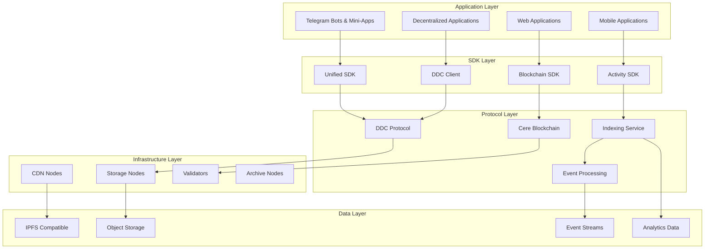
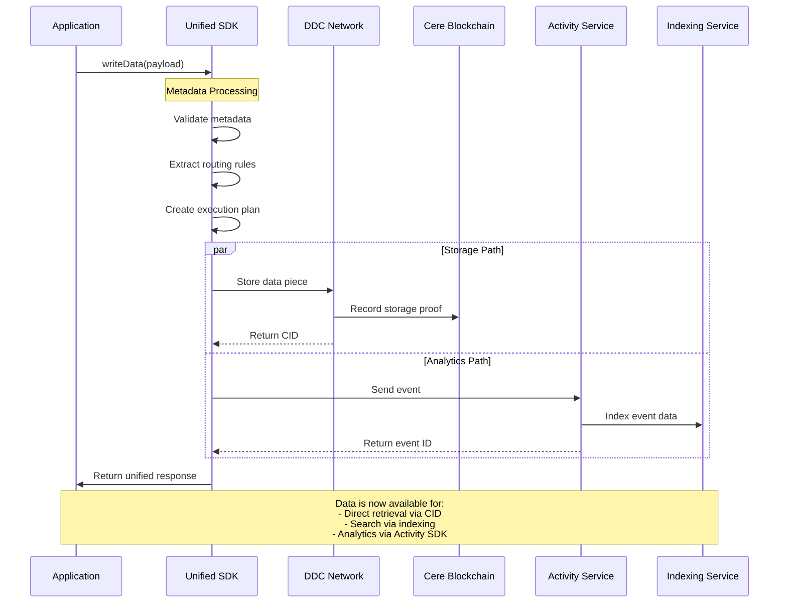
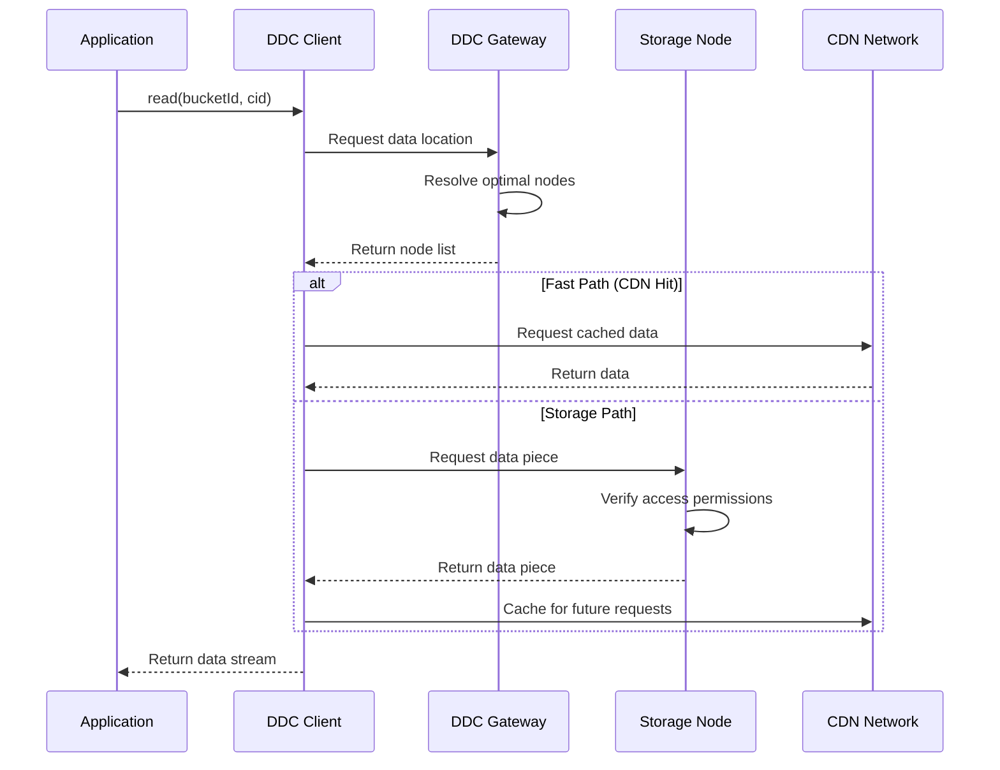
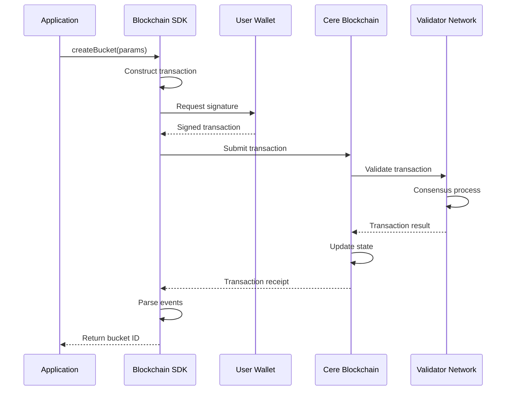

# Cere DDC SDK - Ecosystem Integration & Data Flow Guide

## Introduction

The Cere DDC SDK represents a sophisticated integration layer within the broader Cere ecosystem, connecting various blockchain technologies, storage networks, and data processing systems. This document explores how the SDK fits into the larger ecosystem, its integration patterns, and the data flows that enable decentralized applications.

## Ecosystem Overview

### The Cere Network Ecosystem



### Core Integration Points

The Cere DDC SDK serves as the primary integration layer between applications and the Cere ecosystem, providing:

1. **Data Storage Integration**: Direct connection to DDC storage nodes
2. **Blockchain Integration**: Transaction processing on Cere blockchain
3. **Event Processing**: Real-time event indexing and analytics
4. **Content Delivery**: Global CDN for data retrieval
5. **Identity & Authentication**: Decentralized identity management

## Data Flow Architecture

### 1. Data Ingestion Flow



### 2. Data Retrieval Flow



### 3. Blockchain Transaction Flow



## Integration Patterns

### 1. Telegram Ecosystem Integration

The SDK provides specialized support for Telegram applications:

```typescript
// Telegram Bot Integration Pattern
class TelegramIntegration {
  private unifiedSDK: UnifiedSDK;
  private bot: Telegraf;

  async setupTelegramIntegration() {
    // Initialize SDK with Telegram-optimized configuration
    this.unifiedSDK = new UnifiedSDK({
      ddcConfig: {
        signer: process.env.TELEGRAM_BOT_SIGNER,
        bucketId: BigInt(process.env.TELEGRAM_BUCKET_ID),
        network: 'testnet',
      },
      activityConfig: {
        appId: 'telegram-quest-bot',
        endpoint: 'https://api.stats.cere.network',
        // ... other config
      },
      processing: {
        enableBatching: true, // Optimize for high message volume
        defaultBatchSize: 100,
        defaultBatchTimeout: 2000,
      },
    });

    await this.unifiedSDK.initialize();
    
    // Setup bot event handlers
    this.setupBotHandlers();
  }

  private setupBotHandlers() {
    // Quest completion events
    this.bot.command('complete_quest', async (ctx) => {
      await this.unifiedSDK.writeData({
        eventType: 'quest_completed',
        userId: ctx.from.id.toString(),
        chatId: ctx.chat.id.toString(),
        eventData: {
          questId: ctx.message.text.split(' ')[1],
          timestamp: new Date(),
        },
      });
    });

    // Message storage for analytics
    this.bot.on('message', async (ctx) => {
      await this.unifiedSDK.writeData({
        messageId: ctx.message.message_id.toString(),
        chatId: ctx.chat.id.toString(),
        userId: ctx.from.id.toString(),
        messageType: this.getMessageType(ctx.message),
        timestamp: new Date(ctx.message.date * 1000),
      });
    });
  }
}
```

### 2. Web3 Application Integration

For decentralized applications requiring blockchain interaction:

```typescript
// DApp Integration Pattern
class DAppIntegration {
  private ddcClient: DdcClient;
  private blockchain: Blockchain;
  private wallet: Web3Provider;

  async setupDAppIntegration() {
    // Connect to user's wallet
    this.wallet = await this.connectWallet();
    
    // Initialize blockchain SDK with wallet signer
    const signer = new Web3Signer(this.wallet);
    this.blockchain = await Blockchain.connect({
      wsEndpoint: 'wss://rpc.mainnet.cere.network/ws',
    });

    // Initialize DDC client
    this.ddcClient = await DdcClient.create(signer, MAINNET);
  }

  async storeUserContent(content: File, metadata: any) {
    // Store content in DDC
    const { cid } = await this.ddcClient.store(this.bucketId, content);
    
    // Record content hash on blockchain
    const tx = this.blockchain.ddcCustomers.setBucketParams(this.bucketId, {
      metadata: { contentCid: cid, ...metadata },
    });
    
    await this.blockchain.send(tx, { account: signer });
    
    return { cid, blockHash: tx.hash };
  }

  async shareContent(cid: string, recipientAddress: string) {
    // Create access token for recipient
    const authToken = new AuthToken(this.bucketId, cid, ['GET']);
    const signedToken = await authToken.sign(this.signer);
    
    // Share via secure channel (e.g., encrypted message)
    return this.sendSecureMessage(recipientAddress, {
      type: 'content_share',
      cid,
      accessToken: signedToken,
      expiresAt: new Date(Date.now() + 24 * 60 * 60 * 1000), // 24 hours
    });
  }
}
```

### 3. Enterprise Data Pipeline Integration

For enterprise applications requiring robust data processing:

```typescript
// Enterprise Integration Pattern
class EnterpriseDataPipeline {
  private unifiedSDK: UnifiedSDK;
  private dataProcessor: DataProcessor;
  private metricsCollector: MetricsCollector;

  async setupEnterprisePipeline() {
    this.unifiedSDK = new UnifiedSDK({
      ddcConfig: {
        signer: process.env.ENTERPRISE_SIGNER,
        bucketId: BigInt(process.env.ENTERPRISE_BUCKET_ID),
        network: 'mainnet',
        clusterId: process.env.PREMIUM_CLUSTER_ID,
      },
      processing: {
        enableBatching: true,
        defaultBatchSize: 1000, // High-volume processing
        defaultBatchTimeout: 10000,
        maxRetries: 5,
        retryDelay: 2000,
      },
      logging: {
        level: 'info',
        enableMetrics: true,
      },
    });

    await this.unifiedSDK.initialize();
    this.setupDataProcessing();
    this.setupMonitoring();
  }

  async processDataStream(dataStream: ReadableStream) {
    const reader = dataStream.getReader();
    const batch: any[] = [];

    try {
      while (true) {
        const { done, value } = await reader.read();
        if (done) break;

        batch.push(value);

        // Process in batches for efficiency
        if (batch.length >= 100) {
          await this.processBatch(batch.splice(0));
        }
      }

      // Process remaining items
      if (batch.length > 0) {
        await this.processBatch(batch);
      }
    } finally {
      reader.releaseLock();
    }
  }

  private async processBatch(items: any[]) {
    const promises = items.map(item => 
      this.unifiedSDK.writeData(item, {
        priority: this.determinePriority(item),
        encryption: this.requiresEncryption(item),
        metadata: {
          processing: {
            dataCloudWriteMode: 'batch',
            indexWriteMode: 'realtime',
          },
        },
      })
    );

    const results = await Promise.allSettled(promises);
    this.handleBatchResults(results);
  }
}
```

## Wallet and Identity Integration

### Supported Wallet Types

The SDK supports multiple wallet integration patterns:

#### 1. Substrate-Native Wallets

```typescript
// Polkadot.js Extension Integration
import { web3Accounts, web3Enable } from '@polkadot/extension-dapp';

class PolkadotWalletIntegration {
  async connectPolkadotWallet() {
    // Enable the extension
    await web3Enable('Your DApp Name');
    
    // Get available accounts
    const accounts = await web3Accounts();
    
    // Create signer from selected account
    const signer = new ExtensionSigner(accounts[0]);
    
    // Initialize SDK with extension signer
    const ddcClient = await DdcClient.create(signer, MAINNET);
    
    return ddcClient;
  }
}
```

#### 2. Cere Wallet Integration

```typescript
// Official Cere Wallet Integration
import { CereWalletSigner } from '@cere-ddc-sdk/blockchain';

class CereWalletIntegration {
  async connectCereWallet() {
    // Initialize Cere Wallet connection
    const signer = new CereWalletSigner({
      appName: 'Your DApp',
      appIcon: '/path/to/icon.png',
    });

    await signer.connect();
    
    // Auto-signing capability for DDC operations
    const ddcClient = await DdcClient.create(signer, MAINNET);
    
    return { signer, ddcClient };
  }

  async enableAutoSigning(signer: CereWalletSigner) {
    // Enable auto-signing for DDC operations to reduce user friction
    await signer.enableAutoSigning(['ddc.store', 'ddc.read']);
  }
}
```

#### 3. Web3 Wallet Integration

```typescript
// MetaMask and other Web3 wallets
class Web3WalletIntegration {
  async connectWeb3Wallet() {
    if (!window.ethereum) {
      throw new Error('Web3 wallet not available');
    }

    // Request account access
    await window.ethereum.request({ method: 'eth_requestAccounts' });
    
    // Create Web3 provider
    const provider = new ethers.providers.Web3Provider(window.ethereum);
    const ethersSigner = provider.getSigner();
    
    // Wrap with Cere-compatible signer
    const signer = new Web3Signer(ethersSigner);
    
    return signer;
  }
}
```

## Network Configuration & Environments

### Network Topology

The Cere DDC SDK operates across multiple network environments:

#### Mainnet Configuration

```typescript
const MAINNET_CONFIG = {
  blockchain: {
    wsEndpoint: 'wss://rpc.mainnet.cere.network/ws',
    httpEndpoint: 'https://rpc.mainnet.cere.network',
  },
  ddc: {
    gatewayUrl: 'https://ddc.mainnet.cere.network',
    storageNodes: [
      'https://storage-1.mainnet.cere.network',
      'https://storage-2.mainnet.cere.network',
      'https://storage-3.mainnet.cere.network',
    ],
  },
  activity: {
    endpoint: 'https://api.stats.cere.network',
  },
  indexing: {
    endpoint: 'https://search.cere.network',
  },
};
```

#### Testnet Configuration

```typescript
const TESTNET_CONFIG = {
  blockchain: {
    wsEndpoint: 'wss://rpc.testnet.cere.network/ws',
    httpEndpoint: 'https://rpc.testnet.cere.network',
  },
  ddc: {
    gatewayUrl: 'https://ddc.testnet.cere.network',
    storageNodes: [
      'https://storage-1.testnet.cere.network',
      'https://storage-2.testnet.cere.network',
    ],
  },
  activity: {
    endpoint: 'https://api.stats.testnet.cere.network',
  },
  indexing: {
    endpoint: 'https://search.testnet.cere.network',
  },
};
```

### Multi-Cluster Support

The SDK supports deployment across multiple storage clusters for different use cases:

```typescript
interface ClusterConfig {
  id: string;
  type: 'performance' | 'archive' | 'analytics';
  regions: string[];
  costTier: 'low' | 'standard' | 'premium';
  features: string[];
}

const CLUSTER_CONFIGS: ClusterConfig[] = [
  {
    id: '0x825c4b2352850de9986d9d28568db6f0c023a1e3',
    type: 'performance',
    regions: ['us-east-1', 'eu-west-1', 'ap-southeast-1'],
    costTier: 'premium',
    features: ['high-iops', 'cdn', 'encryption'],
  },
  {
    id: '0x123456789abcdef123456789abcdef123456789a',
    type: 'archive',
    regions: ['us-west-2', 'eu-central-1'],
    costTier: 'low',
    features: ['long-term-storage', 'compression'],
  },
  {
    id: '0xfedcba987654321fedcba987654321fedcba987',
    type: 'analytics',
    regions: ['us-central-1', 'eu-north-1'],
    costTier: 'standard',
    features: ['indexing', 'search', 'analytics-api'],
  },
];
```

## Cross-Chain Integration

### Interoperability Features

The SDK is designed to support cross-chain scenarios:

```typescript
class CrossChainIntegration {
  private cereSDK: UnifiedSDK;
  private ethereumProvider: ethers.providers.Provider;
  private polygonProvider: ethers.providers.Provider;

  async setupCrossChain() {
    // Initialize Cere SDK
    this.cereSDK = new UnifiedSDK({
      ddcConfig: {
        signer: process.env.CERE_SIGNER,
        bucketId: BigInt(process.env.CERE_BUCKET_ID),
        network: 'mainnet',
      },
    });

    // Setup cross-chain providers
    this.ethereumProvider = new ethers.providers.InfuraProvider('mainnet');
    this.polygonProvider = new ethers.providers.JsonRpcProvider('https://polygon-rpc.com');
  }

  async bridgeDataFromEthereum(contractAddress: string, tokenId: string) {
    // Read NFT metadata from Ethereum
    const contract = new ethers.Contract(contractAddress, ERC721_ABI, this.ethereumProvider);
    const tokenURI = await contract.tokenURI(tokenId);
    const metadata = await fetch(tokenURI).then(r => r.json());

    // Store metadata in Cere DDC
    const response = await this.cereSDK.writeData({
      type: 'nft_metadata',
      chainId: 1, // Ethereum mainnet
      contractAddress,
      tokenId,
      metadata,
      bridgedAt: new Date(),
    });

    return response.ddcResult?.cid;
  }

  async syncPolygonEvents() {
    // Listen for events on Polygon
    const filter = {
      address: process.env.POLYGON_CONTRACT_ADDRESS,
      topics: ['0x...'], // Event signature
    };

    this.polygonProvider.on(filter, async (log) => {
      // Process and store event in Cere
      await this.cereSDK.writeData({
        type: 'polygon_event',
        chainId: 137, // Polygon
        transactionHash: log.transactionHash,
        blockNumber: log.blockNumber,
        eventData: this.parseEventLog(log),
        timestamp: new Date(),
      });
    });
  }
}
```

## Performance Optimization Strategies

### 1. Intelligent Caching

```typescript
class PerformanceOptimizer {
  private cache: Map<string, CacheEntry> = new Map();
  private cdnEndpoints: string[];

  async optimizedRead(bucketId: bigint, cid: string): Promise<ArrayBuffer> {
    const cacheKey = `${bucketId}:${cid}`;
    
    // Check local cache
    const cached = this.cache.get(cacheKey);
    if (cached && cached.expiresAt > Date.now()) {
      return cached.data;
    }

    // Try CDN endpoints first (fastest)
    for (const endpoint of this.cdnEndpoints) {
      try {
        const response = await fetch(`${endpoint}/${bucketId}/${cid}`);
        if (response.ok) {
          const data = await response.arrayBuffer();
          this.cacheData(cacheKey, data, 3600000); // Cache for 1 hour
          return data;
        }
      } catch (error) {
        // Continue to next endpoint
        continue;
      }
    }

    // Fallback to direct storage node access
    const ddcClient = await DdcClient.create(this.signer, this.network);
    const uri = new FileUri(bucketId, cid);
    const response = await ddcClient.read(uri);
    const data = await response.arrayBuffer();
    
    this.cacheData(cacheKey, data, 1800000); // Cache for 30 minutes
    return data;
  }
}
```

### 2. Batch Processing

```typescript
class BatchProcessor {
  private writeQueue: BatchItem[] = [];
  private batchTimer: NodeJS.Timeout | null = null;

  async queueWrite(data: any, options?: WriteOptions): Promise<string> {
    return new Promise((resolve, reject) => {
      this.writeQueue.push({
        data,
        options,
        resolve,
        reject,
        timestamp: Date.now(),
      });

      this.scheduleBatchProcess();
    });
  }

  private scheduleBatchProcess() {
    if (this.batchTimer) return;

    this.batchTimer = setTimeout(async () => {
      await this.processBatch();
      this.batchTimer = null;
    }, 1000); // Process every second

    // Also process if queue gets too large
    if (this.writeQueue.length >= 50) {
      clearTimeout(this.batchTimer);
      this.batchTimer = null;
      this.processBatch();
    }
  }

  private async processBatch() {
    const batch = this.writeQueue.splice(0);
    if (batch.length === 0) return;

    try {
      // Group by processing options for efficiency
      const groups = this.groupByOptions(batch);
      
      for (const group of groups) {
        const promises = group.items.map(item => 
          this.unifiedSDK.writeData(item.data, item.options)
        );

        const results = await Promise.allSettled(promises);
        
        results.forEach((result, index) => {
          const item = group.items[index];
          if (result.status === 'fulfilled') {
            item.resolve(result.value.transactionId);
          } else {
            item.reject(result.reason);
          }
        });
      }
    } catch (error) {
      // Reject all items in batch
      batch.forEach(item => item.reject(error));
    }
  }
}
```

## Monitoring and Observability

### SDK Health Monitoring

```typescript
class SDKHealthMonitor {
  private healthChecks: Map<string, HealthCheck> = new Map();
  private metricsCollector: MetricsCollector;

  setupHealthChecks() {
    // DDC connectivity check
    this.healthChecks.set('ddc_connectivity', {
      name: 'DDC Connectivity',
      check: async () => {
        try {
          const response = await fetch(`${this.ddcGateway}/health`);
          return response.ok;
        } catch {
          return false;
        }
      },
      interval: 30000, // 30 seconds
    });

    // Blockchain connectivity check
    this.healthChecks.set('blockchain_connectivity', {
      name: 'Blockchain Connectivity',
      check: async () => {
        try {
          const api = await this.blockchain.getApi();
          const health = await api.rpc.system.health();
          return health.peers.toNumber() > 0;
        } catch {
          return false;
        }
      },
      interval: 60000, // 1 minute
    });

    // Activity SDK check
    this.healthChecks.set('activity_sdk', {
      name: 'Activity SDK',
      check: async () => {
        try {
          const response = await fetch(`${this.activityEndpoint}/health`);
          return response.ok;
        } catch {
          return false;
        }
      },
      interval: 45000, // 45 seconds
    });
  }

  async collectMetrics(): Promise<HealthStatus> {
    const results = await Promise.allSettled(
      Array.from(this.healthChecks.values()).map(check => check.check())
    );

    const healthy = results.every(r => r.status === 'fulfilled' && r.value);

    return {
      healthy,
      timestamp: Date.now(),
      checks: Array.from(this.healthChecks.entries()).map(([key, check], index) => ({
        name: check.name,
        healthy: results[index].status === 'fulfilled' && (results[index] as any).value,
        lastCheck: Date.now(),
      })),
      metrics: await this.metricsCollector.export(),
    };
  }
}
```

This comprehensive ecosystem integration guide demonstrates how the Cere DDC SDK serves as a critical bridge between applications and the broader Cere ecosystem, enabling seamless data flow, blockchain integration, and cross-chain functionality while maintaining high performance and reliability standards. 