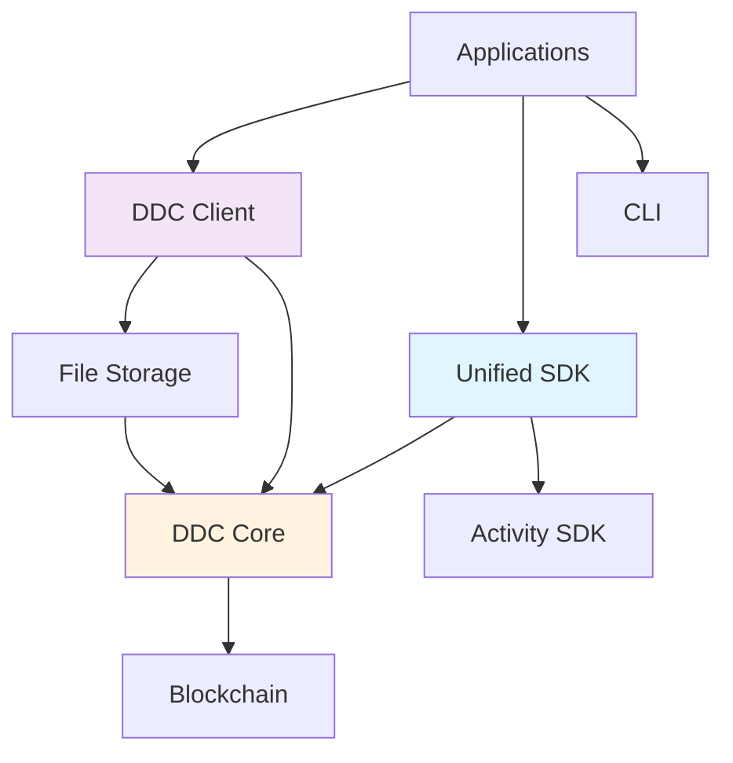

# Cere DDC SDK for JavaScript/TypeScript - Comprehensive Overview

## Executive Summary

The **Cere DDC SDK for JavaScript/TypeScript** is a sophisticated development kit that enables seamless integration with the Cerebellum Network's Decentralized Data Cloud (DDC). It provides a comprehensive set of modules and APIs for building applications that interact with Cere's blockchain-based infrastructure, offering everything from simple file storage to complex data ingestion workflows.

## What is the Cere DDC SDK?

The DDC SDK is a multi-layered, modular software development kit designed to provide developers with various levels of abstraction for interacting with the Cere ecosystem:

1. **High-level APIs** for straightforward use cases (DDC Client)
2. **Unified APIs** for complex data ingestion scenarios (Unified SDK)
3. **Low-level APIs** for advanced customization (DDC Core, Blockchain)
4. **Command-line tools** for automation and scripting (CLI)

## Repository Architecture

### Project Structure

```
cere-ddc-sdk-js/
├── packages/                    # Core SDK packages
│   ├── unified/                # 🌟 Unified Data Ingestion SDK
│   ├── ddc-client/            # High-level DDC client
│   ├── ddc/                   # Low-level DDC operations  
│   ├── file-storage/          # File upload/download APIs
│   ├── blockchain/            # Blockchain interaction layer
│   └── cli/                   # Command-line interface
├── examples/                   # Usage examples and tutorials
├── playground/                 # Interactive demo application
├── tests/                     # Comprehensive test suite
└── docs/                      # Documentation and diagrams
```

### Package Hierarchy



## Core Packages

### 1. Unified SDK (@cere-ddc-sdk/unified) ⭐ **FLAGSHIP**

**Purpose**: Single entry point for all data ingestion operations in the Cere ecosystem.

**Key Features**:
- **One API Method**: `writeData()` handles all data types automatically
- **Intelligent Data Detection**: Automatically detects Telegram events, messages, drone telemetry, etc.
- **Metadata-Driven Routing**: Routes data based on processing rules
- **Telegram-Optimized**: Built-in support for Telegram bots and mini-apps
- **Fallback Mechanisms**: Graceful degradation when services are unavailable
- **Production Ready**: 68 tests with 100% pass rate

**Architecture**: 4-layer modular design
1. **API Surface**: UnifiedSDK (entry point)
2. **Processing Logic**: RulesInterpreter + Dispatcher  
3. **Execution Engine**: Orchestrator (error handling, fallbacks)
4. **External Services**: DDC Client + Activity SDK + HTTP APIs

**Use Cases**:
```typescript
// Telegram Event - Auto-detected
await sdk.writeData({
  eventType: 'quest_completed',
  userId: 'user123',
  eventData: { questId: 'daily_checkin', points: 100 },
  timestamp: new Date(),
});

// Telegram Message - Auto-detected  
await sdk.writeData({
  messageId: 'msg123',
  chatId: 'chat456',
  messageText: 'Hello from mini-app!',
  messageType: 'text',
  timestamp: new Date(),
});
```

### 2. DDC Client (@cere-ddc-sdk/ddc-client)

**Purpose**: High-level wrapper for common DDC operations like bucket management and file storage.

**Key Features**:
- Simple bucket creation and management
- File upload/download with streaming support
- Built-in authentication and authorization
- Network abstraction (mainnet/testnet)

**Use Cases**:
```typescript
const ddcClient = await DdcClient.create(seed, TESTNET);
const bucketId = await client.createBucket(clusterId, { isPublic: true });
const { cid } = await ddcClient.store(bucketId, file);
```

### 3. DDC Core (@cere-ddc-sdk/ddc)

**Purpose**: Low-level API for direct communication with DDC storage nodes.

**Key Features**:
- Direct node communication via gRPC/HTTP
- Piece-based storage operations
- Advanced routing and load balancing
- Custom transport implementations

### 4. File Storage (@cere-ddc-sdk/file-storage)

**Purpose**: Specialized APIs for large file operations with chunk streaming.

**Key Features**:
- Efficient large file handling
- Streaming upload/download
- Automatic chunking and reassembly
- Progress tracking

### 5. Blockchain (@cere-ddc-sdk/blockchain)

**Purpose**: Direct interaction with Cere blockchain infrastructure.

**Key Features**:
- Wallet integration (Substrate, Polkadot.js, Cere Wallet)
- DDC pallet operations (buckets, clusters, nodes)
- Transaction signing and submission
- Event monitoring

### 6. CLI (@cere-ddc-sdk/cli)

**Purpose**: Command-line interface for DDC operations.

**Key Features**:
- File upload/download commands
- Bucket management
- Token generation and management
- Configuration file support

## Technical Implementation

### Technology Stack

- **Language**: TypeScript with full type safety
- **Runtime**: Node.js 18+ and modern browsers
- **Validation**: Zod for runtime schema validation
- **Testing**: Jest with comprehensive test coverage
- **Build**: Rollup for optimized bundles
- **Documentation**: TypeDoc for API documentation

### Architectural Patterns

1. **Layered Architecture**: Clear separation between API, processing, execution, and service layers
2. **Component Separation**: Single responsibility principle with independent, testable components
3. **Metadata-Driven Processing**: Flexible routing based on configurable metadata schemas
4. **Error Handling Strategy**: Structured error types with graceful degradation
5. **Fallback Mechanisms**: Circuit breakers and service unavailability handling

### Integration Points

#### DDC Integration ✅
- **Status**: Fully operational
- **Network**: Cere Testnet/Mainnet
- **Storage Nodes**: 68+ available nodes
- **Performance**: ~1.6s average operation time

#### Activity SDK Integration ⚠️
- **Status**: Graceful fallback mode
- **Fallback**: Automatic DDC storage when Activity SDK unavailable
- **Authentication**: UriSigner integration for simplified setup

## Key Use Cases

### 1. Telegram Bot & Mini-App Development
- Quest and gamification systems
- User interaction tracking
- Message analytics and storage
- Social feature implementation

### 2. Decentralized File Storage
- Large file upload/download
- Website hosting
- Document management
- Media storage and delivery

### 3. Data Analytics & Indexing
- Event stream processing
- Real-time data ingestion
- Search and discovery
- Performance monitoring

### 4. Blockchain Integration
- Wallet connectivity
- Transaction management
- Asset operations
- Smart contract interaction

## Configuration & Setup

### Basic Configuration
```typescript
const config = {
  ddcConfig: {
    signer: 'your-mnemonic-phrase',
    bucketId: BigInt(12345),
    network: 'testnet',
  },
  activityConfig: {
    endpoint: 'https://api.stats.cere.network',
    keyringUri: '//Alice',
    appId: 'your-app-id',
  },
};
```

### Network Support
- **Mainnet**: Production Cere network
- **Testnet**: Development and testing environment
- **Local**: Docker-based local development setup

## Development Workflow

### Quick Start
```bash
# Setup
nvm use
npm install
npm run build

# Run playground
npm run playground

# Run tests
npm test

# Local environment
npm run test:env
```

### Testing Infrastructure
- **68 tests** with 100% pass rate
- **5 test suites** covering all components
- **Local environment** with Docker containers
- **Integration tests** with real DDC infrastructure

## Quality Assurance

### Code Quality Standards
- **TypeScript**: Strict typing throughout
- **ESLint**: Comprehensive linting rules
- **Prettier**: Consistent code formatting
- **Conventional Commits**: Standardized commit messages

### Error Handling
- **Structured Errors**: Custom error classes with codes
- **Graceful Degradation**: Service fallbacks
- **User-Friendly Messages**: Clear error descriptions
- **Debug Information**: Detailed logging and metrics

### Documentation Standards
- **API Documentation**: Generated TypeDoc documentation
- **Architecture Guides**: Detailed design documentation
- **Usage Examples**: Comprehensive example library
- **Troubleshooting**: Common issues and solutions

## Ecosystem Integration

### Supported Networks
- **Cere Mainnet**: Production blockchain network
- **Cere Testnet**: Development and testing network

### Wallet Support
- **Substrate**: Native Substrate account support
- **Polkadot.js**: Browser extension integration
- **Cere Wallet**: Official Cere wallet integration
- **MetaMask**: Web3 wallet support (via adapters)

### Data Flow Architecture
```
Application → Unified SDK → Rules Engine → Dispatcher → Orchestrator
                    ↓
             [DDC Client] ← → [Activity SDK] ← → [HTTP APIs]
                    ↓
             [Storage Nodes] ← → [Blockchain] ← → [Indexing]
```

## Production Readiness

### Performance Characteristics
- **Throughput**: 1000+ events/minute capability
- **Latency**: Sub-2 second average response times
- **Reliability**: Circuit breakers and retry mechanisms
- **Scalability**: Horizontal scaling support

### Deployment Options
- **Node.js Applications**: Server-side integration
- **Browser Applications**: Client-side web apps
- **CLI Tools**: Automation and scripting
- **Docker Containers**: Containerized deployments

### Monitoring & Observability
- **Metrics Collection**: Built-in performance monitoring
- **Error Tracking**: Structured error reporting
- **Health Checks**: Service availability monitoring
- **Debug Logging**: Configurable log levels

## Future Roadmap

### Planned Features
- **Batch Processing**: Enhanced batch storage capabilities
- **Advanced Analytics**: Extended Activity SDK features
- **Multi-Chain Support**: Additional blockchain networks
- **Enhanced CLI**: More automation commands

### Extensibility
- **Plugin Architecture**: Custom transport implementations
- **Custom Routing**: Metadata-driven extensions
- **Service Adapters**: New backend integrations
- **Schema Evolution**: Backward-compatible updates

## Getting Started Resources

### Documentation Hierarchy
1. **[Main README](repos/cere-ddc-sdk-js/README.md)**: Project overview
2. **[Unified SDK Guide](repos/cere-ddc-sdk-js/packages/unified/docs/README.md)**: Comprehensive unified SDK documentation
3. **[API Reference](repos/cere-ddc-sdk-js/packages/unified/docs/api-reference.md)**: Complete API documentation
4. **[Examples](repos/cere-ddc-sdk-js/examples/)**: Practical implementation examples

### Learning Path
1. Start with **DDC Client** for simple file operations
2. Progress to **Unified SDK** for complex data workflows
3. Use **CLI** for automation and testing
4. Explore **low-level APIs** for advanced customization

This comprehensive overview demonstrates that the Cere DDC SDK is a mature, well-architected solution that provides multiple levels of abstraction for different use cases, from simple file storage to complex data ingestion workflows, with particular strength in Telegram ecosystem integration. 