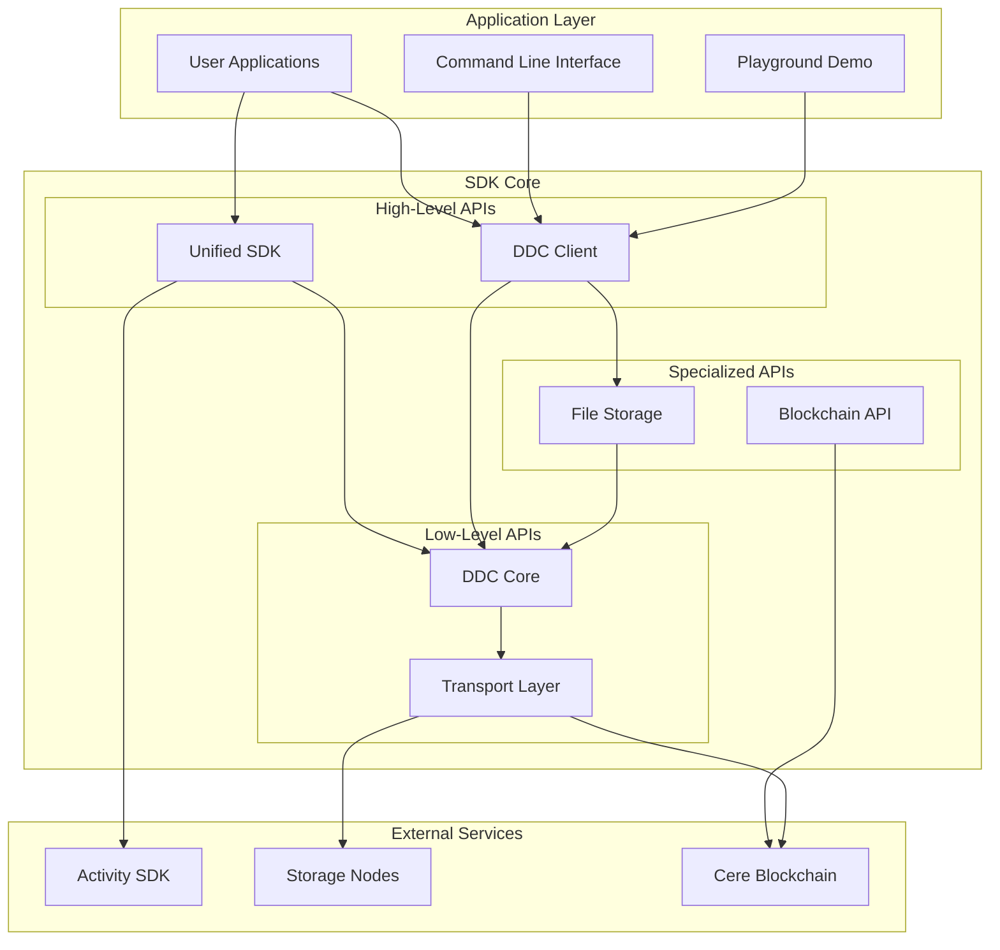
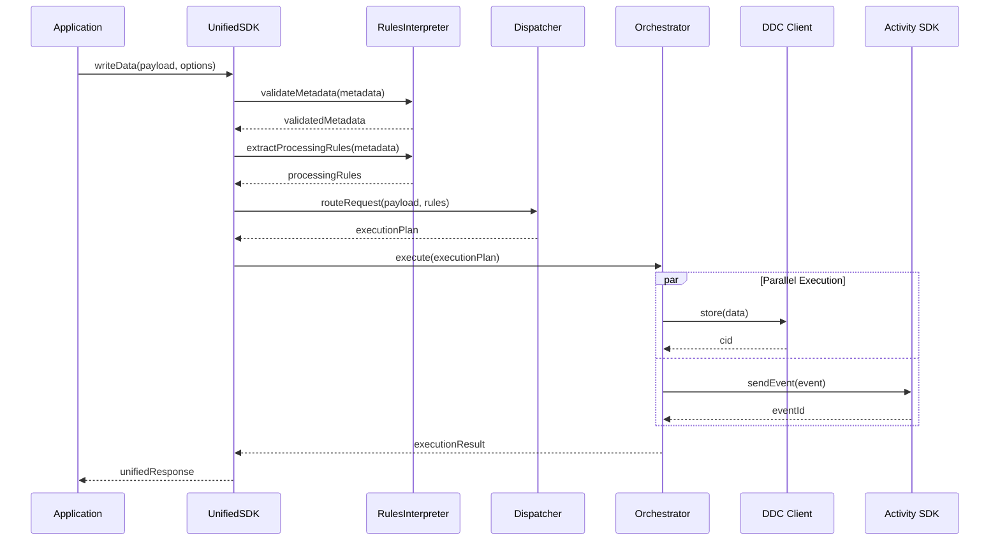

# Cere DDC SDK - Technical Architecture & Implementation Guide

## Technical Architecture Overview

The Cere DDC SDK for JavaScript/TypeScript is built on a sophisticated multi-layered architecture that provides both simplicity for basic use cases and flexibility for advanced scenarios. This document provides a deep technical analysis of the system's architecture, implementation patterns, and engineering decisions.

## System Architecture

### High-Level Architecture



## Core Component Architecture

### 1. Unified SDK Architecture (Flagship Component)

The Unified SDK implements a sophisticated 4-layer architecture pattern:

```typescript
// Layer 1: API Surface
class UnifiedSDK {
  private rulesInterpreter: RulesInterpreter;  // Layer 2
  private dispatcher: Dispatcher;              // Layer 2  
  private orchestrator: Orchestrator;          // Layer 3
  
  // Single entry point for all data types
  async writeData(payload: any, options?: WriteOptions): Promise<UnifiedResponse>
}

// Layer 2: Processing Logic
class RulesInterpreter {
  // Validates metadata and extracts processing rules
  validateMetadata(metadata: ProcessingMetadata): ValidationResult
  extractProcessingRules(metadata: ProcessingMetadata): ProcessingRules
}

class Dispatcher {
  // Translates rules into concrete actions
  routeRequest(payload: any, rules: ProcessingRules): DispatchPlan
  createExecutionPlan(actions: Action[]): ExecutionPlan
}

// Layer 3: Execution Engine  
class Orchestrator {
  // Manages execution with error handling and fallbacks
  async execute(plan: ExecutionPlan): Promise<ExecutionResult>
  private async executeAction(action: Action): Promise<ActionResult>
  private async handleFailure(action: Action, error: Error): Promise<ActionResult>
}
```

#### Data Flow in Unified SDK



### 2. DDC Core Architecture

The DDC Core provides low-level APIs for direct node communication:

```typescript
// Storage Node Communication
class StorageNode {
  private transport: GrpcTransport | WebsocketTransport;
  
  async storePiece(bucketId: bigint, piece: Piece): Promise<string>
  async readPiece(bucketId: bigint, cid: string): Promise<PieceResponse>
}

// Multi-transport Support
abstract class Transport {
  abstract async request<T>(method: string, params: any): Promise<T>
}

class GrpcTransport extends Transport {
  // High-performance gRPC communication
}

class WebsocketTransport extends Transport {
  // Browser-compatible WebSocket communication
}
```

### 3. Blockchain Integration Architecture

```typescript
// Blockchain Abstraction Layer
class Blockchain {
  private api: ApiPromise;
  private pallets: {
    ddcCustomers: DDCCustomersPallet;
    ddcNodes: DDCNodesPallet;
    ddcClusters: DDCClustersPallet;
    ddcStaking: DDCStakingPallet;
  };
  
  async send(tx: SubmittableExtrinsic, options: SendOptions): Promise<TxResult>
}

// Pallet-Specific Operations
class DDCCustomersPallet {
  deposit(amount: bigint): SubmittableExtrinsic
  createBucket(clusterId: string, params: BucketParams): SubmittableExtrinsic
  setBucketParams(bucketId: bigint, params: BucketParams): SubmittableExtrinsic
}
```

## Design Patterns & Principles

### 1. Metadata-Driven Architecture

The SDK uses a flexible metadata schema to drive routing decisions:

```typescript
interface ProcessingMetadata {
  dataCloudWriteMode: 'direct' | 'batch' | 'viaIndex' | 'skip';
  indexWriteMode: 'realtime' | 'skip';
  priority?: 'low' | 'normal' | 'high';
  encryption?: boolean;
  ttl?: number;
  batchOptions?: {
    maxSize?: number;
    maxWaitTime?: number;
  };
}

// Zod validation schemas ensure type safety
const ProcessingMetadataSchema = z.object({
  dataCloudWriteMode: z.enum(['direct', 'batch', 'viaIndex', 'skip']),
  indexWriteMode: z.enum(['realtime', 'skip']),
  priority: z.enum(['low', 'normal', 'high']).default('normal'),
  encryption: z.boolean().default(false),
  ttl: z.number().positive().optional(),
  batchOptions: BatchOptionsSchema.optional(),
});
```

### 2. Error Handling Strategy

Comprehensive error handling with typed errors and fallback mechanisms:

```typescript
// Structured Error Hierarchy
class UnifiedSDKError extends Error {
  constructor(
    message: string,
    public code: string,
    public component: string,
    public cause?: Error,
    public metadata?: Record<string, any>
  ) {
    super(message);
    this.name = 'UnifiedSDKError';
  }
}

// Error Categories
enum ErrorCode {
  VALIDATION_ERROR = 'VALIDATION_ERROR',
  CONFIGURATION_ERROR = 'CONFIGURATION_ERROR', 
  NETWORK_ERROR = 'NETWORK_ERROR',
  SERVICE_UNAVAILABLE = 'SERVICE_UNAVAILABLE',
  INTERNAL_ERROR = 'INTERNAL_ERROR'
}

// Fallback Mechanism Implementation
async executeWithFallback(action: Action): Promise<ActionResult> {
  try {
    return await this.executeAction(action);
  } catch (error) {
    if (action.options.writeToDataCloud && this.shouldFallbackToDDC(error)) {
      return await this.executeDDCFallback(action);
    }
    throw this.wrapError(error, action);
  }
}
```

### 3. Component Separation Pattern

Clear separation of concerns with single responsibility principle:

```typescript
// Each component has a focused responsibility
interface Component {
  readonly name: string;
  readonly responsibility: string;
  initialize(): Promise<void>;
  cleanup(): Promise<void>;
}

class RulesInterpreter implements Component {
  readonly name = 'RulesInterpreter';
  readonly responsibility = 'Metadata validation and rule extraction';
  
  // Only handles metadata processing
}

class Dispatcher implements Component {
  readonly name = 'Dispatcher'; 
  readonly responsibility = 'Action routing and execution planning';
  
  // Only handles routing logic
}

class Orchestrator implements Component {
  readonly name = 'Orchestrator';
  readonly responsibility = 'Execution management and error handling';
  
  // Only handles execution coordination
}
```

## Data Storage & Retrieval Architecture

### 1. Piece-Based Storage Model

```typescript
// Content addressing with CIDs
class Piece {
  constructor(
    public data: Uint8Array,
    public tags?: Tag[],
    public links?: Link[]
  ) {}
  
  get cid(): string {
    return this.calculateCID();
  }
  
  private calculateCID(): string {
    // Content-based addressing using multihash
  }
}

// Hierarchical data structures
class DagNode {
  constructor(
    public pieces: Piece[],
    public links: Link[],
    public size?: number
  ) {}
  
  async store(api: DagApi): Promise<DagNodeResponse> {
    // Store connected pieces as a DAG structure
  }
}
```

### 2. Multi-Node Routing & Load Balancing

```typescript
class BalancedNode {
  private nodes: StorageNode[] = [];
  private loadBalancer: LoadBalancer;
  
  constructor(
    nodes: NodeInfo[],
    strategy: LoadBalancingStrategy = 'round-robin'
  ) {
    this.loadBalancer = new LoadBalancer(strategy);
  }
  
  async selectNode(): Promise<StorageNode> {
    return this.loadBalancer.selectNode(this.nodes);
  }
  
  async executeWithRetry<T>(
    operation: (node: StorageNode) => Promise<T>,
    maxRetries: number = 3
  ): Promise<T> {
    let lastError: Error;
    
    for (let attempt = 0; attempt < maxRetries; attempt++) {
      try {
        const node = await this.selectNode();
        return await operation(node);
      } catch (error) {
        lastError = error;
        await this.backoff(attempt);
      }
    }
    
    throw lastError;
  }
}
```

## Authentication & Security Architecture

### 1. Multi-Wallet Support

```typescript
// Signer abstraction for different wallet types
abstract class Signer {
  abstract get address(): string;
  abstract sign(data: Uint8Array): Promise<Uint8Array>;
  abstract verify(data: Uint8Array, signature: Uint8Array): Promise<boolean>;
}

class UriSigner extends Signer {
  // Substrate URI format: //Alice, mnemonic phrases
}

class KeyringSigner extends Signer {
  // Polkadot.js Keyring integration
}

class CereWalletSigner extends Signer {
  // Official Cere Wallet integration
}

class Web3Signer extends Signer {
  // MetaMask and other Web3 wallets
}
```

### 2. Token-Based Authentication

```typescript
class AuthToken {
  constructor(
    public bucketId: bigint,
    public pieceCid?: string,
    public operations: string[] = ['GET', 'PUT'],
    public expiresAt?: Date
  ) {}
  
  async sign(signer: Signer): Promise<string> {
    const payload = this.createPayload();
    const signature = await signer.sign(payload);
    return this.encodeToken(signature);
  }
  
  static verify(token: string, signer: Signer): Promise<boolean> {
    // Verify token authenticity
  }
}
```

## Network & Transport Architecture

### 1. Multi-Protocol Support

```typescript
interface TransportConfig {
  protocol: 'grpc' | 'http' | 'websocket';
  endpoint: string;
  timeout?: number;
  retries?: number;
}

class TransportFactory {
  static create(config: TransportConfig): Transport {
    switch (config.protocol) {
      case 'grpc':
        return new GrpcTransport(config);
      case 'http':
        return new HttpTransport(config);
      case 'websocket':
        return new WebsocketTransport(config);
      default:
        throw new Error(`Unsupported protocol: ${config.protocol}`);
    }
  }
}
```

### 2. Network Configuration

```typescript
interface NetworkConfig {
  name: 'mainnet' | 'testnet' | 'local';
  blockchain: {
    wsEndpoint: string;
    httpEndpoint?: string;
  };
  ddc: {
    gatewayUrl: string;
    storageNodes?: NodeInfo[];
  };
  activity?: {
    endpoint: string;
  };
}

const NETWORKS: Record<string, NetworkConfig> = {
  mainnet: {
    name: 'mainnet',
    blockchain: {
      wsEndpoint: 'wss://rpc.mainnet.cere.network/ws',
    },
    ddc: {
      gatewayUrl: 'https://ddc.mainnet.cere.network',
    },
    activity: {
      endpoint: 'https://api.stats.cere.network',
    },
  },
  testnet: {
    name: 'testnet',
    blockchain: {
      wsEndpoint: 'wss://rpc.testnet.cere.network/ws',
    },
    ddc: {
      gatewayUrl: 'https://ddc.testnet.cere.network',
    },
    activity: {
      endpoint: 'https://api.stats.testnet.cere.network',
    },
  },
};
```

## Performance & Optimization

### 1. Batching Strategy

```typescript
class BatchProcessor<T> {
  private queue: T[] = [];
  private timer: NodeJS.Timeout | null = null;
  
  constructor(
    private batchSize: number,
    private timeout: number,
    private processor: (items: T[]) => Promise<void>
  ) {}
  
  add(item: T): void {
    this.queue.push(item);
    
    if (this.queue.length >= this.batchSize) {
      this.flush();
    } else if (!this.timer) {
      this.timer = setTimeout(() => this.flush(), this.timeout);
    }
  }
  
  private async flush(): Promise<void> {
    if (this.timer) {
      clearTimeout(this.timer);
      this.timer = null;
    }
    
    if (this.queue.length > 0) {
      const items = this.queue.splice(0);
      await this.processor(items);
    }
  }
}
```

### 2. Caching Strategy

```typescript
class ResponseCache {
  private cache = new Map<string, CacheEntry>();
  
  constructor(private ttl: number = 300000) {} // 5 minutes default
  
  get<T>(key: string): T | null {
    const entry = this.cache.get(key);
    if (!entry || entry.expiresAt < Date.now()) {
      this.cache.delete(key);
      return null;
    }
    return entry.value;
  }
  
  set<T>(key: string, value: T, ttl?: number): void {
    const expiresAt = Date.now() + (ttl || this.ttl);
    this.cache.set(key, { value, expiresAt });
  }
}
```

## Testing Architecture

### 1. Multi-Level Testing Strategy

```typescript
// Unit Tests - Individual components
describe('RulesInterpreter', () => {
  test('validates metadata correctly', () => {
    const interpreter = new RulesInterpreter();
    const result = interpreter.validateMetadata(validMetadata);
    expect(result.isValid).toBe(true);
  });
});

// Integration Tests - Component interactions  
describe('UnifiedSDK Integration', () => {
  test('writeData flows through all components', async () => {
    const sdk = new UnifiedSDK(config);
    await sdk.initialize();
    
    const response = await sdk.writeData(testEvent);
    expect(response.transactionId).toBeDefined();
  });
});

// End-to-End Tests - Real infrastructure
describe('E2E DDC Operations', () => {
  test('stores and retrieves data from real DDC nodes', async () => {
    const client = await DdcClient.create(testSeed, TESTNET);
    const stored = await client.store(bucketId, testFile);
    const retrieved = await client.read(stored.uri);
    
    expect(retrieved.arrayBuffer()).resolves.toEqual(testFile.arrayBuffer());
  });
});
```

### 2. Mock Infrastructure

```typescript
// Service mocks for isolated testing
class MockActivitySDK {
  private events: EventData[] = [];
  
  async sendEvent(event: EventData): Promise<string> {
    this.events.push(event);
    return `mock-event-${Date.now()}`;
  }
  
  getEvents(): EventData[] {
    return [...this.events];
  }
}

// Docker-based local environment
class LocalTestEnvironment {
  async start(): Promise<void> {
    // Start blockchain node, storage nodes, etc.
    await this.docker.compose.up([
      'blockchain-node',
      'storage-node-1', 
      'storage-node-2',
      'storage-node-3'
    ]);
  }
  
  async stop(): Promise<void> {
    await this.docker.compose.down();
  }
}
```

## Build & Distribution Architecture

### 1. Multi-Target Build System

```typescript
// Rollup configuration for different targets
const configs = [
  // Node.js CommonJS
  {
    input: 'src/index.ts',
    output: {
      file: 'dist/index.cjs.js',
      format: 'cjs',
    },
    external: ['fs', 'path', 'crypto'],
  },
  
  // ES Modules
  {
    input: 'src/index.ts', 
    output: {
      file: 'dist/index.esm.js',
      format: 'esm',
    },
  },
  
  // Browser Bundle
  {
    input: 'src/index.ts',
    output: {
      file: 'dist/index.umd.js',
      format: 'umd',
      name: 'CereDDCSDK',
    },
    plugins: [nodePolyfills()],
  },
];
```

### 2. Package Management

```json
{
  "name": "@cere-ddc-sdk/unified",
  "main": "dist/index.cjs.js",
  "module": "dist/index.esm.js", 
  "browser": "dist/index.umd.js",
  "types": "dist/index.d.ts",
  "exports": {
    ".": {
      "import": "./dist/index.esm.js",
      "require": "./dist/index.cjs.js",
      "browser": "./dist/index.umd.js",
      "types": "./dist/index.d.ts"
    }
  }
}
```

## Monitoring & Observability

### 1. Metrics Collection

```typescript
class MetricsCollector {
  private metrics = new Map<string, Metric>();
  
  increment(name: string, value: number = 1, tags?: Record<string, string>): void {
    const metric = this.getOrCreateMetric(name, 'counter');
    metric.increment(value, tags);
  }
  
  histogram(name: string, value: number, tags?: Record<string, string>): void {
    const metric = this.getOrCreateMetric(name, 'histogram');
    metric.record(value, tags);
  }
  
  export(): MetricsSnapshot {
    return {
      timestamp: Date.now(),
      metrics: Array.from(this.metrics.values()).map(m => m.export()),
    };
  }
}
```

### 2. Health Checks

```typescript
class HealthChecker {
  private checks: HealthCheck[] = [];
  
  addCheck(name: string, check: () => Promise<boolean>): void {
    this.checks.push({ name, check });
  }
  
  async runChecks(): Promise<HealthStatus> {
    const results = await Promise.allSettled(
      this.checks.map(async ({ name, check }) => ({
        name,
        healthy: await check(),
      }))
    );
    
    const healthy = results.every(r => 
      r.status === 'fulfilled' && r.value.healthy
    );
    
    return {
      healthy,
      timestamp: Date.now(),
      checks: results.map(r => 
        r.status === 'fulfilled' ? r.value : { name: 'unknown', healthy: false }
      ),
    };
  }
}
```

This technical architecture demonstrates the sophisticated engineering behind the Cere DDC SDK, with its multi-layered design, comprehensive error handling, flexible configuration system, and production-ready features that make it suitable for both simple use cases and complex enterprise applications. 