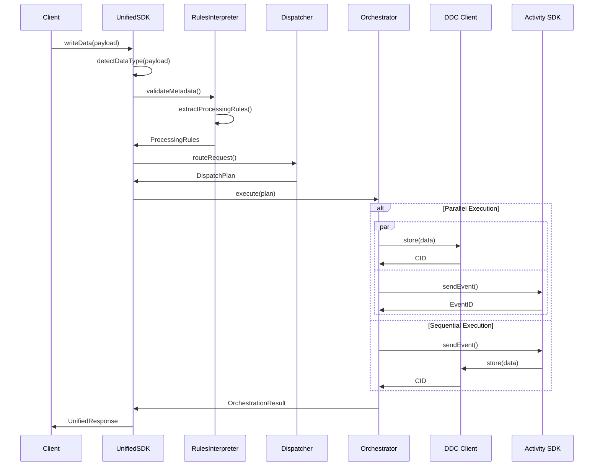

# Unified SDK Documentation

## Overview

The **Unified SDK** is a comprehensive data ingestion solution that provides a single entry point for all data operations across the Cere ecosystem. It automatically detects data types and routes them through optimized processing pipelines to appropriate backend systems.

## Key Features

### 🎯 **Single Entry Point**
One `writeData()` method handles all data types with automatic detection and intelligent routing.

### 🔍 **Automatic Data Type Detection**
Supports multiple data ecosystems:
- **Telegram Events & Messages**: Mini-app interactions, quest completions, user messages
- **Bullish Campaign Events**: Video education, quiz tracking, campaign participation
- **Nightingale Drone Data**: Video streams, KLV metadata, telemetry, frame analysis
- **Generic Data**: Fallback handling for any data structure

### 🏗️ **Multi-Backend Orchestration**
Intelligent routing across multiple backend systems:
- **DDC (Decentralized Data Cloud)**: Content storage and retrieval
- **Activity SDK**: Event indexing and analytics
- **HTTP APIs**: External service integration

### ⚡ **Performance Optimization**
- Context-aware batching and parallel execution
- Payload size-based optimization
- Priority-based processing
- Intelligent fallback mechanisms

### 🔒 **Enterprise-Grade Reliability**
- Comprehensive error handling and recovery
- Graceful degradation when services are unavailable
- Circuit breaker patterns and retry logic
- Full TypeScript support with runtime validation

## Quick Start

### Installation

```bash
npm install @cere-ddc-sdk/unified
```

### Basic Usage

```typescript
import { UnifiedSDK } from '@cere-ddc-sdk/unified';

// Configure the SDK
const sdk = new UnifiedSDK({
  ddcConfig: {
    signer: process.env.DDC_SIGNER!,
    bucketId: BigInt(process.env.DDC_BUCKET_ID!),
    network: 'testnet',
  },
  processing: {
    enableBatching: true,
    defaultBatchSize: 100,
    defaultBatchTimeout: 5000,
    maxRetries: 3,
    retryDelay: 1000,
  },
  logging: {
    level: 'info',
    enableMetrics: true,
  },
});

// Initialize
await sdk.initialize();

// Write any data - automatic detection and routing
const result = await sdk.writeData(yourData);

console.log('Success:', result.status);
console.log('Transaction ID:', result.transactionId);
console.log('Data Cloud Hash:', result.dataCloudHash);
console.log('Index ID:', result.indexId);

// Cleanup
await sdk.cleanup();
```

## Supported Data Types

### Telegram Ecosystem

#### Quest Completion Events
```typescript
const questEvent = {
  eventType: 'quest_completed',
  userId: 'user123',
  chatId: 'chat456',
  eventData: {
    questId: 'daily-check-in',
    points: 100,
    level: 5,
  },
  timestamp: new Date(),
};

const result = await sdk.writeData(questEvent);
```

#### Message Storage
```typescript
const message = {
  messageId: 'msg789',
  chatId: 'chat456',
  userId: 'user123',
  messageText: 'Hello from the mini app!',
  messageType: 'text',
  timestamp: new Date(),
  metadata: {
    miniAppName: 'Cere Games',
    actionContext: 'game-chat',
  },
};

const result = await sdk.writeData(message);
```

### Bullish Campaign Ecosystem

#### Video Education Progress
```typescript
const segmentEvent = {
  eventType: 'SEGMENT_WATCHED',
  campaignId: 'bullish_education_2024',
  accountId: 'user_12345',
  payload: {
    segmentId: 'trading_basics_001',
    segmentTitle: 'Introduction to Trading',
    watchDuration: 300000, // 5 minutes
    completionPercentage: 100,
    isCompleted: true,
  },
  questId: 'education_quest_001',
  timestamp: new Date(),
};

const result = await sdk.writeData(segmentEvent);
```

#### Quiz Tracking
```typescript
const quizEvent = {
  eventType: 'QUESTION_ANSWERED',
  campaignId: 'bullish_quiz_challenge',
  accountId: 'user_67890',
  payload: {
    questionId: 'q_trading_001',
    selectedAnswer: 'A market with rising prices',
    isCorrect: true,
    timeToAnswer: 15000,
    points: 10,
  },
  timestamp: new Date(),
};

const result = await sdk.writeData(quizEvent);
```

### Nightingale Drone Ecosystem

#### Video Stream Ingestion
```typescript
const videoStream = {
  droneId: 'drone_001',
  streamId: 'stream_video_123',
  timestamp: new Date(),
  videoMetadata: {
    duration: 300000, // 5 minutes
    fps: 30,
    resolution: '1920x1080',
    codec: 'h264',
    streamType: 'rgb',
  },
  chunks: [
    {
      chunkId: 'chunk_001',
      startTime: 0,
      endTime: 10000,
      data: Buffer.from('video_chunk_data'),
      size: 2048000, // 2MB
    },
  ],
};

const result = await sdk.writeData(videoStream);
```

#### KLV Metadata
```typescript
const klvData = {
  droneId: 'drone_001',
  streamId: 'stream_video_123',
  timestamp: new Date(),
  pts: 1000,
  klvMetadata: {
    type: 'ST 0601',
    missionId: 'mission_alpha_001',
    platform: {
      headingAngle: 45.5,
      pitchAngle: -2.1,
      rollAngle: 1.3,
    },
    sensor: {
      latitude: 40.7128,
      longitude: -74.0060,
      trueAltitude: 1500.0,
      horizontalFieldOfView: 60.0,
      verticalFieldOfView: 45.0,
    },
    frameCenter: {
      latitude: 40.7129,
      longitude: -74.0061,
      elevation: 100.0,
    },
  },
};

const result = await sdk.writeData(klvData);
```

#### Real-time Telemetry
```typescript
const telemetry = {
  droneId: 'drone_001',
  timestamp: new Date(),
  telemetryData: {
    gps: { lat: 40.7128, lng: -74.0060, alt: 150.5 },
    orientation: { pitch: 2.1, roll: -1.3, yaw: 45.5 },
    velocity: { x: 10.5, y: 2.3, z: 0.1 },
    battery: 85,
    signalStrength: 92,
  },
  coordinates: {
    latitude: 40.7128,
    longitude: -74.0060,
    altitude: 150.5,
  },
  missionId: 'mission_alpha_001',
};

const result = await sdk.writeData(telemetry);
```

#### Frame Analysis Results
```typescript
const frameAnalysis = {
  droneId: 'drone_001',
  streamId: 'stream_video_123',
  frameId: 'frame_001_1000',
  timestamp: new Date(),
  pts: 1000,
  frameData: {
    base64EncodedData: frameImageBase64,
    metadata: {
      width: 1920,
      height: 1080,
      format: 'jpeg',
    },
  },
  analysisResults: {
    objects: [
      {
        type: 'person',
        confidence: 0.95,
        boundingBox: [100, 200, 150, 300],
      },
      {
        type: 'vehicle',
        confidence: 0.87,
        boundingBox: [500, 400, 200, 100],
      },
    ],
    features: {
      sceneType: 'urban',
      lightingConditions: 'daylight',
    },
  },
};

const result = await sdk.writeData(frameAnalysis);
```

## Advanced Configuration

### Ecosystem-Specific Configuration

```typescript
const config = {
  ddcConfig: {
    signer: process.env.DDC_SIGNER!,
    bucketId: BigInt(process.env.DDC_BUCKET_ID!),
    clusterId: BigInt(process.env.DDC_CLUSTER_ID!),
    network: 'mainnet' as const,
  },
  
  // Activity SDK for indexing and analytics
  activityConfig: {
    endpoint: 'https://api.stats.cere.network',
    keyringUri: process.env.ACTIVITY_KEYRING_URI!,
    appId: 'my-application',
    appPubKey: process.env.APP_PUBLIC_KEY!,
    dataServicePubKey: process.env.DATA_SERVICE_PUBLIC_KEY!,
  },
  
  // Nightingale-specific optimizations
  nightingaleConfig: {
    videoProcessing: {
      chunkSize: 2 * 1024 * 1024, // 2MB chunks
      timelinePreservation: true,
      compression: false,
    },
    klvProcessing: {
      coordinateIndexing: true,
      metadataValidation: true,
    },
    telemetryProcessing: {
      timeSeries: true,
      coordinateTracking: true,
    },
  },
  
  // Performance tuning
  performance: {
    connectionTimeout: 30000,
    requestTimeout: 60000,
    maxConcurrentRequests: 10,
  },
  
  // Error handling
  errorHandling: {
    enableFallbacks: true,
    circuitBreakerThreshold: 5,
    fallbackToDataCloud: true,
  },
  
  // Processing configuration
  processing: {
    enableBatching: true,
    defaultBatchSize: 100,
    defaultBatchTimeout: 5000,
    maxRetries: 3,
    retryDelay: 1000,
  },
  
  // Logging and monitoring
  logging: {
    level: 'info' as const,
    enableMetrics: true,
    logRequests: false, // Disable for high-volume data
  },
};
```

### Custom Processing Options

```typescript
// High-priority processing
const result = await sdk.writeData(data, {
  priority: 'high',
  encryption: true,
  metadata: {
    processing: {
      dataCloudWriteMode: 'direct',
      indexWriteMode: 'realtime',
      priority: 'high',
      ttl: 86400, // 24 hours
    },
  },
});

// Batch processing for high volume
const batchResult = await sdk.writeData(data, {
  metadata: {
    processing: {
      dataCloudWriteMode: 'batch',
      indexWriteMode: 'realtime',
      batchOptions: {
        maxSize: 50,
        maxWaitTime: 3000,
      },
    },
  },
});

// DDC-only storage (skip indexing)
const ddcOnlyResult = await sdk.writeData(data, {
  metadata: {
    processing: {
      dataCloudWriteMode: 'direct',
      indexWriteMode: 'skip',
    },
  },
});
```

## Architecture

The SDK uses a 4-layer component architecture:

### 1. API Surface Layer
- **UnifiedSDK**: Single entry point with automatic data type detection

### 2. Business Logic Layer
- **RulesInterpreter**: Metadata validation and processing rule extraction
- **Dispatcher**: Request routing and action creation

### 3. Execution Layer
- **Orchestrator**: Multi-backend coordination and execution

### 4. Integration Layer
- **DDC Client**: Decentralized data cloud storage
- **Activity SDK**: Event indexing and analytics
- **HTTP APIs**: External service integration

## Data Flow



## Error Handling

### Graceful Degradation
The SDK provides fallback mechanisms when services are unavailable:

```typescript
try {
  const result = await sdk.writeData(data);
  console.log('Success:', result);
} catch (error) {
  if (error instanceof ValidationError) {
    console.error('Invalid data:', error.validationErrors);
  } else if (error instanceof UnifiedSDKError && error.recoverable) {
    console.warn('Recoverable error, retrying...', error);
    // Implement retry logic
  } else {
    console.error('Non-recoverable error:', error);
  }
}
```

### Partial Success Handling
```typescript
const result = await sdk.writeData(data);

if (result.status === 'partial') {
  console.log('Partial success:');
  console.log('- DDC Storage:', result.dataCloudHash ? 'Success' : 'Failed');
  console.log('- Indexing:', result.indexId ? 'Success' : 'Failed');
  
  if (result.errors) {
    result.errors.forEach(error => {
      console.error(`${error.component}: ${error.error}`);
    });
  }
}
```

## Performance Optimization

### Automatic Optimization
The SDK automatically optimizes processing based on:
- **Payload Size**: Adjusts batch sizes for large data
- **Priority**: Reduces timeouts for high-priority operations
- **Data Type**: Uses optimal routing per data type
- **Context**: Applies data-type-specific optimizations

### Manual Optimization
```typescript
// Optimize for high-volume telemetry
const telemetryConfig = {
  metadata: {
    processing: {
      dataCloudWriteMode: 'batch',
      indexWriteMode: 'realtime',
      batchOptions: {
        maxSize: 1000,
        maxWaitTime: 1000,
      },
    },
  },
};

// Optimize for large video files
const videoConfig = {
  metadata: {
    processing: {
      dataCloudWriteMode: 'direct',
      indexWriteMode: 'skip', // Skip indexing for performance
    },
  },
};
```

## Monitoring and Observability

### Built-in Metrics
```typescript
const status = sdk.getStatus();
console.log('SDK Status:', status);

// Enable detailed logging
const config = {
  // ... other config
  logging: {
    level: 'debug',
    enableMetrics: true,
    logRequests: true, // Log all requests for debugging
  },
};
```

### Response Metadata
```typescript
const result = await sdk.writeData(data);
console.log('Processing Time:', result.metadata.processingTime);
console.log('Actions Executed:', result.metadata.actionsExecuted);
console.log('Processed At:', result.metadata.processedAt);
```

## Migration and Compatibility

### From Direct DDC/Activity SDK Usage
```typescript
// Old approach
const ddcClient = new DdcClient(signer);
const activityClient = new EventDispatcher(signer, cipher);

await ddcClient.store(bucketId, data);
await activityClient.dispatchEvent(event);

// New unified approach
const sdk = new UnifiedSDK(config);
await sdk.writeData(data); // Automatic routing to both systems
```

### Backward Compatibility
The SDK maintains full backward compatibility:
- Existing Telegram data processing unchanged
- Generic data handling preserved
- Configuration extensions use sensible defaults

## Documentation

### Comprehensive Guides
- **[API Reference](./api-reference.md)**: Complete API documentation
- **[Architecture](./architecture.md)**: System architecture and design
- **[Configuration](./configuration.md)**: Detailed configuration options
- **[Telegram Guide](./telegram-guide.md)**: Telegram integration patterns
- **[Bullish Campaign Guide](./bullish-campaign-guide.md)**: Campaign event handling
- **[Nightingale Guide](./nightingale-guide.md)**: Drone data integration
- **[Testing Guide](./testing-guide.md)**: Testing strategies and examples
- **[Troubleshooting](./troubleshooting.md)**: Common issues and solutions

### Developer Resources
- **[Components](./components.md)**: Component architecture details
- **[Design Decisions](./design-decisions.md)**: Architectural rationale
- **[Usage and Setup](./usage-and-setup-guide.md)**: Detailed setup instructions
- **[Migration Guide](./migration.md)**: Migration strategies

## Examples

### Complete Integration Examples
Check the `examples/` directory for complete integration examples:
- **[Telegram Example](../examples/telegram-example.ts)**: Mini-app integration
- **[Bullish Campaign Example](../examples/bullish-campaign-example.ts)**: Campaign tracking
- **[Nightingale Example](../examples/nightingale-example.ts)**: Drone data processing

### Environment Configuration
```bash
# DDC Configuration
DDC_SIGNER="your mnemonic phrase here"
DDC_BUCKET_ID=12345
DDC_CLUSTER_ID=67890
DDC_NETWORK=testnet

# Activity SDK Configuration
ACTIVITY_ENDPOINT=https://api.stats.cere.network
ACTIVITY_KEYRING_URI="your mnemonic phrase here"
ACTIVITY_APP_ID=my-application
APP_PUBLIC_KEY=your-app-public-key
DATA_SERVICE_PUBLIC_KEY=your-data-service-public-key

# Nightingale Configuration (optional)
NIGHTINGALE_VIDEO_CHUNK_SIZE=2097152
NIGHTINGALE_TIMELINE_PRESERVATION=true
NIGHTINGALE_COMPRESSION=false

# Performance Configuration (optional)
CONNECTION_TIMEOUT=30000
REQUEST_TIMEOUT=60000
MAX_CONCURRENT_REQUESTS=10
```

## Support and Community

### Getting Help
- **Documentation**: Comprehensive guides and API reference
- **Examples**: Real-world integration examples
- **Issues**: GitHub issues for bug reports and feature requests

### Contributing
- **Code**: Submit pull requests for improvements
- **Documentation**: Help improve documentation
- **Testing**: Add test cases for new features

### License
Apache 2.0 - see LICENSE file for details

---

The Unified SDK provides a powerful, flexible, and reliable foundation for data ingestion across multiple ecosystems while maintaining simplicity from the developer perspective. Whether you're building Telegram mini-apps, Bullish campaigns, or Nightingale drone operations, the SDK handles the complexity of multi-backend coordination automatically.
