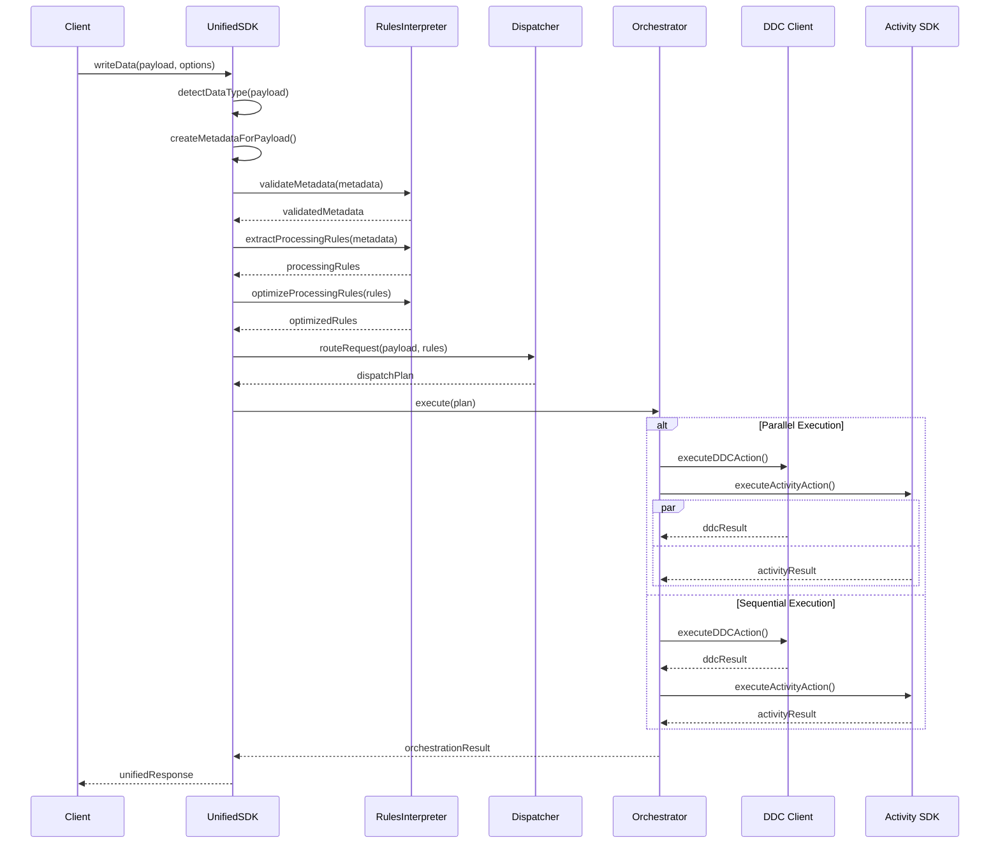

# Unified SDK Architecture Guide

## Overview

The Unified Data Ingestion SDK implements a **4-layer architecture** designed around the principle of **extreme simplicity** with **maximum reliability**. The architecture follows clean separation of concerns with each layer having distinct responsibilities.

## Core Architectural Principles

### 1. **Single Entry Point Philosophy**
- **ONE method**: `writeData()` handles all data types and routing decisions
- **Automatic detection**: Data type detection based on payload structure
- **Zero configuration**: Smart defaults with metadata-driven customization

### 2. **Metadata-Driven Architecture**
- Processing rules derived from metadata, not hardcoded logic
- Flexible routing decisions configurable per request
- Validation using Zod schemas for type safety

### 3. **Graceful Degradation**
- Fallback mechanisms when services are unavailable
- Partial success handling (some operations succeed, others fail)
- Non-blocking error handling to maintain service availability

## 4-Layer Architecture

```
┌─────────────────────────────────────────────────────────────┐
│                    Layer 1: API Surface                    │
│                     (UnifiedSDK)                            │
├─────────────────────────────────────────────────────────────┤
│  • Single writeData() method                               │
│  • Automatic data type detection                           │
│  • Initialization and cleanup management                   │
│  • Status reporting and health checks                      │
└─────────────────┬───────────────────────────┬───────────────┘
                  │                           │
        ┌─────────▼──────────┐      ┌─────────▼──────────┐
        │    Layer 2:        │      │    Layer 2:        │
        │ Business Logic     │      │ Route Planning     │
        │(RulesInterpreter)  │      │  (Dispatcher)      │
        ├────────────────────┤      ├────────────────────┤
        │ • Metadata         │      │ • Action Creation  │
        │   Validation       │      │ • Target Selection │
        │ • Rules Extraction │      │ • Execution Plans  │
        │ • Optimization     │      │ • Priority Mgmt    │
        └─────────┬──────────┘      └─────────┬──────────┘
                  │                           │
                  └─────────┬─────────────────┘
                            │
                  ┌─────────▼──────────┐
                  │      Layer 3:      │
                  │ Execution Engine   │
                  │   (Orchestrator)   │
                  ├────────────────────┤
                  │ • Resource Mgmt    │
                  │ • Error Handling   │
                  │ • Fallback Logic   │
                  │ • Service Init     │
                  └─────────┬──────────┘
                            │
           ┌────────────────┼────────────────┐
           │                │                │
    ┌──────▼──────┐  ┌──────▼──────┐  ┌──────▼──────┐
    │   Layer 4:  │  │   Layer 4:  │  │   Layer 4:  │
    │ DDC Client  │  │Activity SDK │  │ HTTP APIs   │
    │             │  │             │  │ (Future)    │
    │ • Data      │  │ • Events    │  │             │
    │   Storage   │  │ • Analytics │  │ • Webhooks  │
    │ • Files     │  │ • Indexing  │  │ • External  │
    │ • DagNodes  │  │ • Fallback  │  │   Services  │
    └─────────────┘  └─────────────┘  └─────────────┘
```

## Layer 1: API Surface (UnifiedSDK)

**File**: `UnifiedSDK.ts` (421 lines)

### Responsibilities
- **Single Entry Point**: Provides the unified `writeData()` method
- **Data Type Detection**: Automatically detects Telegram events, messages, drone telemetry
- **Component Orchestration**: Manages interaction between all layers
- **Lifecycle Management**: Initialization, cleanup, and health monitoring

### Key Methods

```typescript
class UnifiedSDK {
  // Main entry point - ONE method for all data types
  async writeData(payload: any, options?: WriteOptions): Promise<UnifiedResponse>
  
  // Lifecycle management
  async initialize(): Promise<void>
  async cleanup(): Promise<void>
  getStatus(): object
  
  // Internal detection and routing
  private detectDataType(payload: any): string
  private createMetadataForPayload(payload: any, options?: WriteOptions): UnifiedMetadata
  private generateTraceId(dataType: string, payload: any): string
}
```

### Data Type Detection Logic

The SDK automatically detects data types based on payload structure:

```typescript
private detectDataType(payload: any): string {
  // Telegram Event Detection
  if (payload.eventType && payload.userId && payload.timestamp) {
    return 'telegram_event';
  }
  
  // Telegram Message Detection  
  if (payload.messageId && payload.chatId && payload.userId && payload.messageType) {
    return 'telegram_message';
  }
  
  // Drone Telemetry Detection
  if (payload.droneId && payload.telemetry && (payload.latitude || payload.longitude)) {
    return 'drone_telemetry';
  }
  
  // Drone Video Detection
  if (payload.droneId && (payload.videoChunk || payload.frameData)) {
    return 'drone_video';
  }
  
  return 'generic';
}
```

## Layer 2A: Business Logic (RulesInterpreter)

**File**: `RulesInterpreter.ts` (208 lines)

### Responsibilities
- **Metadata Validation**: Validate input metadata using Zod schemas
- **Rule Extraction**: Convert metadata into actionable processing rules
- **Business Logic**: Apply routing decisions and optimization logic

### Key Methods

```typescript
class RulesInterpreter {
  // Core validation and rule extraction
  validateMetadata(metadata: any): UnifiedMetadata
  extractProcessingRules(metadata: UnifiedMetadata): ProcessingRules
  optimizeProcessingRules(rules: ProcessingRules, context?: any): ProcessingRules
  
  // Internal mapping logic
  private mapDataCloudWriteMode(mode: string): ProcessingRules['dataCloudAction']
  private mapIndexWriteMode(mode: string): ProcessingRules['indexAction']
  private determineBatchingRequirement(processing: ProcessingMetadata): boolean
  private validateRuleConsistency(rules: ProcessingRules): void
}
```

### Processing Rules Interface

```typescript
interface ProcessingRules {
  dataCloudAction: 'write_direct' | 'write_batch' | 'write_via_index' | 'skip';
  indexAction: 'write_realtime' | 'skip';
  batchingRequired: boolean;
  additionalParams: {
    priority: 'low' | 'normal' | 'high';
    ttl?: number;
    encryption: boolean;
    batchOptions?: {
      maxSize: number;
      maxWaitTime: number;
    };
  };
}
```

## Layer 2B: Route Planning (Dispatcher)

**File**: `Dispatcher.ts` (261 lines)

### Responsibilities
- **Action Creation**: Transform processing rules into concrete actions
- **Target Selection**: Route to appropriate backend services
- **Execution Planning**: Determine parallel vs sequential execution
- **Data Transformation**: Adapt payloads for specific backend APIs

### Key Methods

```typescript
class Dispatcher {
  // Main routing method
  routeRequest(payload: any, rules: ProcessingRules): DispatchPlan
  
  // Action creation
  private createDataCloudAction(payload: any, rules: ProcessingRules): Action | null
  private createIndexAction(payload: any, rules: ProcessingRules): Action | null
  
  // Data transformation
  private transformPayloadForDDC(payload: any): any
  private transformPayloadForActivity(payload: any): any
  
  // Type detection
  private isTelegramEvent(payload: any): boolean
  private isTelegramMessage(payload: any): boolean
}
```

### Action and DispatchPlan Interfaces

```typescript
interface Action {
  target: 'ddc-client' | 'activity-sdk' | 'http-api';
  method: string;
  payload: any;
  options: Record<string, any>;
  priority: 'low' | 'normal' | 'high';
}

interface DispatchPlan {
  actions: Action[];
  executionMode: 'sequential' | 'parallel';
  rollbackRequired: boolean;
}
```

## Layer 3: Execution Engine (Orchestrator)

**File**: `Orchestrator.ts` (458 lines)

### Responsibilities
- **Resource Management**: Initialize and manage backend clients
- **Execution Control**: Execute actions in parallel or sequential mode
- **Error Handling**: Comprehensive error handling with fallbacks
- **Service Integration**: Manage DDC Client and Activity SDK connections

### Key Methods

```typescript
class Orchestrator {
  // Lifecycle management
  async initialize(): Promise<void>
  async cleanup(): Promise<void>
  
  // Execution engine
  async execute(plan: DispatchPlan): Promise<OrchestrationResult>
  
  // Execution modes
  private async executeParallel(actions: Action[]): Promise<ExecutionResult[]>
  private async executeSequential(actions: Action[]): Promise<ExecutionResult[]>
  
  // Backend integrations
  private async executeDDCAction(action: Action): Promise<any>
  private async executeActivityAction(action: Action): Promise<any>
  private async executeHTTPAction(action: Action): Promise<any>
}
```

### Execution Results

```typescript
interface ExecutionResult {
  target: string;
  success: boolean;
  response: any;
  error?: any;
  executionTime: number;
}

interface OrchestrationResult {
  results: ExecutionResult[];
  overallStatus: 'success' | 'partial' | 'failed';
  totalExecutionTime: number;
  transactionId: string;
}
```

## Layer 4: External Services

### DDC Client Integration

The Orchestrator manages DDC Client initialization and operations:

```typescript
// DDC Client initialization with network presets
const networkConfig = this.config.ddcConfig.network === 'devnet'
  ? 'wss://archive.devnet.cere.network/ws'
  : 'wss://rpc.testnet.cere.network/ws';

this.ddcClient = await DdcClient.create(this.config.ddcConfig.signer, {
  blockchain: networkConfig,
  logLevel: this.config.logging.level === 'debug' ? 'debug' : 'silent',
});
```

### Activity SDK Integration

Activity SDK integration with UriSigner approach and fallback mechanisms:

```typescript
// Activity SDK initialization with UriSigner
const signer = new UriSigner(this.config.activityConfig.keyringUri || '//Alice', {
  type: 'ed25519', // Use ed25519 signatures for Event Service compatibility
});

this.activityClient = new EventDispatcher(signer, cipher, {
  baseUrl: this.config.activityConfig.endpoint || 'https://api.stats.cere.network',
  appId: this.config.activityConfig.appId || 'unified-sdk',
  // ... additional configuration
});
```

## Data Flow Architecture

### Complete Request Flow



## Error Handling Architecture

### Hierarchical Error Handling

```typescript
// Layer 1: API Surface Errors
class UnifiedSDKError extends Error {
  constructor(
    message: string,
    public code: string,
    public component: string,
    public recoverable: boolean = false,
    public originalError?: Error
  );
}

// Layer 2: Validation Errors
class ValidationError extends UnifiedSDKError {
  constructor(
    message: string,
    public validationErrors: z.ZodError
  );
}
```

### Fallback Mechanisms

1. **Activity SDK Unavailable**: Falls back to DDC storage only
2. **DDC Storage Failure**: Returns error but preserves Activity SDK indexing
3. **Partial Success**: Returns status with successful operations noted

```typescript
// Activity SDK fallback implementation
if (!this.activityClient) {
  // Return mock response to maintain workflow continuity
  return {
    eventId: this.generateEventId(),
    status: 'skipped',
    reason: 'Activity SDK not initialized',
    timestamp: new Date().toISOString(),
  };
}
```

## Configuration Architecture

### Unified Configuration Interface

```typescript
interface UnifiedSDKConfig {
  // DDC Client configuration
  ddcConfig: {
    signer: string; // Substrate URI or mnemonic phrase
    bucketId: bigint;
    clusterId?: bigint;
    network?: 'testnet' | 'devnet' | 'mainnet';
  };

  // Activity SDK configuration (optional)
  activityConfig?: {
    endpoint?: string;
    keyringUri?: string;
    appId?: string;
    connectionId?: string;
    sessionId?: string;
    appPubKey?: string;
    dataServicePubKey?: string;
  };

  // Processing options
  processing: {
    enableBatching: boolean;
    defaultBatchSize: number;
    defaultBatchTimeout: number;
    maxRetries: number;
    retryDelay: number;
  };

  // Logging and monitoring
  logging: {
    level: 'debug' | 'info' | 'warn' | 'error';
    enableMetrics: boolean;
  };
}
```

## Performance Architecture

### Optimization Strategies

1. **Intelligent Batching**: Automatic batching based on payload size and timing
2. **Parallel Execution**: Concurrent operations when dependencies allow
3. **Resource Pooling**: Reuse of connections and clients
4. **Lazy Initialization**: Services initialized only when needed

### Payload Size Optimization

```typescript
// Automatic batch size optimization based on payload size
if (context?.payloadSize && rules.batchingRequired) {
  const payloadSize = context.payloadSize;
  if (payloadSize > 1024 * 1024) { // 1MB
    optimizedRules.additionalParams.batchOptions = {
      maxSize: Math.max(1, Math.floor(1000 / (payloadSize / (1024 * 1024)))),
      maxWaitTime: rules.additionalParams.batchOptions?.maxWaitTime || 5000,
    };
  }
}
```

## Monitoring and Observability

### Built-in Logging

Each component includes structured logging:

```typescript
private createLogger(): (level: string, message: string, ...args: any[]) => void {
  const logLevel = this.config.logging.level;
  const enableMetrics = this.config.logging.enableMetrics;

  return (level: string, message: string, ...args: any[]) => {
    const messageLevel = logLevels[level as keyof typeof logLevels] || 1;
    
    if (messageLevel >= currentLevel) {
      const timestamp = new Date().toISOString();
      const logMessage = `[${timestamp}] [UnifiedSDK:${level.toUpperCase()}] ${message}`;
      
      // Log to appropriate console method
      if (level === 'error') {
        console.error(logMessage, ...args);
      } else if (level === 'warn') {
        console.warn(logMessage, ...args);
      } else {
        console.log(logMessage, ...args);
      }
    }
  };
}
```

### Metrics Collection

```typescript
// Response metadata includes performance metrics
metadata: {
  processedAt: new Date(),
  processingTime: Date.now() - startTime,
  actionsExecuted: orchestrationResult.results.map(r => r.target),
}
```

## Security Architecture

### Data Protection

1. **Encryption Support**: Optional encryption for sensitive data
2. **Secure Configuration**: Sensitive values (signers, keys) are sanitized in logs
3. **Access Control**: Component-level access restrictions

### Configuration Sanitization

```typescript
private sanitizeConfig(config: UnifiedSDKConfig): any {
  return {
    ddcConfig: {
      bucketId: config.ddcConfig.bucketId.toString(),
      clusterId: config.ddcConfig.clusterId?.toString(),
      network: config.ddcConfig.network,
      // Don't log the signer for security
    },
    activityConfig: config.activityConfig ? {
      endpoint: config.activityConfig.endpoint,
      // Don't log sensitive keys
    } : undefined,
    processing: config.processing,
    logging: config.logging,
  };
}
```

## Testing Architecture

The SDK includes comprehensive test coverage across all layers:

- **Unit Tests**: Individual component testing
- **Integration Tests**: Cross-component interaction testing
- **Mock Support**: Complete mocking infrastructure for external services
- **Real Integration**: Actual DDC and Activity SDK integration tests

## Design Benefits

### For Developers
- **🎯 Extreme Simplicity**: One method for all use cases
- **🔒 Type Safety**: Full TypeScript support with Zod validation
- **📊 Comprehensive Monitoring**: Built-in observability

### For Operations
- **🔄 Graceful Degradation**: Services can fail independently
- **📈 Performance**: Intelligent batching and parallel execution
- **🔧 Maintainability**: Clear separation of concerns

### For Business
- **⚡ Fast Development**: Reduced complexity means faster implementation
- **💰 Cost Effective**: Efficient resource usage through optimization
- **📊 Rich Analytics**: Automatic event tracking and indexing

This architecture achieves the perfect balance of simplicity for developers while maintaining enterprise-grade reliability and performance.
