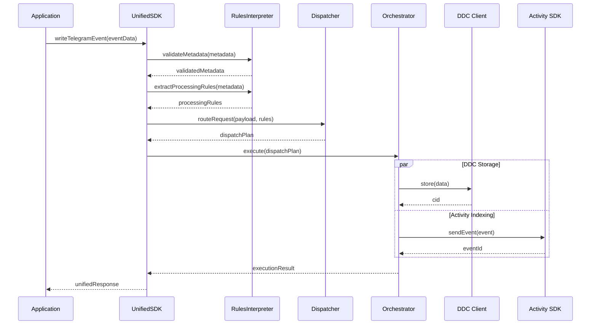

# Architecture Guide

## System Overview

The Unified Data Ingestion SDK follows a **layered architecture** with clear separation of concerns, enabling maintainable, testable, and extensible code. Each layer has specific responsibilities and communicates through well-defined interfaces.

## Architectural Layers

### Layer 1: API Surface (UnifiedSDK)

**Purpose**: Provides the public interface and manages SDK lifecycle

```typescript
┌─────────────────────────────────────────┐
│              UnifiedSDK                 │
│  ┌─────────────────────────────────────┐│
│  │  Public API Methods                 ││
│  │  • writeTelegramEvent()             ││
│  │  • writeTelegramMessage()           ││
│  │  • writeData()                      ││
│  │  • initialize() / cleanup()         ││
│  │  • getStatus()                      ││
│  └─────────────────────────────────────┘│
│  ┌─────────────────────────────────────┐│
│  │  Lifecycle Management               ││
│  │  • Component initialization         ││
│  │  • Configuration validation         ││
│  │  • Resource cleanup                 ││
│  └─────────────────────────────────────┘│
└─────────────────────────────────────────┘
```

### Layer 2: Processing Logic (RulesInterpreter + Dispatcher)

**Purpose**: Transforms user input into executable plans

```typescript
┌─────────────────────┐    ┌─────────────────────┐
│  RulesInterpreter   │    │     Dispatcher      │
│                     │    │                     │
│ • Metadata          │    │ • Route Planning    │
│   Validation        │    │ • Action Creation   │
│ • Rules Extraction  │    │ • Priority Mgmt     │
│ • Optimization      │    │ • Execution Mode    │
│ • Business Logic    │    │ • Resource Alloc    │
└─────────────────────┘    └─────────────────────┘
```

### Layer 3: Execution Engine (Orchestrator)

**Purpose**: Executes plans and manages external dependencies

```typescript
┌─────────────────────────────────────────┐
│              Orchestrator               │
│  ┌─────────────────────────────────────┐│
│  │  Execution Strategies               ││
│  │  • Sequential execution             ││
│  │  • Parallel execution               ││
│  │  • Batched execution                ││
│  └─────────────────────────────────────┘│
│  ┌─────────────────────────────────────┐│
│  │  Error Handling & Fallbacks        ││
│  │  • Retry logic                      ││
│  │  • Circuit breakers                 ││
│  │  • Graceful degradation             ││
│  └─────────────────────────────────────┘│
└─────────────────────────────────────────┘
```

### Layer 4: External Services

**Purpose**: Actual data storage and processing

```typescript
┌─────────────┐  ┌─────────────┐  ┌─────────────┐
│ DDC Client  │  │Activity SDK │  │ HTTP APIs   │
│             │  │             │  │             │
│ • File      │  │ • Events    │  │ • Webhooks  │
│   Storage   │  │ • Analytics │  │ • External  │
│ • DagNodes  │  │ • Indexing  │  │   Services  │
└─────────────┘  └─────────────┘  └─────────────┘
```

## Data Flow Architecture



## Component Interactions

### 1. Metadata Processing Flow

```typescript
// Input: Raw metadata from user
const metadata = {
  processing: {
    dataCloudWriteMode: 'viaIndex',
    indexWriteMode: 'realtime',
    priority: 'high',
    encryption: true,
  },
};

// Step 1: RulesInterpreter validates and extracts rules
const rules = {
  dataCloudAction: 'write_via_index', // Derived from dataCloudWriteMode
  indexAction: 'write_realtime', // Derived from indexWriteMode
  batchingRequired: false, // Derived from mode + payload size
  additionalParams: {
    priority: 'high',
    encryption: true,
    ttl: undefined,
    batchOptions: undefined,
  },
};

// Step 2: Dispatcher creates execution plan
const plan = {
  actions: [
    {
      target: 'activity-sdk',
      method: 'sendEvent',
      payload: { type: 'telegram.event', data: eventData },
      options: { writeToDataCloud: true },
      priority: 'high',
    },
  ],
  executionMode: 'sequential',
  rollbackRequired: false,
};
```

### 2. Execution Strategies

#### Sequential Execution

```typescript
// For dependent operations or when order matters
for (const action of plan.actions) {
  const result = await this.executeAction(action);
  results.push(result);

  if (!result.success && plan.rollbackRequired) {
    await this.rollback(results);
    break;
  }
}
```

#### Parallel Execution

```typescript
// For independent operations
const promises = plan.actions.map((action) => this.executeAction(action));
const results = await Promise.allSettled(promises);
```

#### Batch Execution

```typescript
// For high-throughput scenarios
const batches = this.createBatches(plan.actions, batchSize);
for (const batch of batches) {
  await this.executeBatch(batch);
}
```

## Error Handling Architecture

### 1. Error Categories

```typescript
enum ErrorCategory {
  VALIDATION = 'validation', // Bad input data
  CONFIGURATION = 'config', // SDK misconfiguration
  NETWORK = 'network', // Network/connectivity issues
  SERVICE = 'service', // External service errors
  INTERNAL = 'internal', // SDK internal errors
}
```

### 2. Error Propagation Strategy

```typescript
┌─────────────────┐
│ Application     │ ← UnifiedSDKError (user-friendly)
└─────────────────┘
         ↑
┌─────────────────┐
│ UnifiedSDK      │ ← Catches & wraps all errors
└─────────────────┘
         ↑
┌─────────────────┐
│ Components      │ ← Throw specific error types
└─────────────────┘
         ↑
┌─────────────────┐
│ External APIs   │ ← Raw errors (network, service, etc.)
└─────────────────┘
```

### 3. Fallback Mechanisms

```typescript
// Activity SDK → DDC fallback
if (activityResult.failed && action.options.writeToDataCloud) {
  const fallbackResult = await this.executeDDCAction({
    target: 'ddc-client',
    method: 'store',
    payload: action.payload,
    options: { fallback: true },
  });

  return {
    status: 'fallback_to_ddc',
    originalError: activityResult.error,
    ddcResult: fallbackResult,
  };
}
```

## Configuration Architecture

### 1. Hierarchical Configuration

```typescript
interface UnifiedSDKConfig {
  // Required: DDC configuration
  ddcConfig: {
    signer: string;
    bucketId: bigint;
    network: 'mainnet' | 'testnet';
    clusterId?: string;
  };

  // Optional: Activity SDK configuration
  activityConfig?: {
    keyringUri: string;
    appId: string;
    endpoint: string;
    appPubKey: string;
    dataServicePubKey: string;
  };

  // Optional: Processing defaults
  processing?: {
    enableBatching: boolean;
    defaultBatchSize: number;
    defaultBatchTimeout: number;
    maxRetries: number;
    retryDelay: number;
  };

  // Optional: Logging configuration
  logging?: {
    level: 'debug' | 'info' | 'warn' | 'error';
    enableMetrics: boolean;
  };
}
```

### 2. Configuration Validation

```typescript
// Validation happens at multiple levels:
// 1. TypeScript compile-time validation
// 2. Runtime Zod schema validation
// 3. Business logic validation (e.g., network connectivity)

const configSchema = z.object({
  ddcConfig: DDCConfigSchema,
  activityConfig: ActivityConfigSchema.optional(),
  processing: ProcessingConfigSchema.optional(),
  logging: LoggingConfigSchema.optional(),
});
```

## Performance Architecture

### 1. Batching Strategy

```typescript
interface BatchingConfig {
  maxSize: number; // Maximum items per batch
  maxWaitTime: number; // Maximum wait time before processing
  dynamicSizing: boolean; // Adjust batch size based on payload size
}

// Dynamic batch sizing
if (payloadSize > LARGE_PAYLOAD_THRESHOLD) {
  batchConfig.maxSize = Math.floor(batchConfig.maxSize / 2);
  batchConfig.maxWaitTime = Math.floor(batchConfig.maxWaitTime * 1.5);
}
```

### 2. Resource Management

```typescript
class ResourceManager {
  private ddcClient?: DdcClient;
  private activityDispatcher?: EventDispatcher;
  private connectionPool: Map<string, Connection>;

  async initialize() {
    // Lazy initialization of expensive resources
    this.ddcClient = await DdcClient.create(config);
    this.activityDispatcher = new EventDispatcher(signer, cipher, config);
  }

  async cleanup() {
    // Proper cleanup to prevent resource leaks
    await this.ddcClient?.disconnect();
    this.connectionPool.clear();
  }
}
```

### 3. Monitoring & Observability

```typescript
interface ExecutionMetrics {
  transactionId: string;
  startTime: number;
  endTime: number;
  totalExecutionTime: number;
  actionsExecuted: string[];
  payloadSize: number;
  status: 'success' | 'partial' | 'failed';
}

// Built-in metrics collection
const metrics: ExecutionMetrics = {
  transactionId: this.generateTransactionId(),
  startTime: Date.now(),
  // ... execution happens
  endTime: Date.now(),
  totalExecutionTime: endTime - startTime,
  actionsExecuted: results.map((r) => r.target),
  payloadSize: this.estimatePayloadSize(payload),
  status: this.determineOverallStatus(results),
};
```

## Security Architecture

### 1. Data Sanitization

```typescript
// Configuration sanitization for logging
private sanitizeConfig(config: UnifiedSDKConfig) {
  return {
    ...config,
    ddcConfig: {
      ...config.ddcConfig,
      signer: undefined  // Remove sensitive signing keys
    },
    activityConfig: config.activityConfig ? {
      ...config.activityConfig,
      keyringUri: undefined  // Remove sensitive keys
    } : undefined
  };
}
```

### 2. Encryption Support

```typescript
// Encryption is handled at the action level
if (action.options.encryption) {
  action.payload = await this.encrypt(action.payload);
}
```

## Extensibility Architecture

### 1. Plugin System (Future)

```typescript
interface Plugin {
  name: string;
  version: string;
  initialize(sdk: UnifiedSDK): Promise<void>;
  beforeAction?(action: Action): Promise<Action>;
  afterAction?(action: Action, result: any): Promise<any>;
}

// Plugin registration
sdk.registerPlugin(new TelegramAnalyticsPlugin());
sdk.registerPlugin(new CustomValidationPlugin());
```

### 2. Custom Action Targets

```typescript
// The system is designed to be extended with new targets
interface ActionTarget {
  name: string;
  execute(action: Action): Promise<any>;
  healthCheck(): Promise<boolean>;
}

// Register custom targets
orchestrator.registerTarget('webhook', new WebhookTarget());
orchestrator.registerTarget('database', new DatabaseTarget());
```

This architecture provides a solid foundation for the Unified SDK while maintaining flexibility for future enhancements and customizations.
