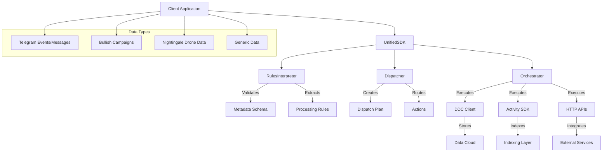
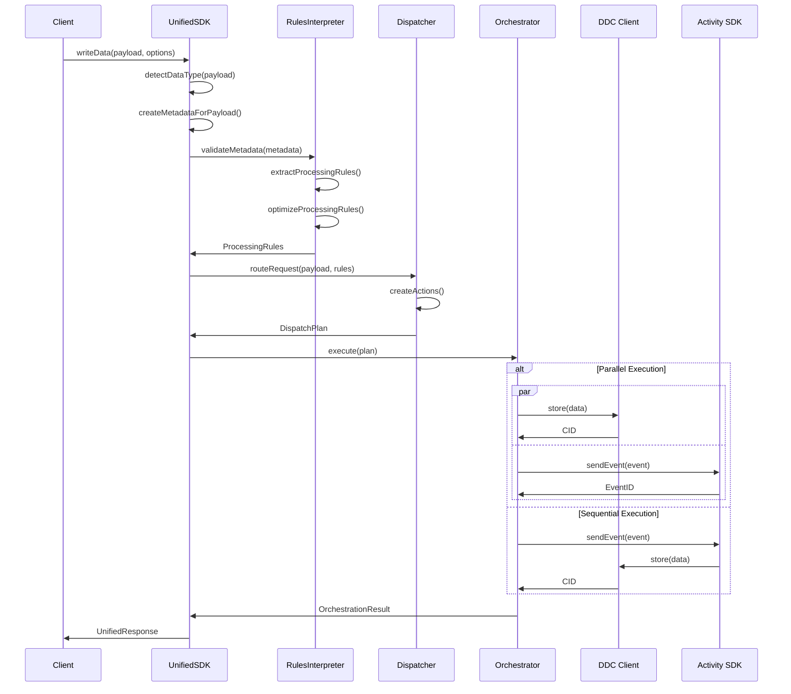
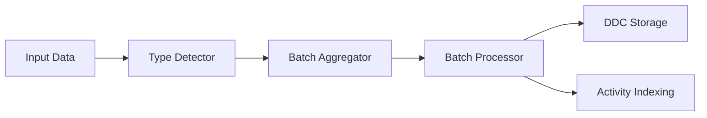
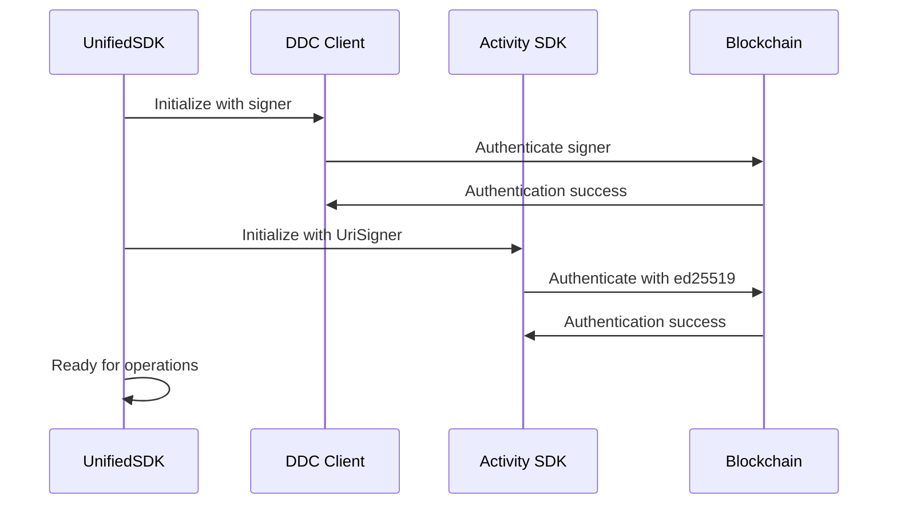

# Unified SDK Architecture

## Overview

The Unified SDK implements a sophisticated data ingestion architecture that provides a single entry point for multiple data ecosystems while maintaining optimal performance, reliability, and extensibility. The system automatically detects data types and routes them through appropriate processing pipelines.

## Core Architectural Principles

### 1. **Single Responsibility with Composability**
Each component has a single, well-defined responsibility while being composable with others:
- **UnifiedSDK**: Entry point and orchestration
- **RulesInterpreter**: Metadata validation and rule extraction
- **Dispatcher**: Request routing and action planning
- **Orchestrator**: Multi-backend execution and coordination

### 2. **Metadata-Driven Processing**
All processing decisions are driven by metadata schemas, enabling:
- Consistent processing across different data types
- Flexible routing configurations
- Runtime optimization based on context

### 3. **Multi-Backend Orchestration**
The system coordinates multiple backend services:
- **DDC (Decentralized Data Cloud)**: Content storage and retrieval
- **Activity SDK**: Event indexing and analytics
- **HTTP APIs**: External service integration

## System Architecture


```mermaid
graph TB
    Client[Client Application] --> SDK[UnifiedSDK]
    
    SDK --> RI[RulesInterpreter]
    SDK --> DIS[Dispatcher]
    SDK --> ORC[Orchestrator]
    
    RI --> |Validates| META[Metadata Schema]
    RI --> |Extracts| RULES[Processing Rules]
    
    DIS --> |Creates| PLAN[Dispatch Plan]
    DIS --> |Routes| ACTIONS[Actions]
    
    ORC --> |Executes| DDC[DDC Client]
    ORC --> |Executes| ACT[Activity SDK]
    ORC --> |Executes| HTTP[HTTP APIs]
    
    DDC --> |Stores| CLOUD[Data Cloud]
    ACT --> |Indexes| INDEX[Indexing Layer]
    HTTP --> |Integrates| EXT[External Services]
    
    subgraph "Data Types"
        TG[Telegram Events/Messages]
        BC[Bullish Campaigns]
        NG[Nightingale Drone Data]
        GEN[Generic Data]
    end
    
    Client --> TG
    Client --> BC
    Client --> NG
    Client --> GEN
```

## Component Architecture

### UnifiedSDK (Main Entry Point)

The central orchestrator that provides the unified interface:

```typescript
class UnifiedSDK {
  // Core components
  private rulesInterpreter: RulesInterpreter;
  private dispatcher: Dispatcher;
  private orchestrator: Orchestrator;
  
  // Main data ingestion method
  async writeData(payload: any, options?: WriteOptions): Promise<UnifiedResponse>
}
```

**Key Responsibilities:**
- Data type auto-detection
- Component coordination
- Response aggregation
- Error handling and recovery
- Lifecycle management

**Auto-Detection Algorithm:**
1. Analyze payload structure
2. Match against known patterns
3. Apply type-specific metadata defaults
4. Generate trace ID for tracking

### RulesInterpreter (Business Logic Engine)

Translates client intentions into actionable processing rules:

```typescript
class RulesInterpreter {
  validateMetadata(metadata: any): UnifiedMetadata;
  extractProcessingRules(metadata: UnifiedMetadata): ProcessingRules;
  optimizeProcessingRules(rules: ProcessingRules, context?: any): ProcessingRules;
}
```

**Key Responsibilities:**
- Metadata validation using Zod schemas
- Business rule enforcement
- Processing rule extraction
- Context-based optimization

**Rule Optimization Strategies:**
- Payload size-based batch adjustment
- Priority-based timeout reduction
- Execution mode selection
- Resource allocation optimization

### Dispatcher (Command Pattern Implementation)

Converts processing rules into concrete actions:

```typescript
class Dispatcher {
  routeRequest(payload: any, rules: ProcessingRules): DispatchPlan;
}
```

**Key Responsibilities:**
- Action creation and configuration
- Payload transformation for different backends
- Execution mode determination
- Rollback planning

**Routing Logic:**
- **Direct Storage**: Immediate DDC writes
- **Batch Processing**: Aggregated writes via Activity SDK
- **Index-First**: Activity SDK with DDC fallback
- **Parallel Execution**: Independent DDC + Activity SDK operations

### Orchestrator (Execution Engine)

Manages complex workflows across multiple systems:

```typescript
class Orchestrator {
  async initialize(): Promise<void>;
  async execute(plan: DispatchPlan): Promise<OrchestrationResult>;
  async cleanup(): Promise<void>;
}
```

**Key Responsibilities:**
- Backend client management
- Action execution (parallel/sequential)
- Error recovery and fallback
- Resource cleanup

**Execution Patterns:**
- **Sequential**: Dependencies between actions
- **Parallel**: Independent operations
- **Fallback**: Automatic recovery mechanisms

## Data Flow Architecture

### 1. **Ingestion Flow**


```mermaid
sequenceDiagram
    participant C as Client
    participant SDK as UnifiedSDK
    participant RI as RulesInterpreter
    participant D as Dispatcher
    participant O as Orchestrator
    participant DDC as DDC Client
    participant ACT as Activity SDK
    
    C->>SDK: writeData(payload, options)
    SDK->>SDK: detectDataType(payload)
    SDK->>SDK: createMetadataForPayload()
    SDK->>RI: validateMetadata(metadata)
    RI->>RI: extractProcessingRules()
    RI->>RI: optimizeProcessingRules()
    RI->>SDK: ProcessingRules
    SDK->>D: routeRequest(payload, rules)
    D->>D: createActions()
    D->>SDK: DispatchPlan
    SDK->>O: execute(plan)
    
    alt Parallel Execution
        par
            O->>DDC: store(data)
            DDC->>O: CID
        and
            O->>ACT: sendEvent(event)
            ACT->>O: EventID
        end
    else Sequential Execution
        O->>ACT: sendEvent(event)
        ACT->>DDC: store(data)
        DDC->>O: CID
    end
    
    O->>SDK: OrchestrationResult
    SDK->>C: UnifiedResponse
```

### 2. **Data Type Detection Flow**

The system uses pattern matching to automatically detect data types:

```typescript
// Detection patterns
const detectionPatterns = {
  telegram_event: (payload) => 
    payload.eventType && payload.userId && payload.timestamp,
  
  telegram_message: (payload) => 
    payload.messageId && payload.chatId && payload.userId && payload.messageType,
  
  bullish_campaign: (payload) => 
    payload.eventType && payload.campaignId && payload.accountId &&
    ['SEGMENT_WATCHED', 'QUESTION_ANSWERED', 'JOIN_CAMPAIGN', 'CUSTOM_EVENTS']
      .includes(payload.eventType),
  
  nightingale_video_stream: (payload) => 
    payload.droneId && payload.streamId && payload.videoMetadata && 
    Array.isArray(payload.chunks),
  
  nightingale_klv_data: (payload) => 
    payload.droneId && payload.streamId && payload.klvMetadata && 
    typeof payload.pts === 'number',
  
  nightingale_telemetry: (payload) => 
    payload.droneId && payload.telemetryData && payload.coordinates,
  
  nightingale_frame_analysis: (payload) => 
    payload.droneId && payload.streamId && payload.frameId && 
    payload.frameData && payload.analysisResults
};
```

## Supported Data Ecosystems

### 1. **Telegram Ecosystem**

**Data Types:**
- **Events**: Quest completions, user actions, mini-app interactions
- **Messages**: Text, media, documents with metadata

**Processing Characteristics:**
- Real-time indexing for analytics
- Moderate volume with burst patterns
- User-centric data organization

**Default Routing:**
- Events: Activity SDK → DDC (via index)
- Messages: DDC direct storage + Activity SDK indexing

### 2. **Bullish Campaign Ecosystem**

**Data Types:**
- **SEGMENT_WATCHED**: Video education progress
- **QUESTION_ANSWERED**: Quiz and assessment results
- **JOIN_CAMPAIGN**: Campaign participation tracking
- **CUSTOM_EVENTS**: Trading simulations and custom interactions

**Processing Characteristics:**
- High-priority processing for quest tracking
- Campaign-specific metadata enrichment
- Quest progression and reward calculations

**Default Routing:**
- Direct DDC storage for CID tracking
- Real-time Activity SDK indexing
- Campaign-specific post-processing

### 3. **Nightingale Drone Ecosystem**

**Data Types:**
- **Video Streams**: RGB and thermal video with chunked storage
- **KLV Metadata**: Geospatial and sensor metadata
- **Telemetry**: Real-time drone status and positioning
- **Frame Analysis**: AI-processed frame data with object detection

**Processing Characteristics:**
- High-volume data with different priorities
- Geospatial indexing and coordinate tracking
- Timeline preservation for video analysis
- Specialized compression and chunking

**Default Routing:**
- Video Streams: Direct DDC storage (skip indexing for performance)
- KLV Data: Activity SDK indexing only (skip DDC for metadata)
- Telemetry: Direct DDC + real-time indexing
- Frame Analysis: Direct DDC + real-time indexing

## Backend Integration Architecture

### DDC (Decentralized Data Cloud) Integration

```typescript
// DDC Client Integration
class Orchestrator {
  private async executeDDCAction(action: Action): Promise<any> {
    switch (action.method) {
      case 'store':
        // Determine storage format based on payload
        if (action.payload.data && typeof action.payload.data === 'string') {
          // DagNode for structured data
          const dagNode = new DagNode(action.payload.data, action.payload.links || []);
          return await this.ddcClient.store(bucketId, dagNode);
        } else if (Buffer.isBuffer(action.payload.data)) {
          // File for binary data
          const file = new File(action.payload.data, action.payload.metadata || {});
          return await this.ddcClient.store(bucketId, file);
        }
        break;
      
      case 'storeBatch':
        // Route through Activity SDK for batch processing
        return await this.executeActivityAction(batchAction);
    }
  }
}
```

**Storage Patterns:**
- **DagNode**: Structured data with links (events, metadata)
- **File**: Binary data (video chunks, images)
- **Batch**: High-volume data via Activity SDK routing

### Activity SDK Integration

```typescript
// Activity SDK Integration with UriSigner
class Orchestrator {
  async initialize(): Promise<void> {
    const { EventDispatcher } = await import('@cere-activity-sdk/events');
    const { UriSigner } = await import('@cere-activity-sdk/signers');
    const { NoOpCipher } = await import('@cere-activity-sdk/ciphers');
    
    // Create signer with ed25519 for Event Service compatibility
    const signer = new UriSigner(this.config.activityConfig.keyringUri || '//Alice', {
      type: 'ed25519'
    });
    
    // Initialize EventDispatcher
    this.activityClient = new EventDispatcher(signer, cipher, {
      baseUrl: this.config.activityConfig.endpoint,
      appId: this.config.activityConfig.appId,
      // ... other config
    });
  }
}
```

**Event Transformation:**
- Telegram events → `telegram.event` type
- Bullish campaigns → `bullish.campaign` type
- Nightingale data → `nightingale.*` types
- Generic data → `generic.event` type

## Error Handling and Resilience

### Multi-Level Error Handling

```typescript
// Error handling hierarchy
try {
  const result = await sdk.writeData(payload);
} catch (error) {
  if (error instanceof ValidationError) {
    // Handle validation errors
  } else if (error instanceof UnifiedSDKError && error.recoverable) {
    // Retry recoverable errors
  } else {
    // Handle non-recoverable errors
  }
}
```

**Error Categories:**
- **Validation Errors**: Schema validation failures
- **Recoverable Errors**: Network timeouts, temporary service unavailability
- **Non-Recoverable Errors**: Authentication failures, invalid configuration

### Fallback Mechanisms

1. **Activity SDK Fallback**: DDC storage if Activity SDK fails
2. **Network Fallback**: Alternative endpoints for connectivity issues
3. **Batch Fallback**: Individual processing if batch operations fail

## Performance Optimization

### Batch Processing Architecture


```mermaid
graph LR
    Input[Input Data] --> Detector[Type Detector]
    Detector --> Batcher[Batch Aggregator]
    Batcher --> Processor[Batch Processor]
    Processor --> DDC[DDC Storage]
    Processor --> Index[Activity Indexing]
```

**Optimization Strategies:**
- **Size-Based Batching**: Adjust batch sizes based on payload size
- **Priority-Based Processing**: Reduce timeouts for high-priority data
- **Parallel Execution**: Independent DDC and Activity SDK operations
- **Connection Pooling**: Reuse connections across operations

### Memory Management

- **Streaming**: Process large payloads without loading entirely into memory
- **Chunking**: Split large video streams into manageable chunks
- **Garbage Collection**: Automatic cleanup of temporary resources

## Security Architecture

### Data Protection

1. **Encryption**: Optional payload encryption before storage
2. **Access Control**: Bucket-level and application-level permissions
3. **Audit Trails**: Comprehensive logging and tracing
4. **Key Management**: Secure handling of signing keys and credentials

### Authentication Flow


```mermaid
sequenceDiagram
    participant SDK as UnifiedSDK
    participant DDC as DDC Client
    participant ACT as Activity SDK
    participant BC as Blockchain
    
    SDK->>DDC: Initialize with signer
    DDC->>BC: Authenticate signer
    BC->>DDC: Authentication success
    
    SDK->>ACT: Initialize with UriSigner
    ACT->>BC: Authenticate with ed25519
    BC->>ACT: Authentication success
    
    SDK->>SDK: Ready for operations
```

## Extensibility Architecture

### Adding New Data Types

1. **Define Interface**: Create TypeScript interface and Zod schema
2. **Add Detection**: Implement type guard function
3. **Configure Routing**: Define default processing metadata
4. **Add Transformations**: Implement payload transformations for backends
5. **Update Tests**: Add comprehensive test coverage

### Adding New Backends

1. **Implement Client**: Create backend client integration
2. **Add Actions**: Define supported actions and methods
3. **Update Orchestrator**: Add execution logic
4. **Configure Routing**: Update dispatcher routing logic

## Monitoring and Observability

### Metrics Collection

```typescript
interface Metrics {
  // Performance metrics
  processingTime: number;
  payloadSize: number;
  batchSize: number;
  
  // Success metrics
  successRate: number;
  errorRate: number;
  fallbackRate: number;
  
  // Business metrics
  dataTypeDistribution: Record<string, number>;
  backendUtilization: Record<string, number>;
}
```

### Tracing

Each operation generates a unique trace ID for end-to-end tracking:
- Request ingestion
- Component processing
- Backend operations
- Response generation

## Configuration Architecture

### Hierarchical Configuration

```typescript
interface UnifiedSDKConfig {
  // Required core configuration
  ddcConfig: DDCConfig;
  processing: ProcessingConfig;
  logging: LoggingConfig;
  
  // Optional ecosystem configurations
  activityConfig?: ActivityConfig;
  nightingaleConfig?: NightingaleConfig;
  
  // Optional advanced configurations
  performance?: PerformanceConfig;
  errorHandling?: ErrorHandlingConfig;
}
```

### Environment-Based Configuration

- **Development**: Debug logging, mock backends, reduced batch sizes
- **Testing**: Isolated environments, comprehensive logging
- **Production**: Optimized performance, minimal logging, robust error handling

## Migration and Compatibility

### Backward Compatibility

The architecture maintains backward compatibility while adding new features:
- Existing Telegram and generic data processing unchanged
- New data types added without breaking existing functionality
- Configuration extensions maintain default values

### Migration Strategies

1. **Gradual Migration**: Migrate data types one at a time
2. **Parallel Operation**: Run old and new systems simultaneously
3. **Rollback Support**: Maintain ability to revert to previous versions

This architecture provides a robust, scalable, and extensible foundation for unified data ingestion across multiple ecosystems while maintaining simplicity from the client perspective.
