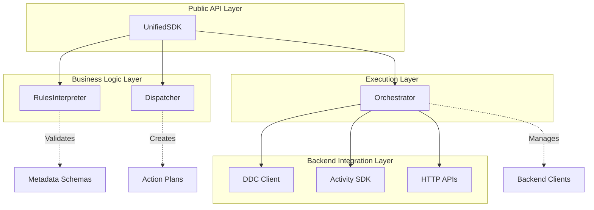

# Unified SDK Components

## Overview

The Unified SDK is built using a modular component architecture where each component has a specific responsibility and can be composed together to create powerful data ingestion workflows. This document provides detailed information about each component, their interfaces, and how they work together.

## Component Hierarchy



## Core Components

### UnifiedSDK

**File**: `src/UnifiedSDK.ts` (606 lines)

The main entry point that orchestrates all data ingestion operations.

#### Key Responsibilities

1. **Data Type Auto-Detection**: Automatically identifies data types based on payload structure
2. **Component Orchestration**: Coordinates interactions between all other components
3. **Lifecycle Management**: Handles initialization and cleanup of the entire system
4. **Response Aggregation**: Combines results from multiple operations into unified responses

#### Public Interface

```typescript
class UnifiedSDK {
  constructor(config: UnifiedSDKConfig);
  
  // Core methods
  async initialize(): Promise<void>;
  async writeData(payload: any, options?: WriteOptions): Promise<UnifiedResponse>;
  getStatus(): SDKStatus;
  async cleanup(): Promise<void>;
}
```

#### Data Type Detection

The SDK uses sophisticated pattern matching to detect data types:

```typescript
private detectDataType(payload: any): string {
  // Telegram Events
  if (payload.eventType && payload.userId && payload.timestamp) {
    return 'telegram_event';
  }
  
  // Telegram Messages
  if (payload.messageId && payload.chatId && payload.userId && payload.messageType) {
    return 'telegram_message';
  }
  
  // Bullish Campaign Events
  if (payload.eventType && payload.campaignId && payload.accountId) {
    const bullishEventTypes = ['SEGMENT_WATCHED', 'QUESTION_ANSWERED', 'JOIN_CAMPAIGN', 'CUSTOM_EVENTS'];
    if (bullishEventTypes.includes(payload.eventType)) {
      return 'bullish_campaign';
    }
  }
  
  // Nightingale Data Types
  if (this.isNightingaleVideoStream(payload)) return 'nightingale_video_stream';
  if (this.isNightingaleKLVData(payload)) return 'nightingale_klv_data';
  if (this.isNightingaleTelemetry(payload)) return 'nightingale_telemetry';
  if (this.isNightingaleFrameAnalysis(payload)) return 'nightingale_frame_analysis';
  
  // Legacy drone data (backward compatibility)
  if (payload.droneId && payload.telemetry) return 'drone_telemetry';
  if (payload.droneId && payload.videoChunk) return 'drone_video';
  
  return 'generic';
}
```

#### Metadata Creation

Each data type gets specific metadata defaults:

```typescript
private createMetadataForPayload(payload: any, options?: WriteOptions): UnifiedMetadata {
  const dataType = this.detectDataType(payload);
  
  switch (dataType) {
    case 'bullish_campaign':
      return {
        processing: {
          dataCloudWriteMode: 'direct', // CID tracking for quests
          indexWriteMode: 'realtime',   // Real-time analytics
          priority: 'high',             // Campaign events are important
        },
        userContext: {
          source: 'bullish',
          accountId: payload.accountId,
          campaignId: payload.campaignId,
          eventType: payload.eventType,
        },
        traceId: this.generateTraceId(dataType, payload),
      };
      
    case 'nightingale_video_stream':
      return {
    processing: {
          dataCloudWriteMode: 'direct', // Direct storage for video chunks
          indexWriteMode: 'skip',       // Skip indexing for large video data
          priority: 'normal',
        },
        userContext: {
          source: 'nightingale',
          dataType: 'video_stream',
          droneId: payload.droneId,
          streamId: payload.streamId,
          streamType: payload.videoMetadata.streamType,
        },
        traceId: this.generateTraceId(dataType, payload),
      };
      
    // ... other data types
  }
}
```

### RulesInterpreter

**File**: `src/RulesInterpreter.ts` (221 lines)

The business logic engine that validates metadata and extracts processing rules.

#### Key Responsibilities

1. **Metadata Validation**: Uses Zod schemas for runtime validation
2. **Rule Extraction**: Converts metadata into actionable processing rules
3. **Business Logic Enforcement**: Applies routing decisions and constraints
4. **Rule Optimization**: Context-based optimization of processing rules

#### Core Interface

```typescript
class RulesInterpreter {
  constructor(logger?: LoggerFunction);
  
  validateMetadata(metadata: any): UnifiedMetadata;
  extractProcessingRules(metadata: UnifiedMetadata): ProcessingRules;
  optimizeProcessingRules(rules: ProcessingRules, context?: any): ProcessingRules;
}
```

#### Processing Rules Structure

```typescript
interface ProcessingRules {
  dataCloudAction: 'write_direct' | 'write_batch' | 'write_via_index' | 'skip';
  indexAction: 'write_realtime' | 'skip';
  batchingRequired: boolean;
    additionalParams: {
    priority: 'low' | 'normal' | 'high';
    ttl?: number;
    encryption: boolean;
    batchOptions?: {
      maxSize: number;
      maxWaitTime: number;
    };
  };
}
```

#### Rule Optimization Logic

```typescript
optimizeProcessingRules(rules: ProcessingRules, context?: any): ProcessingRules {
  // Payload size-based optimization
  if (context?.payloadSize && rules.batchingRequired) {
    const payloadSize = context.payloadSize;
    if (payloadSize > 1024 * 1024) { // 1MB
      optimizedRules.additionalParams.batchOptions = {
        maxSize: Math.max(1, Math.floor(1000 / (payloadSize / (1024 * 1024)))),
        maxWaitTime: rules.additionalParams.batchOptions?.maxWaitTime || 5000,
      };
    }
  }

  // Priority-based timeout optimization
  if (rules.additionalParams.priority === 'high' && rules.batchingRequired) {
    optimizedRules.additionalParams.batchOptions = {
      maxSize: optimizedRules.additionalParams.batchOptions?.maxSize || 1000,
      maxWaitTime: Math.floor((rules.additionalParams.batchOptions.maxWaitTime || 5000) * 0.5),
    };
  }
  
  return optimizedRules;
}
```

#### Validation and Error Handling

```typescript
validateMetadata(metadata: any): UnifiedMetadata {
  try {
    const validated = MetadataSchema.parse(metadata);
    
    // Business rule validation
    if (validated.processing.dataCloudWriteMode === 'skip' && 
        validated.processing.indexWriteMode === 'skip') {
      throw new UnifiedSDKError(
        'Both data cloud and index actions cannot be skip - data must go somewhere',
        'INVALID_RULE_COMBINATION',
        'RulesInterpreter'
      );
    }
    
    return validated;
  } catch (error) {
    if (error instanceof z.ZodError) {
      throw new ValidationError('Invalid metadata provided', error);
    }
    throw error;
  }
}
```

### Dispatcher

**File**: `src/Dispatcher.ts` (472 lines)

The command pattern implementation that routes requests and creates execution plans.

#### Key Responsibilities

1. **Request Routing**: Routes requests based on processing rules
2. **Action Creation**: Creates concrete actions for backend systems
3. **Payload Transformation**: Adapts payloads for different backend APIs
4. **Execution Planning**: Determines parallel vs sequential execution

#### Core Interface

```typescript
class Dispatcher {
  constructor(logger?: LoggerFunction);
  
  routeRequest(payload: any, rules: ProcessingRules): DispatchPlan;
}
```

#### Action and Plan Structures

```typescript
interface Action {
  target: 'ddc-client' | 'activity-sdk' | 'http-api';
  method: string;
  payload: any;
  options: Record<string, any>;
  priority: 'low' | 'normal' | 'high';
}

interface DispatchPlan {
  actions: Action[];
  executionMode: 'sequential' | 'parallel';
  rollbackRequired: boolean;
}
```

#### Data Cloud Action Creation

```typescript
private createDataCloudAction(payload: any, rules: ProcessingRules): Action | null {
  switch (rules.dataCloudAction) {
    case 'write_direct':
      return {
        target: 'ddc-client',
        method: 'store',
        payload: this.transformPayloadForDDC(payload),
        options: {
          encryption: rules.additionalParams.encryption,
          ttl: rules.additionalParams.ttl,
          // Bullish campaign specific options
          ...(this.isBullishCampaign(payload) && {
            campaignTracking: true,
            campaignId: payload.campaignId,
          }),
        },
      priority: rules.additionalParams.priority,
  };

    case 'write_batch':
  return {
        target: 'ddc-client',
        method: 'storeBatch',
        payload: this.transformPayloadForDDC(payload),
    options: {
          batchOptions: rules.additionalParams.batchOptions,
          encryption: rules.additionalParams.encryption,
    },
        priority: rules.additionalParams.priority,
      };
      
    case 'write_via_index':
      // Data will be written via index, so no direct DDC action needed
      return null;
      
    case 'skip':
      return null;
  }
}
```

#### Payload Transformations

The Dispatcher transforms payloads for different backends:

```typescript
// DDC transformations
private transformPayloadForDDC(payload: any): any {
  if (this.isTelegramEvent(payload)) {
    return {
      data: JSON.stringify(payload),
      links: [], // Could add links to previous events
    };
  }
  
  if (this.isBullishCampaign(payload)) {
    return {
      data: JSON.stringify(payload),
      links: [],
      metadata: {
        type: 'bullish_campaign',
        campaignId: payload.campaignId,
        eventType: payload.eventType,
        accountId: payload.accountId,
      },
    };
  }
  
  if (this.isNightingaleVideoStream(payload)) {
    return {
      data: JSON.stringify({
        droneId: payload.droneId,
        streamId: payload.streamId,
        videoMetadata: payload.videoMetadata,
        timestamp: payload.timestamp,
      }),
      chunks: payload.chunks.map((chunk: any) => ({
        id: chunk.chunkId,
        data: chunk.data,
        startTime: chunk.startTime,
        endTime: chunk.endTime,
      })),
      metadata: {
        type: 'nightingale_video_stream',
        droneId: payload.droneId,
        streamId: payload.streamId,
        streamType: payload.videoMetadata.streamType,
        chunkCount: payload.chunks.length,
      },
    };
  }
}

// Activity SDK transformations
private transformPayloadForActivity(payload: any): any {
  if (this.isBullishCampaign(payload)) {
    return {
      type: 'bullish.campaign',
      userId: payload.accountId,
      campaignId: payload.campaignId,
      eventType: payload.eventType,
      data: payload.payload,
      timestamp: payload.timestamp,
      metadata: {
        questId: payload.payload?.questId,
        points: payload.payload?.points,
      },
    };
  }
  
  if (this.isNightingaleKLVData(payload)) {
    return {
      type: 'nightingale.klv',
      droneId: payload.droneId,
      streamId: payload.streamId,
      timestamp: payload.timestamp,
      data: payload.klvMetadata,
      metadata: {
        coordinates: payload.klvMetadata.frameCenter,
        missionId: payload.klvMetadata.missionId,
        chunkCid: payload.chunkCid,
        pts: payload.pts,
      },
    };
  }
}
```

### Orchestrator

**File**: `src/Orchestrator.ts` (558 lines)

The execution engine that manages complex workflows across multiple backend systems.

#### Key Responsibilities

1. **Backend Client Management**: Initialize and manage DDC and Activity SDK clients
2. **Action Execution**: Execute actions in parallel or sequential mode
3. **Error Handling**: Comprehensive error handling with fallback mechanisms
4. **Resource Management**: Cleanup and connection management

#### Core Interface

```typescript
class Orchestrator {
  constructor(config: UnifiedSDKConfig, logger?: LoggerFunction);
  
  async initialize(): Promise<void>;
  async execute(plan: DispatchPlan): Promise<OrchestrationResult>;
  async cleanup(): Promise<void>;
}
```

#### Backend Initialization

```typescript
async initialize(): Promise<void> {
  // DDC Client initialization
  const networkConfig = this.config.ddcConfig.network === 'devnet'
    ? 'wss://archive.devnet.cere.network/ws'
    : 'wss://rpc.testnet.cere.network/ws';

    this.ddcClient = await DdcClient.create(this.config.ddcConfig.signer, {
    blockchain: networkConfig,
    logLevel: this.config.logging.level === 'debug' ? 'debug' : 'silent',
    });

  // Activity SDK initialization with UriSigner
    if (this.config.activityConfig) {
    const { EventDispatcher } = await import('@cere-activity-sdk/events');
    const { UriSigner } = await import('@cere-activity-sdk/signers');
    const { NoOpCipher } = await import('@cere-activity-sdk/ciphers');

    const signer = new UriSigner(this.config.activityConfig.keyringUri || '//Alice', {
      type: 'ed25519', // Event Service compatibility
    });

    this.activityClient = new EventDispatcher(signer, cipher, {
      baseUrl: this.config.activityConfig.endpoint,
      appId: this.config.activityConfig.appId,
      // ... other configuration
    });
  }
}
```

#### Execution Modes

```typescript
async execute(plan: DispatchPlan): Promise<OrchestrationResult> {
  let results: ExecutionResult[];

  if (plan.executionMode === 'parallel') {
    results = await this.executeParallel(plan.actions);
  } else {
      results = await this.executeSequential(plan.actions);
    }

    return {
      results,
    overallStatus: this.determineOverallStatus(results),
    totalExecutionTime: Date.now() - startTime,
    transactionId: this.generateTransactionId(),
  };
}

private async executeParallel(actions: Action[]): Promise<ExecutionResult[]> {
  const promises = actions.map(action => this.executeAction(action));
  return Promise.all(promises);
}

private async executeSequential(actions: Action[]): Promise<ExecutionResult[]> {
  const results: ExecutionResult[] = [];

  for (const action of actions) {
    const result = await this.executeAction(action);
    results.push(result);
    
    // Stop execution if a critical action fails
    if (!result.success && this.isCriticalAction(action)) {
        break;
    }
  }

  return results;
}
```

#### DDC Action Execution

```typescript
private async executeDDCAction(action: Action): Promise<any> {
  switch (action.method) {
    case 'store': {
      let cid: any;
      
      if (action.payload.data && typeof action.payload.data === 'string') {
        // DagNode for structured data
        const { DagNode } = await import('@cere-ddc-sdk/ddc-client');
        const dagNode = new DagNode(action.payload.data, action.payload.links || []);
        cid = await this.ddcClient.store(this.config.ddcConfig.bucketId, dagNode);
      } else if (Buffer.isBuffer(action.payload.data)) {
        // File for binary data
        const { File } = await import('@cere-ddc-sdk/ddc-client');
        const file = new File(action.payload.data, action.payload.metadata || {});
        cid = await this.ddcClient.store(this.config.ddcConfig.bucketId, file);
      } else {
        // JSON serialization fallback
        const { DagNode } = await import('@cere-ddc-sdk/ddc-client');
        const jsonData = JSON.stringify(action.payload.data || action.payload);
        const dagNode = new DagNode(jsonData, []);
        cid = await this.ddcClient.store(this.config.ddcConfig.bucketId, dagNode);
      }

      return {
        cid: cid.toString(),
        bucketId: this.config.ddcConfig.bucketId,
        status: 'stored',
        timestamp: new Date().toISOString(),
        size: this.estimateDataSize(action.payload),
      };
    }
    
    case 'storeBatch': {
      // Route batch requests through Activity SDK
      const batchAction: Action = {
        target: 'activity-sdk',
        method: 'sendEvent',
        payload: {
          ...action.payload,
          _batchMode: true,
          _batchOptions: action.options.batchOptions,
        },
        options: { ...action.options, writeToDataCloud: false },
        priority: action.priority,
      };
      
      return await this.executeActivityAction(batchAction);
    }
  }
}
```

#### Activity SDK Integration

```typescript
private async executeActivityAction(action: Action): Promise<any> {
  if (!this.activityClient) {
    // Graceful degradation - return mock response
    return {
      eventId: this.generateEventId(),
      status: 'skipped',
      reason: 'Activity SDK not initialized',
      timestamp: new Date().toISOString(),
    };
  }

  switch (action.method) {
    case 'sendEvent': {
      const { ActivityEvent } = await import('@cere-activity-sdk/events');
      
      const activityEvent = new ActivityEvent(
        action.payload.type || 'generic.event',
        action.payload.data || action.payload,
        {
          time: action.payload.timestamp ? new Date(action.payload.timestamp) : new Date(),
        }
      );
      
      const success = await this.activityClient.dispatchEvent(activityEvent);

      return {
        eventId: activityEvent.id,
        status: success ? 'sent' : 'failed',
        timestamp: activityEvent.time.toISOString(),
        success,
      };
    }
  }
}
```

#### Campaign-Specific Logic

```typescript
private async processCampaignSpecificLogic(action: Action, response: any): Promise<void> {
  try {
    // Quest-specific processing
    if (action.options?.questTracking && action.payload?.payload?.questId) {
      await this.processQuestUpdate(action.payload, response);
    }

    // Campaign-specific processing
    if (action.options?.campaignTracking && action.options?.campaignId) {
      await this.updateCampaignMetrics(action.payload, response);
    }
  } catch (error) {
    // Log error but don't fail the main action
    this.logger('warn', 'Campaign-specific processing failed', {
      campaignId: action.options?.campaignId,
      questId: action.payload?.payload?.questId,
      error: error instanceof Error ? error.message : String(error),
    });
  }
}
```

## Data Type Support Components

### Type Guards and Detection

Each data type has specific type guard functions:

   ```typescript
// Nightingale type guards
private isNightingaleVideoStream(payload: any): boolean {
  return !!(
    payload.droneId &&
    payload.streamId &&
    payload.videoMetadata &&
    Array.isArray(payload.chunks) &&
    payload.chunks.length > 0 &&
    payload.chunks[0].chunkId
  );
}

private isNightingaleKLVData(payload: any): boolean {
  return !!(
    payload.droneId &&
    payload.streamId &&
    payload.klvMetadata &&
    payload.klvMetadata.platform &&
    payload.klvMetadata.sensor &&
    payload.klvMetadata.frameCenter &&
    typeof payload.pts === 'number'
  );
}

private isNightingaleTelemetry(payload: any): boolean {
  return !!(
    payload.droneId &&
    payload.telemetryData &&
    payload.coordinates &&
    payload.coordinates.latitude !== undefined &&
    payload.coordinates.longitude !== undefined &&
    payload.telemetryData.gps &&
    payload.telemetryData.orientation
  );
}

private isNightingaleFrameAnalysis(payload: any): boolean {
  return !!(
    payload.droneId &&
    payload.streamId &&
    payload.frameId &&
    payload.frameData &&
    payload.frameData.base64EncodedData &&
    payload.analysisResults &&
    payload.analysisResults.objects &&
    typeof payload.pts === 'number'
  );
}

// Bullish campaign type guard
private isBullishCampaign(payload: any): boolean {
  return !!(
    payload.eventType &&
    payload.campaignId &&
    payload.accountId &&
    ['SEGMENT_WATCHED', 'QUESTION_ANSWERED', 'JOIN_CAMPAIGN', 'CUSTOM_EVENTS']
      .includes(payload.eventType)
  );
}
```

## Error Handling Components

### Error Classes

   ```typescript
class UnifiedSDKError extends Error {
  constructor(
    message: string,
    public code: string,
    public component: string,
    public recoverable: boolean = false,
    public originalError?: Error,
  ) {
    super(message);
    this.name = 'UnifiedSDKError';
  }
}

class ValidationError extends UnifiedSDKError {
  constructor(
    message: string,
    public validationErrors: z.ZodError,
  ) {
    super(message, 'VALIDATION_ERROR', 'RulesInterpreter', false);
  }
}
```

### Fallback Mechanisms

Each component implements graceful degradation:

1. **Activity SDK Fallback**: If Activity SDK fails, operations continue with DDC only
2. **DDC Fallback**: If DDC fails but Activity SDK succeeds, partial success is reported
3. **Validation Fallback**: Invalid metadata is rejected with clear error messages

## Configuration Components

### Configuration Schema Validation

   ```typescript
// Core schemas
export const DataCloudWriteModeSchema = z.enum(['direct', 'batch', 'viaIndex', 'skip']);
export const IndexWriteModeSchema = z.enum(['realtime', 'skip']);

export const ProcessingMetadataSchema = z.object({
  dataCloudWriteMode: DataCloudWriteModeSchema,
  indexWriteMode: IndexWriteModeSchema,
  priority: z.enum(['low', 'normal', 'high']).optional(),
  ttl: z.number().min(0).optional(),
  encryption: z.boolean().optional(),
  batchOptions: z.object({
    maxSize: z.number().min(1).optional(),
    maxWaitTime: z.number().min(0).optional(),
  }).optional(),
});

// Data type schemas
export const BullishCampaignEventSchema = z.object({
  eventType: z.enum(['SEGMENT_WATCHED', 'QUESTION_ANSWERED', 'JOIN_CAMPAIGN', 'CUSTOM_EVENTS']),
  accountId: z.string(),
  campaignId: z.string(),
  timestamp: z.date(),
  payload: z.record(z.any()),
});

export const NightingaleVideoStreamSchema = z.object({
  droneId: z.string(),
  streamId: z.string(),
  timestamp: z.date(),
  videoMetadata: z.object({
    duration: z.number(),
    fps: z.number(),
    resolution: z.string(),
    codec: z.string(),
    streamType: z.enum(['thermal', 'rgb']).optional(),
  }),
  chunks: z.array(z.object({
    chunkId: z.string(),
    startTime: z.number(),
    endTime: z.number(),
    data: z.union([z.instanceof(Buffer), z.string()]),
    offset: z.number().optional(),
    size: z.number().optional(),
  })),
});
```

## Logging and Monitoring Components

### Logger Implementation

   ```typescript
private createLogger(): (level: string, message: string, ...args: any[]) => void {
  const logLevel = this.config.logging.level;
  const enableMetrics = this.config.logging.enableMetrics;
  const logRequests = this.config.logging.logRequests;

  const logLevels = { debug: 0, info: 1, warn: 2, error: 3 };
  const currentLevel = logLevels[logLevel] || 1;

  return (level: string, message: string, ...args: any[]) => {
    const messageLevel = logLevels[level as keyof typeof logLevels] || 1;

    if (messageLevel >= currentLevel) {
      const timestamp = new Date().toISOString();
      const logMessage = `[${timestamp}] [UnifiedSDK:${level.toUpperCase()}] ${message}`;

      if (level === 'error') {
        console.error(logMessage, ...args);
      } else if (level === 'warn') {
        console.warn(logMessage, ...args);
      } else {
        console.log(logMessage, ...args);
      }

      // Request logging for debugging
      if (logRequests && level === 'debug') {
        // Enhanced request logging
      }

      // Metrics collection
      if (enableMetrics) {
        // Implement metrics collection
      }
    }
  };
}
```

## Component Integration Patterns

### Initialization Pattern

```typescript
// SDK initialization coordinates all components
async initialize(): Promise<void> {
  if (this.initialized) return;

try {
    // Initialize orchestrator (which initializes backend clients)
    await this.orchestrator.initialize();
    
    // All other components are stateless and don't need initialization
    this.initialized = true;
    
    this.logger('info', 'UnifiedSDK initialized successfully');
  } catch (error) {
    this.logger('error', 'Failed to initialize UnifiedSDK', error);
    throw error;
  }
}
```

### Data Flow Pattern

```typescript
// Main data flow through components
async writeData(payload: any, options?: WriteOptions): Promise<UnifiedResponse> {
  const startTime = Date.now();
  
  try {
    // 1. Data type detection (UnifiedSDK)
    const metadata = this.createMetadataForPayload(payload, options);
    
    // 2. Validation and rule extraction (RulesInterpreter)
    const validatedMetadata = this.rulesInterpreter.validateMetadata(metadata);
    const rules = this.rulesInterpreter.extractProcessingRules(validatedMetadata);
    const optimizedRules = this.rulesInterpreter.optimizeProcessingRules(rules, {
      payloadSize: this.estimatePayloadSize(payload),
    });
    
    // 3. Request routing and action creation (Dispatcher)
    const plan = this.dispatcher.routeRequest(payload, optimizedRules);
    
    // 4. Action execution (Orchestrator)
    const orchestrationResult = await this.orchestrator.execute(plan);
    
    // 5. Response transformation (UnifiedSDK)
    return this.createUnifiedResponse(orchestrationResult, startTime);
  } catch (error) {
    this.logger('error', 'Unified data ingestion failed', error);
    throw error;
  }
}
```

### Error Propagation Pattern

```typescript
// Errors bubble up through components with context
try {
  // Component operation
} catch (error) {
  if (error instanceof UnifiedSDKError) {
    // Re-throw with additional context
    throw new UnifiedSDKError(
      `${this.constructor.name}: ${error.message}`,
      error.code,
      error.component,
      error.recoverable,
      error
    );
  }
  
  // Wrap unknown errors
  throw new UnifiedSDKError(
    `Unexpected error in ${this.constructor.name}`,
    'UNEXPECTED_ERROR',
    this.constructor.name,
    true,
    error as Error
  );
}
```

## Component Extension Points

### Adding New Data Types

1. **Add Type Interface**: Define TypeScript interface and Zod schema
2. **Add Type Guard**: Implement detection function
3. **Update UnifiedSDK**: Add detection logic and metadata defaults
4. **Update Dispatcher**: Add payload transformations
5. **Add Tests**: Comprehensive test coverage

### Adding New Backends

1. **Create Client Wrapper**: Implement backend client integration
2. **Update Orchestrator**: Add execution logic for new backend
3. **Update Dispatcher**: Add action creation for new backend
4. **Update Configuration**: Add configuration options

### Performance Optimization

1. **Connection Pooling**: Reuse connections across operations
2. **Batch Optimization**: Intelligent batching based on data type and size
3. **Parallel Execution**: Execute independent operations concurrently
4. **Memory Management**: Stream large payloads and cleanup resources

This component architecture provides a solid foundation for extensible, maintainable, and performant data ingestion across multiple ecosystems.
