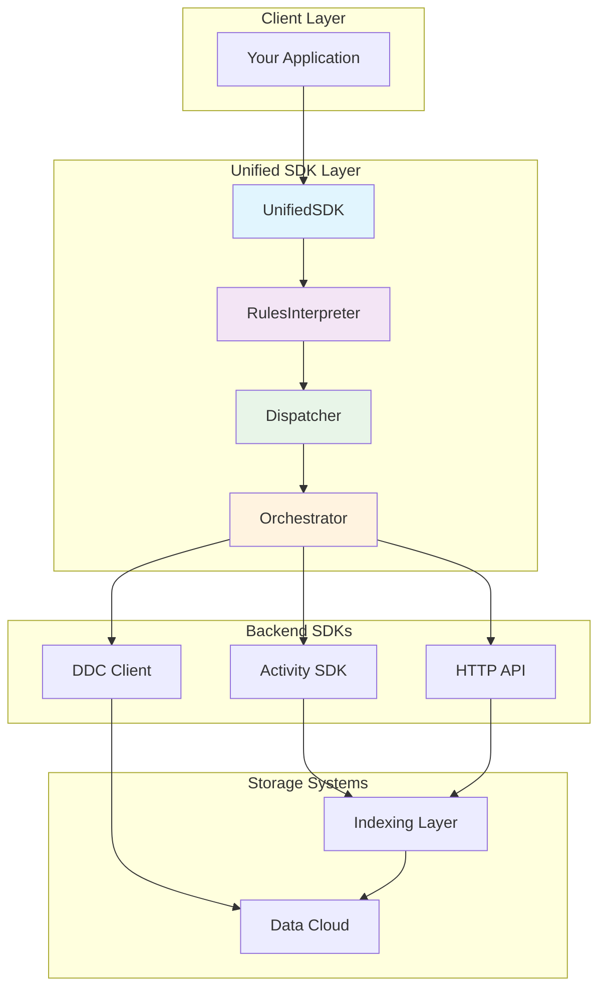
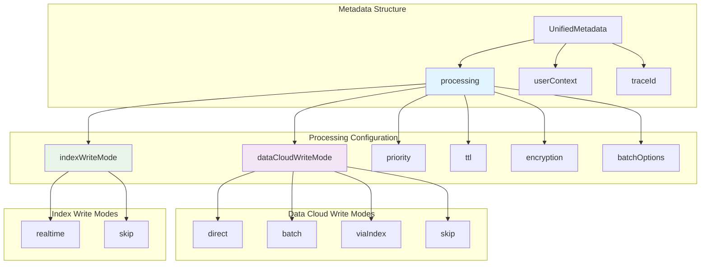
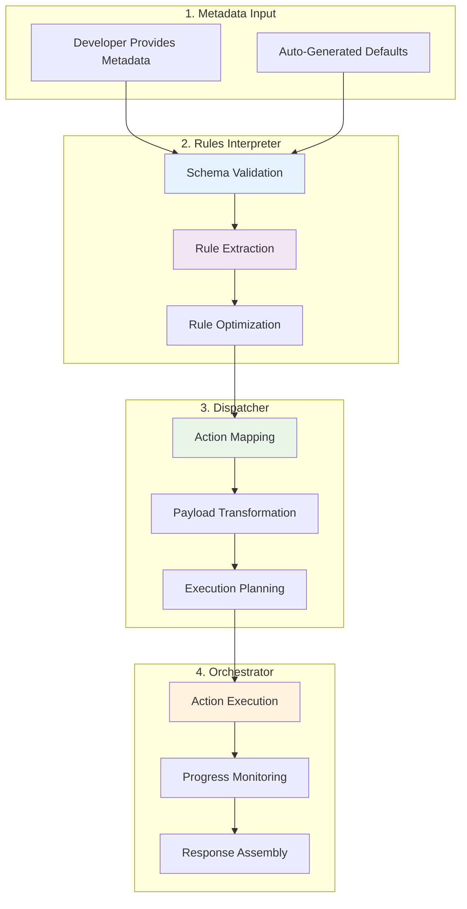
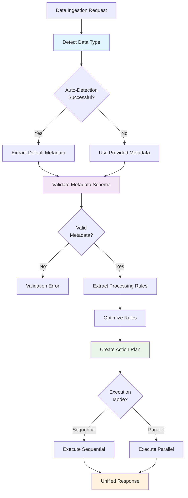
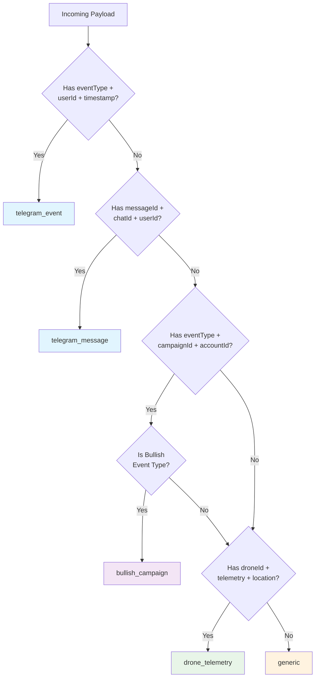
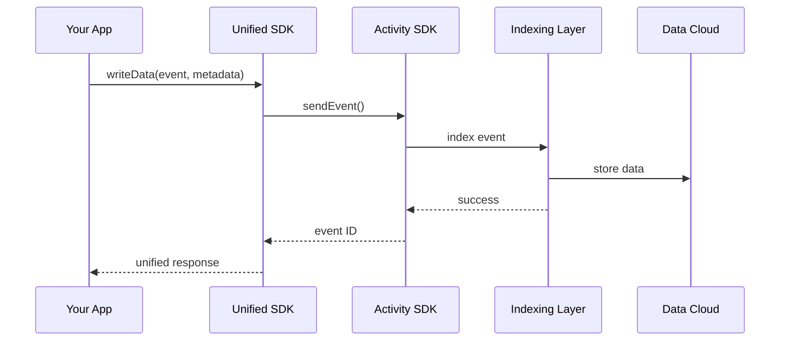
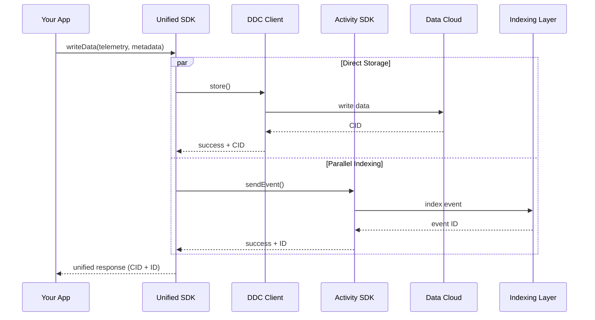
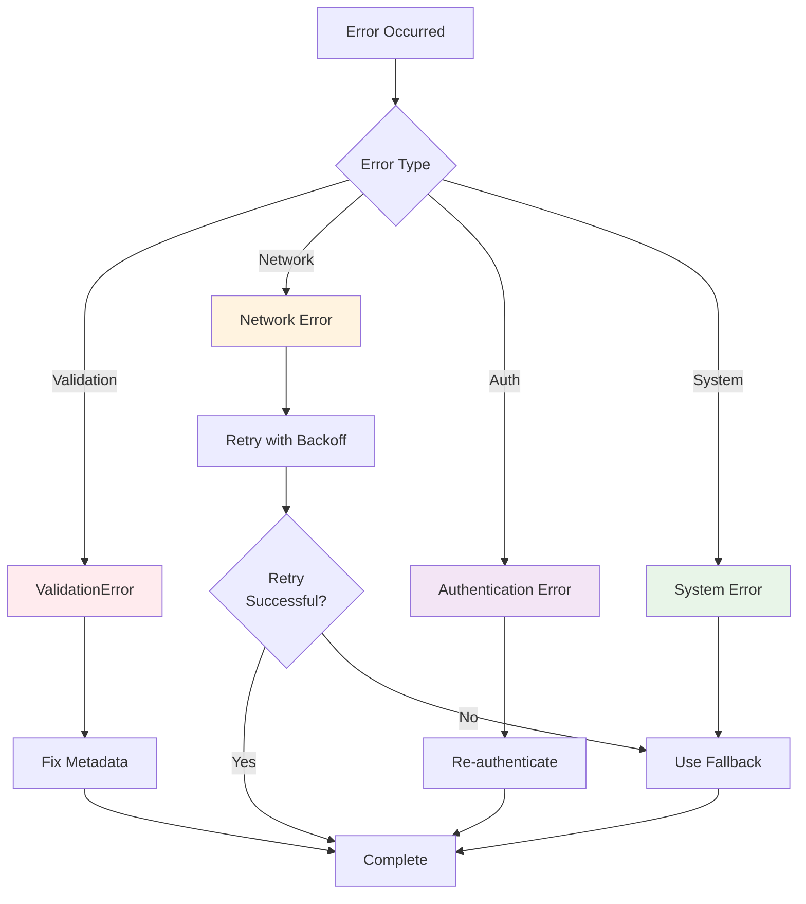
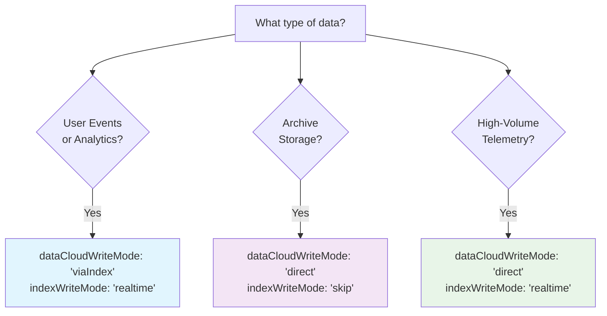

# Unified SDK Developer Guide

## Table of Contents

1. [Introduction](#introduction)
2. [Architecture Overview](#architecture-overview)
3. [Getting Started](#getting-started)
4. [Metadata Routing System](#metadata-routing-system)
5. [Configuration Guide](#configuration-guide)
6. [Data Type Detection](#data-type-detection)
7. [Use Case Patterns](#use-case-patterns)
8. [Advanced Features](#advanced-features)
9. [Error Handling](#error-handling)
10. [Performance Optimization](#performance-optimization)
11. [Migration Guide](#migration-guide)
12. [Troubleshooting](#troubleshooting)
13. [API Reference](#api-reference)

## Introduction

The Unified SDK provides a single, consistent interface for all data ingestion operations in the Cere ecosystem. Instead of choosing between multiple SDKs (Data Cloud SDK, Activity SDK, HTTP API), developers use one unified interface that automatically routes data to the appropriate backend systems based on metadata configuration.

### Key Benefits

- **Single Interface**: One SDK replaces three different APIs
- **Metadata-Driven**: Declarative routing based on processing requirements
- **Automatic Detection**: Smart data type detection with manual override options
- **Backward Compatible**: Preserves all existing functionality
- **Production Ready**: Comprehensive error handling, logging, and monitoring

### Supported Data Types

- **Telegram Events**: Mini-app interactions, quest completions, user actions
- **Telegram Messages**: Chat messages, media, documents
- **Bullish Campaigns**: Video segments, quiz answers, campaign participation
- **Drone Telemetry**: Location data, sensor readings, flight metrics
- **Custom Data**: Any structured data with flexible routing

## Architecture Overview

The Unified SDK implements a 4-layer architecture that abstracts complexity while preserving performance:



### Component Responsibilities

1. **UnifiedSDK**: Single entry point, data type detection, response unification
2. **RulesInterpreter**: Metadata validation, processing rule extraction
3. **Dispatcher**: Action creation, routing logic, payload transformation
4. **Orchestrator**: Multi-system execution, error handling, transaction management

## Getting Started

### Installation

```bash
npm install @cere-ddc-sdk/unified
```

### Basic Setup

```typescript
import { UnifiedSDK } from '@cere-ddc-sdk/unified';

const sdk = new UnifiedSDK({
  ddcConfig: {
    signer: '//Alice', // or your private key/mnemonic
    bucketId: BigInt(12345),
    network: 'testnet' // 'testnet' | 'devnet' | 'mainnet'
  },
  activityConfig: {
    keyringUri: '//Alice',
    appId: 'my-app',
    endpoint: 'https://api.stats.cere.network'
  },
  processing: {
    enableBatching: true,
    defaultBatchSize: 100,
    defaultBatchTimeout: 5000,
    maxRetries: 3,
    retryDelay: 1000
  },
  logging: {
    level: 'info',
    enableMetrics: true
  }
});

// Initialize the SDK
await sdk.initialize();
```

### Your First Data Write

```typescript
// Simple data write with automatic detection
const result = await sdk.writeData({
  eventType: 'quest_completed',
  userId: 'user123',
  questId: 'daily_login',
  timestamp: new Date()
});

console.log('Transaction ID:', result.transactionId);
console.log('Data Cloud Hash:', result.dataCloudHash);
console.log('Index ID:', result.indexId);
```

## Metadata Routing System

The metadata routing system is the core innovation of the Unified SDK. It uses declarative metadata to determine how and where data should be processed and stored.

### Metadata Schema



### How Metadata Routing Works

The Unified SDK uses a sophisticated metadata routing system that transforms declarative configuration into concrete actions. Here's the detailed flow:



### Metadata Processing Rules

The system applies these rules in order:

1. **Schema Validation**: Ensures metadata follows the correct structure
2. **Business Rule Validation**: Prevents invalid combinations (e.g., both modes 'skip')
3. **Default Application**: Fills in missing optional fields with sensible defaults
4. **Optimization**: Adjusts rules based on payload characteristics and system state
5. **Action Generation**: Creates specific actions for backend systems

### Routing Decision Matrix

This matrix shows all valid combinations and their resulting actions:

| dataCloudWriteMode | indexWriteMode | DDC Action | Activity Action | Use Case |
|-------------------|----------------|------------|-----------------|----------|
| `direct` | `realtime` | Direct Write | Send Event | High-priority data with parallel processing |
| `direct` | `skip` | Direct Write | None | Archive-only storage |
| `batch` | `realtime` | Batch Write | Send Event | High-volume data with indexing |
| `batch` | `skip` | Batch Write | None | Bulk archive operations |
| `viaIndex` | `realtime` | None | Send Event (with DDC) | Standard event processing |
| `skip` | `realtime` | None | Send Event | Analytics-only events |

### Processing Modes Explained

#### Data Cloud Write Modes

| Mode | Description | Use Case | Performance |
|------|-------------|----------|-------------|
| `direct` | Write immediately to Data Cloud | High-priority data, immediate storage needed | Fastest write |
| `batch` | Buffer and write in batches | High-volume data, optimize throughput | Highest throughput |
| `viaIndex` | Let Indexing Layer handle Data Cloud writes | Standard events, maintain processing chain | Balanced |
| `skip` | Don't write to Data Cloud | Temporary data, index-only storage | Lowest latency |

#### Index Write Modes

| Mode | Description | Use Case | Searchability |
|------|-------------|----------|---------------|
| `realtime` | Index immediately for search | User events, real-time analytics | Immediate |
| `skip` | Don't index data | Raw storage, non-searchable data | None |

### Routing Decision Flow



## Configuration Guide

### Complete Configuration Reference

```typescript
interface UnifiedSDKConfig {
  // DDC Client Configuration (Required)
  ddcConfig: {
    signer: string;              // Substrate URI or private key
    bucketId: bigint;            // Your DDC bucket ID
    clusterId?: bigint;          // Optional cluster ID
    network?: 'testnet' | 'devnet' | 'mainnet';
  };

  // Activity SDK Configuration (Optional)
  activityConfig?: {
    endpoint?: string;           // Event service endpoint
    keyringUri?: string;         // Signing key URI
    appId?: string;             // Your application ID
    connectionId?: string;       // Connection identifier
    sessionId?: string;         // Session identifier
    appPubKey?: string;         // Application public key
    dataServicePubKey?: string; // Data service public key
  };

  // Processing Configuration
  processing: {
    enableBatching: boolean;     // Enable batch processing
    defaultBatchSize: number;    // Items per batch
    defaultBatchTimeout: number; // Batch timeout (ms)
    maxRetries: number;         // Retry attempts
    retryDelay: number;         // Retry delay (ms)
  };

  // Logging Configuration
  logging: {
    level: 'debug' | 'info' | 'warn' | 'error';
    enableMetrics: boolean;     // Enable performance metrics
  };
}
```

### Environment-Specific Configurations

#### Development Configuration

```typescript
const devConfig: UnifiedSDKConfig = {
  ddcConfig: {
    signer: '//Alice',
    bucketId: BigInt(1),
    network: 'devnet'
  },
  activityConfig: {
    keyringUri: '//Alice',
    appId: 'dev-app',
    endpoint: 'https://api.dev.cere.network'
  },
  processing: {
    enableBatching: false,      // Disable for easier debugging
    defaultBatchSize: 10,
    defaultBatchTimeout: 1000,
    maxRetries: 1,
    retryDelay: 500
  },
  logging: {
    level: 'debug',             // Verbose logging
    enableMetrics: true
  }
};
```

#### Production Configuration

```typescript
const prodConfig: UnifiedSDKConfig = {
  ddcConfig: {
    signer: process.env.CERE_PRIVATE_KEY!,
    bucketId: BigInt(process.env.CERE_BUCKET_ID!),
    network: 'mainnet'
  },
  activityConfig: {
    keyringUri: process.env.CERE_KEYRING_URI!,
    appId: process.env.APP_ID!,
    endpoint: 'https://api.stats.cere.network'
  },
  processing: {
    enableBatching: true,       // Enable for performance
    defaultBatchSize: 1000,
    defaultBatchTimeout: 5000,
    maxRetries: 3,
    retryDelay: 2000
  },
  logging: {
    level: 'warn',              // Minimal logging
    enableMetrics: true
  }
};
```

## Data Type Detection

The Unified SDK automatically detects data types based on payload structure, but you can also specify types explicitly.

### Automatic Detection Rules



### Detection Examples

#### Telegram Event Detection

```typescript
// Automatically detected as 'telegram_event'
const telegramEvent = {
  eventType: 'quest_completed',
  userId: 'user123',
  chatId: 'chat456',
  timestamp: new Date(),
  eventData: {
    questId: 'daily_login',
    points: 100
  }
};
```

#### Bullish Campaign Detection

```typescript
// Automatically detected as 'bullish_campaign'
const campaignEvent = {
  eventType: 'SEGMENT_WATCHED',
  campaignId: 'summer2024',
  accountId: 'acc789',
  timestamp: new Date(),
  payload: {
    segmentId: 'intro_video',
    watchTime: 45,
    completed: true
  }
};
```

#### Manual Type Override

```typescript
// Force specific processing regardless of auto-detection
const result = await sdk.writeData(customPayload, {
  metadata: {
    processing: {
      dataCloudWriteMode: 'direct',
      indexWriteMode: 'realtime'
    }
  }
});
```

## Use Case Patterns

### Pattern 1: Real-time Events (Telegram, Campaigns)

**Use Case**: User interactions that need immediate indexing and eventual Data Cloud storage.

```typescript
// Metadata Configuration
const realtimeMetadata = {
  processing: {
    dataCloudWriteMode: 'viaIndex',  // Let indexing handle Data Cloud
    indexWriteMode: 'realtime',      // Index immediately
    priority: 'high'                 // High priority processing
  }
};

// Example: Telegram Quest Completion
const questResult = await sdk.writeData({
  eventType: 'quest_completed',
  userId: 'user123',
  questId: 'daily_challenge',
  points: 150,
  timestamp: new Date()
}, { metadata: realtimeMetadata });

// Example: Bullish Campaign Interaction
const campaignResult = await sdk.writeData({
  eventType: 'SEGMENT_WATCHED',
  campaignId: 'summer2024',
  accountId: 'acc789',
  payload: {
    segmentId: 'episode_1',
    watchTime: 120,
    completed: true
  },
  timestamp: new Date()
}, { metadata: realtimeMetadata });
```

**Data Flow**:


### Pattern 2: High-Volume Data Storage (Drone Telemetry)

**Use Case**: Large volumes of data that need direct storage with parallel indexing.

```typescript
// Metadata Configuration
const highVolumeMetadata = {
  processing: {
    dataCloudWriteMode: 'direct',    // Direct storage for speed
    indexWriteMode: 'realtime',      // Parallel indexing
    priority: 'normal',
    batchOptions: {
      maxSize: 500,                  // Batch size optimization
      maxWaitTime: 3000             // 3 second timeout
    }
  }
};

// Example: Drone Telemetry Batch
const telemetryBatch = [
  {
    droneId: 'drone_001',
    latitude: 40.7128,
    longitude: -74.0060,
    altitude: 150,
    speed: 25,
    timestamp: new Date()
  },
  // ... more telemetry points
];

for (const telemetry of telemetryBatch) {
  await sdk.writeData(telemetry, { metadata: highVolumeMetadata });
}
```

**Data Flow**:


### Pattern 3: Archive-Only Storage (Raw Data)

**Use Case**: Data that needs long-term storage but doesn't require indexing.

```typescript
// Metadata Configuration
const archiveMetadata = {
  processing: {
    dataCloudWriteMode: 'direct',    // Direct storage
    indexWriteMode: 'skip',          // No indexing needed
    encryption: true,                // Encrypt sensitive data
    ttl: 86400 * 365                // 1 year retention
  }
};

// Example: Raw Video File
const videoData = {
  filename: 'drone_footage_001.mp4',
  size: 1024 * 1024 * 500,         // 500MB
  checksum: 'sha256:abc123...',
  metadata: {
    duration: 1800,                 // 30 minutes
    resolution: '4K',
    codec: 'H.264'
  },
  timestamp: new Date()
};

const result = await sdk.writeData(videoData, { metadata: archiveMetadata });
console.log('Archive CID:', result.dataCloudHash);
```

### Pattern 4: Index-Only Events (Analytics)

**Use Case**: Temporary events for analytics that don't need permanent storage.

```typescript
// Metadata Configuration
const analyticsMetadata = {
  processing: {
    dataCloudWriteMode: 'skip',      // No permanent storage
    indexWriteMode: 'realtime',      // Index for analytics
    priority: 'low'                  // Low priority
  }
};

// Example: User Interaction Analytics
const analyticsEvent = {
  eventType: 'page_view',
  userId: 'user123',
  page: '/dashboard',
  duration: 45,
  timestamp: new Date()
};

const result = await sdk.writeData(analyticsEvent, { metadata: analyticsMetadata });
console.log('Analytics ID:', result.indexId);
// result.dataCloudHash will be undefined
```

### Pattern 5: Batch Processing (High Throughput)

**Use Case**: Processing large volumes of data efficiently with batching.

```typescript
// Metadata Configuration
const batchMetadata = {
  processing: {
    dataCloudWriteMode: 'batch',     // Batch writes
    indexWriteMode: 'realtime',      // Real-time indexing
    batchOptions: {
      maxSize: 1000,                 // 1000 items per batch
      maxWaitTime: 10000            // 10 second timeout
    }
  }
};

// Example: Bulk Event Processing
const events = generateLargeEventSet(); // 10,000 events

// Process in batches automatically
for (const event of events) {
  await sdk.writeData(event, { metadata: batchMetadata });
}

// SDK will automatically batch Data Cloud writes
// while maintaining real-time indexing
```

## Advanced Features

### Transaction Tracking

Every data write operation returns a unique transaction ID for tracking and debugging:

```typescript
const result = await sdk.writeData(payload);

console.log('Transaction ID:', result.transactionId);
console.log('Status:', result.status); // 'success' | 'partial' | 'failed'
console.log('Processing Time:', result.metadata.processingTime);
console.log('Actions Executed:', result.metadata.actionsExecuted);
```

### Custom Trace IDs

Provide your own trace IDs for correlation across systems:

```typescript
const result = await sdk.writeData(payload, {
  metadata: {
    traceId: 'custom-trace-123',
    processing: {
      dataCloudWriteMode: 'direct',
      indexWriteMode: 'realtime'
    }
  }
});
```

### User Context

Attach additional context that flows through the entire processing pipeline:

```typescript
const result = await sdk.writeData(payload, {
  metadata: {
    userContext: {
      userId: 'user123',
      sessionId: 'session456',
      clientVersion: '1.2.3',
      platform: 'web'
    },
    processing: {
      dataCloudWriteMode: 'direct',
      indexWriteMode: 'realtime'
    }
  }
});
```

### Performance Monitoring

Enable detailed performance metrics:

```typescript
const sdk = new UnifiedSDK({
  // ... other config
  logging: {
    level: 'info',
    enableMetrics: true
  }
});

// Metrics are automatically logged
const result = await sdk.writeData(payload);
console.log('Processing time:', result.metadata.processingTime);
```

### Comprehensive Metadata Configuration Examples

Here are detailed examples covering every possible metadata configuration scenario:

#### Example 1: Real-time Event Processing (Telegram/Campaign)

```typescript
const realtimeEventConfig = {
  processing: {
    dataCloudWriteMode: 'viaIndex',  // Let indexing layer handle DDC writes
    indexWriteMode: 'realtime',      // Immediate indexing for search
    priority: 'high',                // High priority processing
    encryption: false,               // No encryption needed for events
    ttl: 86400 * 30                 // 30 days retention
  },
  userContext: {
    userId: 'user123',
    sessionId: 'sess_456',
    appVersion: '2.1.0'
  },
  traceId: 'trace_realtime_001'
};

// Telegram Quest Completion
const questEvent = {
  eventType: 'quest_completed',
  userId: 'user123',
  questId: 'daily_challenge',
  points: 150,
  timestamp: new Date()
};

const result = await sdk.writeData(questEvent, { metadata: realtimeEventConfig });
```

#### Example 2: High-Volume Telemetry Data

```typescript
const telemetryConfig = {
  processing: {
    dataCloudWriteMode: 'direct',    // Direct write for performance
    indexWriteMode: 'realtime',      // Parallel indexing
    priority: 'normal',
    encryption: false,
    batchOptions: {
      maxSize: 500,                  // Optimize batch size
      maxWaitTime: 3000             // 3 second timeout
    }
  },
  userContext: {
    deviceId: 'drone_001',
    flightId: 'flight_789'
  }
};

// Drone Telemetry Stream
const telemetryPoints = [
  {
    droneId: 'drone_001',
    latitude: 40.7128,
    longitude: -74.0060,
    altitude: 150,
    speed: 25,
    batteryLevel: 85,
    timestamp: new Date()
  }
  // ... more points
];

for (const point of telemetryPoints) {
  await sdk.writeData(point, { metadata: telemetryConfig });
}
```

#### Example 3: Secure Archive Storage

```typescript
const secureArchiveConfig = {
  processing: {
    dataCloudWriteMode: 'direct',    // Direct storage
    indexWriteMode: 'skip',          // No indexing for security
    priority: 'low',                 // Low priority for archives
    encryption: true,                // Encrypt sensitive data
    ttl: 86400 * 365 * 7            // 7 years retention
  },
  userContext: {
    complianceLevel: 'high',
    dataClassification: 'confidential'
  },
  traceId: 'archive_secure_001'
};

// Sensitive Document
const document = {
  documentId: 'doc_001',
  content: 'Sensitive business data...',
  author: 'user123',
  classification: 'confidential',
  timestamp: new Date()
};

const result = await sdk.writeData(document, { metadata: secureArchiveConfig });
```

#### Example 4: Analytics-Only Events

```typescript
const analyticsConfig = {
  processing: {
    dataCloudWriteMode: 'skip',      // No permanent storage
    indexWriteMode: 'realtime',      // Index for analytics
    priority: 'low',                 // Low priority
    ttl: 86400 * 7                  // 7 days in index only
  },
  userContext: {
    analyticsSession: 'session_123',
    experimentGroup: 'A'
  }
};

// User Interaction Event
const interaction = {
  eventType: 'button_click',
  userId: 'user123',
  buttonId: 'cta_primary',
  page: '/dashboard',
  timestamp: new Date()
};

const result = await sdk.writeData(interaction, { metadata: analyticsConfig });
```

#### Example 5: Batch Processing with Mixed Priorities

```typescript
const batchMixedConfig = {
  processing: {
    dataCloudWriteMode: 'batch',     // Batch for efficiency
    indexWriteMode: 'realtime',      // Real-time indexing
    priority: 'normal',
    batchOptions: {
      maxSize: 1000,                 // Large batches
      maxWaitTime: 10000            // 10 second timeout
    }
  }
};

// Mixed Event Types
const events = [
  { eventType: 'page_view', userId: 'user1', page: '/home' },
  { eventType: 'purchase', userId: 'user2', amount: 99.99 },
  { eventType: 'signup', userId: 'user3', plan: 'premium' }
];

// Process with automatic batching
for (const event of events) {
  await sdk.writeData({
    ...event,
    timestamp: new Date()
  }, { metadata: batchMixedConfig });
}
```

### Building Patterns for Common Scenarios

#### Pattern: Multi-Tenant Data Isolation

```typescript
class TenantDataService {
  private sdk: UnifiedSDK;
  
  constructor(sdk: UnifiedSDK) {
    this.sdk = sdk;
  }
  
  async writeUserEvent(tenantId: string, userId: string, eventData: any) {
    const metadata = {
      processing: {
        dataCloudWriteMode: 'viaIndex',
        indexWriteMode: 'realtime',
        priority: 'normal'
      },
      userContext: {
        tenantId,
        userId,
        dataIsolation: 'tenant'
      },
      traceId: `tenant_${tenantId}_${Date.now()}`
    };
    
    return this.sdk.writeData({
      ...eventData,
      tenantId,
      userId,
      timestamp: new Date()
    }, { metadata });
  }
}
```

#### Pattern: Conditional Processing Based on Data Size

```typescript
async function smartDataWrite(sdk: UnifiedSDK, payload: any) {
  const payloadSize = JSON.stringify(payload).length;
  
  let metadata;
  
  if (payloadSize > 1024 * 1024) { // > 1MB
    // Large data: direct write, skip indexing
    metadata = {
      processing: {
        dataCloudWriteMode: 'direct',
        indexWriteMode: 'skip',
        priority: 'low',
        encryption: true
      }
    };
  } else if (payloadSize > 1024 * 10) { // > 10KB
    // Medium data: batch write with indexing
    metadata = {
      processing: {
        dataCloudWriteMode: 'batch',
        indexWriteMode: 'realtime',
        priority: 'normal',
        batchOptions: {
          maxSize: 100,
          maxWaitTime: 5000
        }
      }
    };
  } else {
    // Small data: standard processing
    metadata = {
      processing: {
        dataCloudWriteMode: 'viaIndex',
        indexWriteMode: 'realtime',
        priority: 'high'
      }
    };
  }
  
  return sdk.writeData(payload, { metadata });
}
```

#### Pattern: Retry with Degraded Service

```typescript
async function resilientWrite(sdk: UnifiedSDK, payload: any, maxRetries = 3) {
  const baseMetadata = {
    processing: {
      dataCloudWriteMode: 'viaIndex',
      indexWriteMode: 'realtime',
      priority: 'normal'
    }
  };
  
  for (let attempt = 1; attempt <= maxRetries; attempt++) {
    try {
      const result = await sdk.writeData(payload, { metadata: baseMetadata });
      
      if (result.status === 'success') {
        return result;
      } else if (result.status === 'partial' && attempt === maxRetries) {
        // Last attempt: try degraded mode (DDC only)
        const degradedMetadata = {
          processing: {
            dataCloudWriteMode: 'direct',
            indexWriteMode: 'skip',
            priority: 'high'
          }
        };
        
        return sdk.writeData(payload, { metadata: degradedMetadata });
      }
    } catch (error) {
      if (attempt === maxRetries) throw error;
      
      // Wait before retry with exponential backoff
      await new Promise(resolve => setTimeout(resolve, Math.pow(2, attempt) * 1000));
    }
  }
}
```

#### Pattern: Event Correlation and Tracing

```typescript
class EventCorrelationService {
  private sdk: UnifiedSDK;
  private correlationMap = new Map<string, string[]>();
  
  constructor(sdk: UnifiedSDK) {
    this.sdk = sdk;
  }
  
  async writeCorrelatedEvent(
    correlationId: string,
    eventData: any,
    parentEventId?: string
  ) {
    const traceId = `corr_${correlationId}_${Date.now()}`;
    
    const metadata = {
      processing: {
        dataCloudWriteMode: 'viaIndex',
        indexWriteMode: 'realtime',
        priority: 'normal'
      },
      userContext: {
        correlationId,
        parentEventId,
        eventChain: this.correlationMap.get(correlationId) || []
      },
      traceId
    };
    
    const result = await this.sdk.writeData({
      ...eventData,
      correlationId,
      parentEventId,
      timestamp: new Date()
    }, { metadata });
    
    // Track event in correlation chain
    if (!this.correlationMap.has(correlationId)) {
      this.correlationMap.set(correlationId, []);
    }
    this.correlationMap.get(correlationId)!.push(result.transactionId);
    
    return result;
  }
  
  getEventChain(correlationId: string): string[] {
    return this.correlationMap.get(correlationId) || [];
  }
}
```

#### Pattern: Dynamic Configuration Based on System Load

```typescript
class AdaptiveDataService {
  private sdk: UnifiedSDK;
  private systemLoad = 'normal'; // 'low' | 'normal' | 'high'
  
  constructor(sdk: UnifiedSDK) {
    this.sdk = sdk;
    this.monitorSystemLoad();
  }
  
  async writeData(payload: any, userPreferences?: any) {
    const metadata = this.getAdaptiveMetadata(userPreferences);
    return this.sdk.writeData(payload, { metadata });
  }
  
  private getAdaptiveMetadata(userPreferences?: any) {
    const base = {
      processing: {
        dataCloudWriteMode: 'viaIndex' as const,
        indexWriteMode: 'realtime' as const,
        priority: 'normal' as const
      }
    };
    
    // Adapt based on system load
    switch (this.systemLoad) {
      case 'high':
        return {
          processing: {
            dataCloudWriteMode: 'batch' as const,
            indexWriteMode: 'realtime' as const,
            priority: 'low' as const,
            batchOptions: {
              maxSize: 2000,
              maxWaitTime: 15000
            }
          }
        };
        
      case 'low':
        return {
          processing: {
            dataCloudWriteMode: 'direct' as const,
            indexWriteMode: 'realtime' as const,
            priority: 'high' as const
          }
        };
        
      default:
        return base;
    }
  }
  
  private monitorSystemLoad() {
    // Simulate system load monitoring
    setInterval(() => {
      const loads = ['low', 'normal', 'high'];
      this.systemLoad = loads[Math.floor(Math.random() * loads.length)];
    }, 30000); // Check every 30 seconds
  }
}
```

### Metadata Best Practices

#### 1. Always Provide User Context

```typescript
// Good: Rich context for debugging and analytics
const metadata = {
  processing: { /* ... */ },
  userContext: {
    userId: 'user123',
    sessionId: 'sess_456',
    clientVersion: '2.1.0',
    platform: 'web',
    feature: 'dashboard'
  }
};

// Avoid: Minimal context makes debugging difficult
const metadata = {
  processing: { /* ... */ }
};
```

#### 2. Use Meaningful Trace IDs

```typescript
// Good: Descriptive trace IDs
const traceId = `${operation}_${userId}_${timestamp}`;

// Better: Include correlation information
const traceId = `quest_completion_user123_${Date.now()}`;

// Best: Include business context
const traceId = `daily_quest_completion_user123_${questId}_${Date.now()}`;
```

#### 3. Configure TTL Based on Data Importance

```typescript
// Critical business data: Long retention
const criticalMetadata = {
  processing: {
    dataCloudWriteMode: 'direct',
    indexWriteMode: 'realtime',
    ttl: 86400 * 365 * 7 // 7 years
  }
};

// Analytics data: Medium retention
const analyticsMetadata = {
  processing: {
    dataCloudWriteMode: 'skip',
    indexWriteMode: 'realtime',
    ttl: 86400 * 90 // 90 days
  }
};

// Debug logs: Short retention
const debugMetadata = {
  processing: {
    dataCloudWriteMode: 'skip',
    indexWriteMode: 'realtime',
    ttl: 86400 * 7 // 7 days
  }
};
```

## Error Handling

The Unified SDK provides comprehensive error handling with specific error types and recovery strategies.

### Error Types

```typescript
import { UnifiedSDKError, ValidationError } from '@cere-ddc-sdk/unified';

try {
  const result = await sdk.writeData(payload, options);
} catch (error) {
  if (error instanceof ValidationError) {
    console.error('Metadata validation failed:', error.validationErrors);
  } else if (error instanceof UnifiedSDKError) {
    console.error('SDK Error:', {
      code: error.code,
      component: error.component,
      recoverable: error.recoverable,
      originalError: error.originalError
    });
  } else {
    console.error('Unexpected error:', error);
  }
}
```

### Error Recovery Patterns



### Graceful Degradation

The SDK implements fallback strategies when backend services are unavailable:

```typescript
// If Activity SDK is unavailable, automatically fallback to DDC-only mode
const result = await sdk.writeData(payload, {
  metadata: {
    processing: {
      dataCloudWriteMode: 'viaIndex',  // Requested via index
      indexWriteMode: 'realtime'       // But will fallback to direct
    }
  }
});

// Check if fallback occurred
if (result.status === 'partial') {
  console.log('Fallback occurred:', result.errors);
}
```

## Performance Optimization

### Batching Strategies

```typescript
// High-throughput scenario
const highThroughputConfig = {
  processing: {
    dataCloudWriteMode: 'batch',
    indexWriteMode: 'realtime',
    batchOptions: {
      maxSize: 2000,        // Large batches
      maxWaitTime: 15000    // Longer wait time
    }
  }
};

// Low-latency scenario
const lowLatencyConfig = {
  processing: {
    dataCloudWriteMode: 'direct',
    indexWriteMode: 'realtime',
    priority: 'high'
  }
};
```

### Connection Pooling

```typescript
// Reuse SDK instance across your application
class DataService {
  private static sdk: UnifiedSDK;
  
  static async getInstance(): Promise<UnifiedSDK> {
    if (!this.sdk) {
      this.sdk = new UnifiedSDK(config);
      await this.sdk.initialize();
    }
    return this.sdk;
  }
  
  static async writeData(payload: any, options?: any) {
    const sdk = await this.getInstance();
    return sdk.writeData(payload, options);
  }
}
```

### Memory Management

```typescript
// Proper cleanup in long-running applications
process.on('SIGTERM', async () => {
  console.log('Shutting down gracefully...');
  await sdk.cleanup();
  process.exit(0);
});
```

## Migration Guide

### From Activity SDK

**Before (Activity SDK)**:
```typescript
import { EventDispatcher } from '@cere-activity-sdk/events';

const dispatcher = new EventDispatcher(signer, cipher, config);
const result = await dispatcher.sendEvent({
  type: 'telegram.event',
  userId: 'user123',
  data: eventData
});
```

**After (Unified SDK)**:
```typescript
import { UnifiedSDK } from '@cere-ddc-sdk/unified';

const sdk = new UnifiedSDK(config);
await sdk.initialize();

const result = await sdk.writeData({
  eventType: 'quest_completed',
  userId: 'user123',
  eventData: eventData,
  timestamp: new Date()
});
```

### From DDC Client

**Before (DDC Client)**:
```typescript
import { DdcClient } from '@cere-ddc-sdk/ddc-client';

const client = await DdcClient.create(signer, config);
const cid = await client.store(bucketId, {
  data: JSON.stringify(payload)
});
```

**After (Unified SDK)**:
```typescript
const result = await sdk.writeData(payload, {
  metadata: {
    processing: {
      dataCloudWriteMode: 'direct',
      indexWriteMode: 'skip'
    }
  }
});
console.log('CID:', result.dataCloudHash);
```

### Migration Checklist

- [ ] Install Unified SDK package
- [ ] Update configuration format
- [ ] Replace SDK-specific calls with `writeData()`
- [ ] Add metadata configuration
- [ ] Update error handling
- [ ] Test data flows end-to-end
- [ ] Update monitoring and logging
- [ ] Remove old SDK dependencies

## Troubleshooting

### Common Issues

#### 1. Initialization Failures

```typescript
// Problem: SDK fails to initialize
try {
  await sdk.initialize();
} catch (error) {
  console.error('Initialization failed:', error);
  
  // Check configuration
  const status = sdk.getStatus();
  console.log('SDK Status:', status);
}
```

#### 2. Metadata Validation Errors

```typescript
// Problem: Invalid metadata schema
try {
  await sdk.writeData(payload, { metadata: invalidMetadata });
} catch (error) {
  if (error instanceof ValidationError) {
    console.error('Validation errors:', error.validationErrors.issues);
    // Fix metadata based on validation errors
  }
}
```

#### 3. Network Connectivity Issues

```typescript
// Problem: Backend services unavailable
const result = await sdk.writeData(payload);

if (result.status === 'partial') {
  console.log('Some operations failed:', result.errors);
  // Implement retry logic or fallback handling
}
```

### Debug Mode

Enable debug logging for detailed troubleshooting:

```typescript
const debugConfig = {
  // ... other config
  logging: {
    level: 'debug',
    enableMetrics: true
  }
};

const sdk = new UnifiedSDK(debugConfig);
```

### Health Checks

Monitor SDK health in production:

```typescript
// Health check endpoint
app.get('/health/sdk', (req, res) => {
  const status = sdk.getStatus();
  
  if (status.initialized && 
      status.components.orchestrator && 
      status.components.dispatcher) {
    res.json({ status: 'healthy', details: status });
  } else {
    res.status(503).json({ status: 'unhealthy', details: status });
  }
});
```

## API Reference

### UnifiedSDK Class

#### Constructor

```typescript
constructor(config: UnifiedSDKConfig)
```

#### Methods

##### initialize()

```typescript
async initialize(): Promise<void>
```

Initializes the SDK and all backend connections.

**Throws**: `UnifiedSDKError` if initialization fails

##### writeData()

```typescript
async writeData(
  payload: any,
  options?: {
    priority?: 'low' | 'normal' | 'high';
    encryption?: boolean;
    writeMode?: 'realtime' | 'batch';
    metadata?: Partial<UnifiedMetadata>;
  }
): Promise<UnifiedResponse>
```

Main data ingestion method with automatic routing.

**Parameters**:
- `payload`: Data to be ingested
- `options`: Optional processing configuration

**Returns**: `UnifiedResponse` with transaction details

**Throws**: `UnifiedSDKError` for processing failures

##### getStatus()

```typescript
getStatus(): {
  initialized: boolean;
  config: any;
  components: {
    rulesInterpreter: boolean;
    dispatcher: boolean;
    orchestrator: boolean;
  };
}
```

Returns current SDK status and component health.

##### cleanup()

```typescript
async cleanup(): Promise<void>
```

Cleans up resources and closes connections.

### Response Types

#### UnifiedResponse

```typescript
interface UnifiedResponse {
  transactionId: string;
  status: 'success' | 'partial' | 'failed';
  dataCloudHash?: string;    // DDC Content Identifier
  indexId?: string;          // Activity SDK event ID
  errors?: Array<{
    component: string;
    error: string;
    recoverable: boolean;
  }>;
  metadata: {
    processedAt: Date;
    processingTime: number;  // milliseconds
    actionsExecuted: string[];
  };
}
```

### Configuration Types

#### UnifiedSDKConfig

Complete configuration interface with all options documented in the [Configuration Guide](#configuration-guide) section.

### Error Types

#### UnifiedSDKError

```typescript
class UnifiedSDKError extends Error {
  constructor(
    message: string,
    public code: string,
    public component: string,
    public recoverable: boolean = false,
    public originalError?: Error
  )
}
```

#### ValidationError

```typescript
class ValidationError extends UnifiedSDKError {
  constructor(
    message: string,
    public validationErrors: z.ZodError
  )
}
```

---

## Frequently Asked Questions (FAQ)

### General Questions

#### Q: What's the difference between the Unified SDK and the individual SDKs?

**A:** The Unified SDK provides a single interface that automatically routes data to the appropriate backend systems based on metadata configuration. Instead of choosing between DDC Client, Activity SDK, or HTTP API, you use one `writeData()` method that handles routing automatically.

```typescript
// Before: Multiple SDKs
const ddcClient = await DdcClient.create(signer, config);
const activitySDK = new EventDispatcher(signer, cipher, config);

// After: Single SDK
const unifiedSDK = new UnifiedSDK(config);
await unifiedSDK.writeData(payload, { metadata });
```

#### Q: Does the Unified SDK replace all existing SDKs?

**A:** The Unified SDK wraps and orchestrates the existing SDKs rather than replacing them. Under the hood, it still uses DDC Client and Activity SDK, but provides a unified interface on top. This ensures compatibility and preserves all existing functionality.

#### Q: Can I migrate gradually from existing SDKs?

**A:** Yes! The Unified SDK is designed for gradual migration. You can:
1. Start with new features using the Unified SDK
2. Migrate existing code module by module
3. Run both SDKs in parallel during transition
4. Use the same backend configurations

### Metadata and Routing Questions

#### Q: How do I know which metadata configuration to use?

**A:** Use this decision tree:



#### Q: What happens if I provide invalid metadata?

**A:** The SDK validates metadata using Zod schemas and throws a `ValidationError` with detailed information about what's wrong:

```typescript
try {
  await sdk.writeData(payload, { metadata: invalidMetadata });
} catch (error) {
  if (error instanceof ValidationError) {
    console.error('Validation failed:', error.validationErrors.issues);
    // Each issue contains: path, message, code
  }
}
```

#### Q: Can I override automatic data type detection?

**A:** Yes, by providing explicit metadata configuration:

```typescript
// Force specific processing regardless of payload structure
const result = await sdk.writeData(anyPayload, {
  metadata: {
    processing: {
      dataCloudWriteMode: 'direct',
      indexWriteMode: 'realtime'
    }
  }
});
```

#### Q: What's the difference between 'direct' and 'viaIndex' for Data Cloud writes?

**A:** 
- **`direct`**: Writes immediately to Data Cloud using DDC Client (fastest, parallel with indexing)
- **`viaIndex`**: Lets the Activity SDK/Indexing Layer handle Data Cloud writes (preserves existing processing chain)

Use `direct` for high-priority data that needs immediate storage, and `viaIndex` for standard events that should follow the normal processing flow.

### Performance Questions

#### Q: How does batching work and when should I use it?

**A:** Batching collects multiple data items and writes them together for better throughput:

```typescript
const batchConfig = {
  processing: {
    dataCloudWriteMode: 'batch',
    indexWriteMode: 'realtime',
    batchOptions: {
      maxSize: 1000,        // Batch when 1000 items collected
      maxWaitTime: 5000     // Or after 5 seconds, whichever comes first
    }
  }
};
```

**Use batching when:**
- Processing high-volume data (>100 items/second)
- Optimizing for throughput over latency
- Dealing with non-critical data that can tolerate slight delays

**Avoid batching when:**
- Processing real-time user interactions
- Handling critical events that need immediate processing
- Working with low-volume data

#### Q: What's the performance impact compared to direct SDK usage?

**A:** The Unified SDK adds minimal overhead:
- **Latency**: +5-10ms for metadata processing and routing
- **Throughput**: Same as underlying SDKs (batching can improve throughput)
- **Memory**: Minimal additional memory usage
- **CPU**: Slight increase for metadata validation and routing logic

The benefits of simplified code and unified error handling typically outweigh the minimal performance cost.

#### Q: How do I optimize for high-volume scenarios?

**A:** Use these strategies:

```typescript
// 1. Enable batching
const highVolumeConfig = {
  processing: {
    dataCloudWriteMode: 'batch',
    indexWriteMode: 'realtime',
    batchOptions: {
      maxSize: 2000,
      maxWaitTime: 10000
    }
  }
};

// 2. Reuse SDK instance
const sdk = new UnifiedSDK(config);
await sdk.initialize();
// Use same instance for all writes

// 3. Use connection pooling
class DataService {
  private static sdkInstance: UnifiedSDK;
  
  static async getSDK() {
    if (!this.sdkInstance) {
      this.sdkInstance = new UnifiedSDK(config);
      await this.sdkInstance.initialize();
    }
    return this.sdkInstance;
  }
}
```

### Error Handling Questions

#### Q: What should I do when I get a 'partial' status response?

**A:** A 'partial' status means some operations succeeded and others failed. Check the errors array and implement appropriate handling:

```typescript
const result = await sdk.writeData(payload);

if (result.status === 'partial') {
  console.log('Partial success:', result.errors);
  
  // Check which operations failed
  const ddcFailed = result.errors.some(e => e.component === 'ddc-client');
  const activityFailed = result.errors.some(e => e.component === 'activity-sdk');
  
  if (ddcFailed && !activityFailed) {
    // Data was indexed but not stored in DDC
    console.log('Data indexed successfully, DDC storage failed');
    // Maybe retry DDC write later
  } else if (!ddcFailed && activityFailed) {
    // Data stored in DDC but not indexed
    console.log('Data stored in DDC, indexing failed');
    // Maybe trigger manual indexing
  }
}
```

#### Q: How do I implement retry logic?

**A:** Use exponential backoff with circuit breaker pattern:

```typescript
async function writeWithRetry(sdk: UnifiedSDK, payload: any, maxRetries = 3) {
  let lastError;
  
  for (let attempt = 1; attempt <= maxRetries; attempt++) {
    try {
      const result = await sdk.writeData(payload);
      
      if (result.status === 'success') {
        return result;
      } else if (result.status === 'partial') {
        // Decide if partial success is acceptable
        const criticalErrors = result.errors?.filter(e => !e.recoverable);
        if (criticalErrors?.length === 0) {
          return result; // Accept partial success
        }
      }
      
      // Wait before retry with exponential backoff
      const delay = Math.min(1000 * Math.pow(2, attempt - 1), 10000);
      await new Promise(resolve => setTimeout(resolve, delay));
      
    } catch (error) {
      lastError = error;
      
      if (error instanceof ValidationError) {
        // Don't retry validation errors
        throw error;
      }
      
      if (attempt === maxRetries) {
        throw lastError;
      }
    }
  }
}
```

#### Q: How do I handle network connectivity issues?

**A:** The SDK implements automatic fallback strategies:

```typescript
// SDK automatically falls back to DDC-only mode if Activity SDK is unavailable
const result = await sdk.writeData(payload, {
  metadata: {
    processing: {
      dataCloudWriteMode: 'viaIndex',  // Requested
      indexWriteMode: 'realtime'       // But will fallback to 'direct' + 'skip'
    }
  }
});

// Check if fallback occurred
if (result.status === 'partial') {
  const activityError = result.errors?.find(e => e.component === 'activity-sdk');
  if (activityError) {
    console.log('Activity SDK unavailable, used DDC fallback');
  }
}
```

### Configuration Questions

#### Q: How do I configure the SDK for different environments?

**A:** Use environment-specific configurations:

```typescript
const getConfig = (env: string): UnifiedSDKConfig => {
  const baseConfig = {
    processing: {
      enableBatching: true,
      defaultBatchSize: 100,
      defaultBatchTimeout: 5000,
      maxRetries: 3,
      retryDelay: 1000
    }
  };

  switch (env) {
    case 'development':
      return {
        ...baseConfig,
        ddcConfig: {
          signer: '//Alice',
          bucketId: BigInt(1),
          network: 'devnet'
        },
        logging: {
          level: 'debug',
          enableMetrics: true
        }
      };
      
    case 'staging':
      return {
        ...baseConfig,
        ddcConfig: {
          signer: process.env.STAGING_SIGNER!,
          bucketId: BigInt(process.env.STAGING_BUCKET_ID!),
          network: 'testnet'
        },
        logging: {
          level: 'info',
          enableMetrics: true
        }
      };
      
    case 'production':
      return {
        ...baseConfig,
        ddcConfig: {
          signer: process.env.PROD_SIGNER!,
          bucketId: BigInt(process.env.PROD_BUCKET_ID!),
          network: 'mainnet'
        },
        processing: {
          ...baseConfig.processing,
          defaultBatchSize: 1000,
          defaultBatchTimeout: 10000
        },
        logging: {
          level: 'warn',
          enableMetrics: true
        }
      };
      
    default:
      throw new Error(`Unknown environment: ${env}`);
  }
};
```

#### Q: Can I use multiple SDK instances in the same application?

**A:** Yes, but it's generally not recommended. Instead, use a single instance with different metadata configurations:

```typescript
// Preferred: Single SDK instance with different metadata
const sdk = new UnifiedSDK(config);

// Different processing for different data types
const criticalMetadata = { processing: { dataCloudWriteMode: 'direct', indexWriteMode: 'realtime', priority: 'high' } };
const analyticsMetadata = { processing: { dataCloudWriteMode: 'skip', indexWriteMode: 'realtime', priority: 'low' } };

await sdk.writeData(criticalData, { metadata: criticalMetadata });
await sdk.writeData(analyticsData, { metadata: analyticsMetadata });

// If you must use multiple instances (e.g., different buckets):
const primarySDK = new UnifiedSDK(primaryConfig);
const archiveSDK = new UnifiedSDK(archiveConfig);

await primarySDK.initialize();
await archiveSDK.initialize();
```

### Data Type Questions

#### Q: How do I add support for custom data types?

**A:** The SDK automatically handles any data structure. For custom processing, provide explicit metadata:

```typescript
// Custom data type
const customData = {
  customField: 'value',
  specialProperty: 123,
  timestamp: new Date()
};

// Explicit metadata for custom processing
const customMetadata = {
  processing: {
    dataCloudWriteMode: 'direct',
    indexWriteMode: 'realtime',
    priority: 'normal'
  },
  userContext: {
    dataType: 'custom',
    version: '1.0'
  }
};

const result = await sdk.writeData(customData, { metadata: customMetadata });
```

#### Q: Can I modify the automatic detection rules?

**A:** The detection rules are built into the SDK, but you can override them by providing explicit metadata. If you need custom detection logic, wrap the SDK:

```typescript
class CustomUnifiedSDK {
  private sdk: UnifiedSDK;
  
  constructor(config: UnifiedSDKConfig) {
    this.sdk = new UnifiedSDK(config);
  }
  
  async initialize() {
    return this.sdk.initialize();
  }
  
  async writeData(payload: any, options?: any) {
    // Custom detection logic
    const metadata = this.detectCustomDataType(payload) || options?.metadata;
    
    return this.sdk.writeData(payload, { metadata });
  }
  
  private detectCustomDataType(payload: any) {
    if (payload.customType === 'special') {
      return {
        processing: {
          dataCloudWriteMode: 'direct',
          indexWriteMode: 'skip',
          encryption: true
        }
      };
    }
    return null;
  }
}
```

### Troubleshooting Scenarios

#### Scenario 1: Data not appearing in search results

**Problem**: Data is written successfully but doesn't appear in search/analytics.

**Diagnosis**:
```typescript
const result = await sdk.writeData(payload);
console.log('Index ID:', result.indexId); // Should not be undefined
console.log('Status:', result.status);    // Should be 'success'
```

**Solutions**:
1. Check if `indexWriteMode` is set to `'skip'`
2. Verify Activity SDK configuration
3. Check if indexing service is running
4. Ensure data meets indexing requirements

#### Scenario 2: High latency on data writes

**Problem**: Data writes are taking longer than expected.

**Diagnosis**:
```typescript
const start = Date.now();
const result = await sdk.writeData(payload);
const duration = Date.now() - start;
console.log('Write duration:', duration, 'ms');
console.log('Processing time:', result.metadata.processingTime, 'ms');
```

**Solutions**:
1. Enable batching for high-volume scenarios
2. Use `'direct'` mode instead of `'viaIndex'`
3. Check network connectivity to backend services
4. Optimize payload size

#### Scenario 3: Memory usage growing over time

**Problem**: Application memory usage increases with SDK usage.

**Diagnosis**:
```typescript
// Monitor SDK status
setInterval(() => {
  const status = sdk.getStatus();
  console.log('SDK Status:', status);
  console.log('Memory usage:', process.memoryUsage());
}, 30000);
```

**Solutions**:
1. Ensure proper cleanup: `await sdk.cleanup()`
2. Don't create multiple SDK instances
3. Check for memory leaks in user context objects
4. Monitor batch queue sizes

#### Scenario 4: Inconsistent data between DDC and Index

**Problem**: Data appears in one system but not the other.

**Diagnosis**:
```typescript
const result = await sdk.writeData(payload);
console.log('DDC Hash:', result.dataCloudHash);
console.log('Index ID:', result.indexId);
console.log('Errors:', result.errors);
```

**Solutions**:
1. Check for partial failures in result.errors
2. Verify both DDC and Activity SDK configurations
3. Use `'viaIndex'` mode to ensure consistency
4. Implement reconciliation logic for critical data

## Conclusion

The Unified SDK provides a powerful, flexible, and production-ready solution for data ingestion in the Cere ecosystem. By leveraging metadata-driven routing, automatic data type detection, and comprehensive error handling, it simplifies complex data flows while maintaining full control over processing behavior.

For additional support, examples, or questions, please refer to the [GitHub repository](https://github.com/cere-io/cere-ddc-sdk-js) or contact the development team.

**Happy coding! 🚀** 