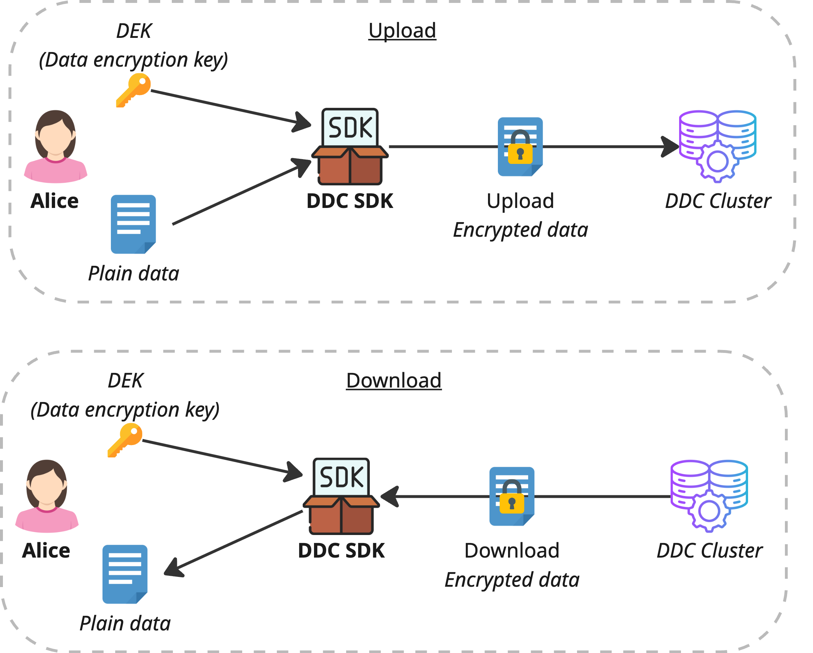

# Built-in encryption for Secure Data Storage 🔑
This document outlines the details of the program, including its objectives, challenges, proposed solutions, deliverables, and resources. Below is the index for easy navigation:

---

## 📚 Index

1. [Introduction 🌟](#introduction-)
2. [Objective 🎯](#objective-)
3. [Key Concepts/Keywords 📝](#key-conceptkeywords-)
4. [Existing System ⚙️](#existing-system-)
5. [Deliverables 📦](#deliverables-)
6. [Quick Start Guide 🚀](#quick-start-guide-)
7. [Resources 📚](#resources-)

---

## Introduction 🌟

Cere’s Decentralized Data Cluster (DDC) SDK currently lets developers store and retrieve raw bytes across an untrusted, peer‑to‑peer network. Today, any encryption must be hand‑rolled by each developer, which is error‑prone and non‑uniform. This grant task will embed **client‑side encryption** directly into:

- The **DDC SDK** core

- The **Playground** (for live testing during development)

- The **DDC CLI**

so that **“privacy by default”** becomes a seamless part of every upload/download flow.

---

## Objective 🎯

Enhance the DDC SDK by introducing built-in optional encryption capabilities, enabling automatic encryption during uploads and decryption during downloads. Update DDC SDK Playground and DDC CLI to showcase the optional encryption feature. 

---

## Key Concepts/Keywords 📝

- **DDC (Decentralized Data Cluster):** Blockchain-based storage solution.
- **DDC SDK:** A development kit used by developers to create applications that interact with the CERE infrastructure. It provides a set of modules and methods that allow seamless integration with the Cerebellum Network's decentralized data cloud (DDC).
- **Storage Node:** A fundamental component of the DDC that enables storing, reading, and searching data, like objects, files, and documents within the Cere Network.
- **CID:** Content Identifier, based on the content’s cryptographic hash label used to point to material. It doesn't indicate where the content is stored, but it forms an address based on the content itself. CIDs are short, regardless of the size of their underlying content.
- **Piece:** An abstraction that signifies a unit of data stored in the DDC. It doesn't have a fixed size and can represent fully logically complete data or a part of it.
- **CNS:** Content Name System to associate CIDs with human-readable names.
- **DAG:** Directed Acyclic Graph stored on DDC is used to establish data relationships between different pieces of data.

---

## Encryption ⚙️

### Symmetric




---

## Deliverables 📦

### Phase 1: Core SDK Encryption
**Design**
  - Define a `Cipher` interface:
    ```ts
    export interface Cipher {
      encrypt(data: Uint8Array): Promise<Uint8Array>;
      decrypt(data: Uint8Array): Promise<Uint8Array>;
    }
    ```  
  - Extend `DdcClientOptions` with an optional `cipher?: Cipher` field.

**Implementation**
  - Store the provided `cipher` in `DdcClient`’s constructor.
  - In `upload()`, wrap outgoing bytes with `cipher.encrypt()`.
  - In `download()`, apply `cipher.decrypt()` before returning the payload.

**Verification**
  - Unit tests using a mock XOR cipher to validate both `encrypt` and `decrypt`.
  - Integration test: round‑trip a small sample file and assert byte‑for‑byte equality.

---

### Phase 2: Playground Encryption Controls
**Design**
  - Build a demo AES‑GCM `Cipher` that accepts a user‑supplied key string.
  - UI requirements:
    - **Enable Encryption** checkbox
    - **Encryption Key** text input
    - **Download & Decrypt** button

**Implementation**
  - Add the above controls into the React + Vite playground app.
  - When toggled on, instantiate the AES‑GCM cipher and pass it to all SDK calls.

**Verification**
  - Manual test: upload a “Hello world!” file with encryption enabled; confirm that the direct download is unintelligible.
  - Click “Download & Decrypt” to retrieve and verify the original plaintext.

---

### Phase 3: CLI Encryption Flags
**Design**
  - Introduce two new flags for `upload` and `download` commands:
    - `--encrypt` (boolean)
    - `--key <hex>` (string)

**Implementation**
  - Parse `--encrypt` and `--key` in the CLI entrypoint (e.g. via `commander` or `yargs`).
  - When flags are provided, build the AES‑GCM cipher and pass it into the SDK’s `upload()`/`download()`.

**Verification**
  - Run `ddc upload ./file.txt --encrypt --key abc123 --network testnet` and ensure the object on the network is encrypted.
  - Run `ddc download <CID> --encrypt --key abc123 --network testnet` and verify the decrypted output matches the original file.

---

## Quick Start Guide 🚀

### 1. Setup environment

1. Clone GitHub repository: [`cere-ddc-sdk-js`](#)
2. Download and install Node.js **v18.17.1** [Node.js – Download Node.js](https://nodejs.org/)

### 2. Run DDC SDK Playground

1. Install dependencies:
    ```bash
    npm i
    ```
2. Build packages and playground application
    ```bash
    npm run build
    ```
3. Run playground application
    ```bash
    npm run playground
    ```
4. Open [http://localhost:5174/](http://localhost:5174/)
5. Upload and download file to ensure it’s working
   1. Keep default Seed phrase as is and click `Continue` button
   2. Select `Testnet` and click `Continue` button
   3. Click `Skip`
   4. Keep default Cluster (`0x825...`) and use existing bucket `573062`
   5. Click `Skip`
   6. Select file on your local file system you would like to upload and click `Continue`
   7. Click a blue link to download a file

### 3. Run DDC CLI

1. Install `ddc-cli` package
    ```jsx
    npm install -g @cere-ddc-sdk/cli
    ```
2. Install `npx`

    ```jsx
    npm install -g npx
    ```

3. Put any file you would like to upload to the same directory from where you execute commands
4. Upload file

    ```jsx
    npx @cere-ddc-sdk/cli upload ./hello-world.txt network=testnet --signer="hybrid label reunion only dawn maze asset draft cousin height flock nation" --bucketId=573062
    ```

5. More details and examples you can find here: https://github.com/Cerebellum-Network/cere-ddc-sdk-js/blob/main/packages/cli/README.md
---

## Resources 📚
- DDC SDK (Monorepo): [GitHub Link](https://github.com/Cerebellum-Network/cere-ddc-sdk-js)
- CLI Package: [GitHub Link](https://github.com/Cerebellum-Network/cere-ddc-sdk-js/tree/main/packages/cli)
- Playground App: [GitHub Link](https://github.com/Cerebellum-Network/cere-ddc-sdk-js/tree/main/playground)
